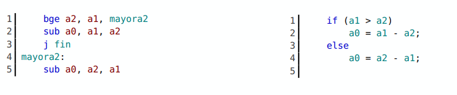
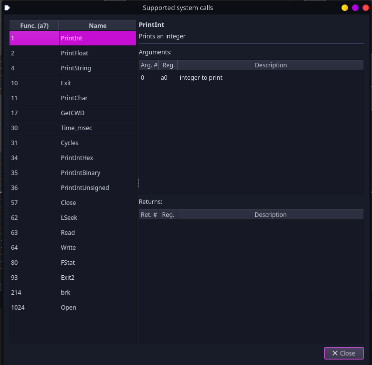
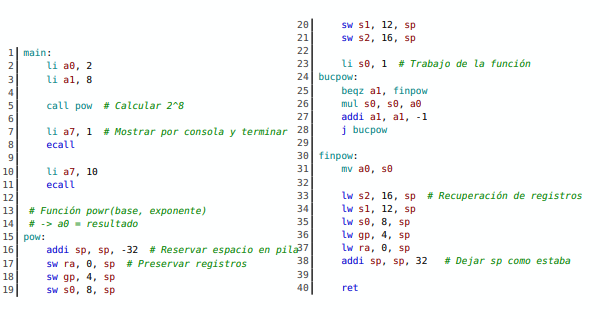
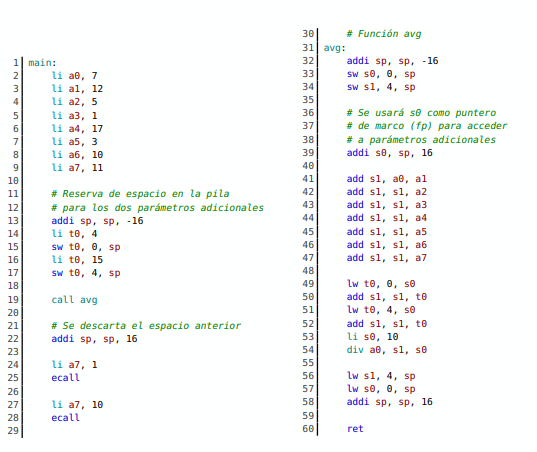
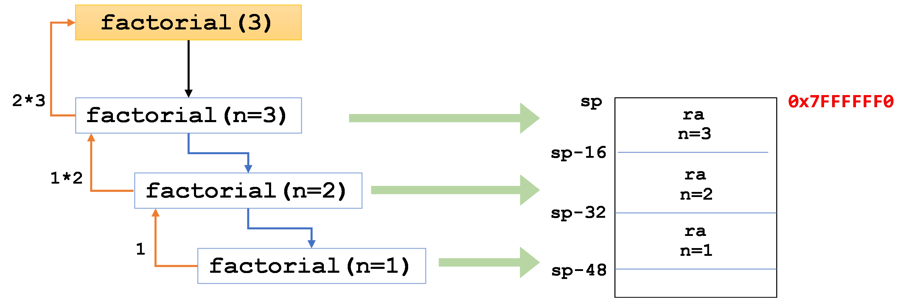
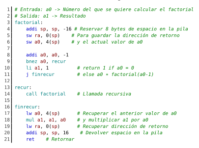

# Capítulo 2: Bucles y Condicionales

La posibilidad de ejecutar o salir de cierto bloque de instrucciones según que se cumpla una determinada condición la haremos con if/ else o la capacidad de repetir la ejecución de un bloque con for o while con ensamblador mediante la **alteración del flujo del programa** que permite cambiar el contenido del **contador de programa**.

## Instrucciones de salto

Modifican `pc` asignándole un valor general que será simbolizado por `etiquetas` sin tener que calcular manualmente las distintas direcciones

A las instrucciones anteriores de la tabla le añadiremos otras 8 más que serán las instrucciones de salto

| Instrucción          | Condición                            |
| -------------------- | ------------------------------------ |
| `beq` rs1, rs2, imm  | salta si rs1= rs2                    |
| `bne` rs1, rs2, imm  | salta si rs1 $\neq$ rs2              |
| `bge` rs1, rs2, imm  | salta si rs1 $\geq$ rs2              |
| `bgeu` rs1, rs2, imm | igual que `bge` pero sin signo       |
| `blt` rs1, rs2, imm  | salta si rs1 < rs2                   |
| `bltu` rs1, rs2, imm | Igual que la anterior pero sin signo |

> Rango de los saltos: los condicionales usan un desplazamiento de 12 bits (≈ ±4 KB) y `jal` uno de 20 bits (≈ ±1 MB).

El valor inmediato + `pc` determina a donde debe saltar `pc` en el caso que se cumpla la condición sobre ambos registros limitado a 12 bits

También se definen otras seudoinstrucciones como `bgt`, `bgtu`, `ble` y `bleu`,
que toman los mismos argumentos que las instrucciones previas, y `beqz`, `bnez`,
`bgez`, `blez` y `bgtz` en las que rs2= `zero` **SIEMPRE**

La seudoinstrucción `bnez` compara el contenido de `a0` con el registro `zero` y si no coinciden , ejecuta el salto de forma que el bucle se repetirá hasta que `a0` contenga `0`



Ejemplo de `if/else`: se ejecuta `a0 = a1 - a2` si `a1 > a2` y `a0 = a2 - a1` en caso contrario. Se salta a `mayora2` cuando `a2 >= a1`, y `j fin` evita ejecutar también el `else`.

**Bucle** (cuenta atrás de 10 a 1):

```asm
    li a0, 10
    li a7, 1
repite:
    ecall              # imprime a0
    addi a0, a0, -1
    bnez a0, repite    # repite mientras a0 != 0
```

Equivalente en C: `for (int a0 = 10; a0 > 0; a0--) ...`

## Saltos Incondicionales

- `jal` rd, imm : Es de tipo U que cuenta con 2 operandos. En `rd` se guarda `pc` actual y después el valor de `pc` pasa a ser `pc + imm` con un desplazamiento de 20 bits.

- `jalr` rd, rs, imm: Es una instrucción de tipo I que cuenta con tres operandos. En rd se guardará el actual contenido del `pc`, y después se actualizará asignándole el resultado de la suma `rs + imm`. Esto nos permite saltar a cualquier punto del programa, sin las limitaciones de los desplazamientos de 12 o 20 bits respecto a la posición actual de `pc`.

Como primer parámetro podemos usar el registro `ra` (`x1`) para la seudoinstrucción `jal imm` -> `jal x1, imm` de forma que no es obligatorio expresar de forma explícita el registro de destino.

- `jal imm` equivale a `jal x1, imm` (guarda el retorno en `ra`)
- `j imm` equivale a `jal x0, imm` (salta sin guardar retorno, se descarta `pc`)

> Nota: en la especificación oficial de RISC-V, los saltos condicionales son de tipo **B** y `jal` es de tipo **J**. El libro los llama tipo S y tipo U.

## Llamadas a Subrutinas

`call` se guarda en `ra` la dirección de pc `pc + 4`, es decir, la instrucción siguiente.

`ret` toma a `ra` la dirección de retorno, enviando a `x0` el actual valor de `pc`. `ret` equivale a `jalr x0, ra, 0`

`call`/`ret` no permiten llamadas anidadas sin guardar `ra` porque se perdería la dirección de retorno

## Llamadas del sistema en Ripes (`ecall`)

El número de la función se carga en `a7` y el argumento en `a0`.

| `a7` | Función                             |
| ---- | ----------------------------------- |
| 1    | Imprimir entero (decimal)           |
| 4    | Imprimir cadena (dirección en `a0`) |
| 10   | Terminar el programa                |
| 11   | Imprimir carácter                   |
| 34   | Imprimir entero en hexadecimal      |

...



## Otras instrucciones

### Instrucciones Lógicas

- Se usan las que hemos visto anteriormente: `and`, `andi`.... Y se añaden otras
- `or`/`ori`: OR bit a bit entre `rs1` y `rs2` (o `imm`)
- `xor`/`xori`: XOR bit a bit entre `rs1` y `rs2` (o `imm`)

| Instrucción         | Funcionamiento                                                                                           |
| ------------------- | -------------------------------------------------------------------------------------------------------- |
| `sll` rd, rs1, rs2  | Desplaza el valor en rs1 hacia la izquierda tantos bits como rs2 y guarda en rd                          |
| `slli` rd, rs1, imm | Igual pero con un valor inmediato                                                                        |
| `srl` rd, rs1, rs2  | Desplaza el contenido de rs1 hacia la derecha tantos bits indique `rs2` y guarda en rd                   |
| `srli` rd, rs1, imm | igual pero con inmediato                                                                                 |
| `sra` rd, rs1, rs2  | Desplaza el contenido de `rs1` hacia la derecha tantos bits como indique `rs2` y tomando el bit de signo |
| `srai` rd, rs1, imm | Como `sra` pero con inmediato                                                                            |

Algunos trucos para tratar con estas instrucciones:

- `sll`/`srl` desplazan **todos** los bits por igual (lógico). `sra` conserva el bit de signo (aritmético).
- Desplazar _n_ bits a la izquierda equivale a **multiplicar por 2ⁿ**, y a la derecha a **dividir por 2ⁿ**. Es más eficiente que `mul`/`div`.
- **Par o impar**: `andi t0, a0, 1` deja 0 si es par y 1 si es impar. Después se usa `beqz`.

### Instrucciones de comparación

**Estas no alteran el valor de `pc`** se limitan a almacenar `0` o `1`

| Instrucción          | Operandos | Signo     |
| -------------------- | --------- | --------- |
| `slt` rd, rs1, rs2   | registros | con signo |
| `sltu` rd, rs1, rs2  | registros | sin signo |
| `slti` rd, rs1, imm  | inmediato | con signo |
| `sltiu` rd, rs1, imm | inmediato | sin signo |

Intercambiando los operandos se obtiene el equivalente a `sgt`.

**Ejemplo**: contar valores menores que 5 **sin saltos condicionales**:

```asm
    la t0, notas
    li t1, 10          # nº de elementos
    li a0, 0           # contador
bucle:
    lw a2, 0(t0)
    slti a1, a2, 5     # a1 = 1 si a2 < 5
    add a0, a0, a1     # suma 0 o 1
    addi t1, t1, -1
    addi t0, t0, 4
    bnez t1, bucle
```

Como vemos/veremos en teoría, evitar saltos es importante en un procesador segmentado (riesgos de control).

> Si `rs1 < rs2` entonces `rd = 1` y en caso contrario `rd = 0`

### Otras seudoinstrucciones

- `not` rd, rs: complemento a uno de rs y almacena en rd. Equivale a `xori rd, rs, -1`.
- `neg` rd, rs: complemento a 2 de rs y almacena en rd. Equivale a `sub rd, x0, rs`.
- `nop` no hace nada solo consume uno o más ciclos de reloj. Equivale a `addi x0, x0, 0`.

### ---Recordatorio---

**Complemento a uno**: invierte todos los bits
**Complemento a dos**: invirtiendo todos los bits y sumando 1

## Almacenamiento temporal de datos en la pila

Una función puede modificar cualquiera de sus registros temporales: `t0` a `t6` o registros `a0` a `a7`. Si el código que la llama necesita conservar alguno, debe guardarlo él mismo. El resto de registros (`s0`-`s11`) los debe preservar la propia función si los usa.

| Registros                  | Los preserva                  |
| -------------------------- | ----------------------------- |
| `t0`-`t6`, `a0`-`a7`, `ra` | Quien llama (_caller_)        |
| `s0`-`s11`, `sp`           | La función llamada (_callee_) |

En Ripes, al pasar el ratón sobre un registro aparece `Saver: Caller` o `Saver: Callee`.

**Pasos**
**1. Reservar en la pila el espacio necesario**: como crece hacia **abajo** tenemos que restar el valor a `sp` y siempre ha de ser un múltiplo de 16

**2. Guardar el contenido de los registros apropiados en el espacio reservado de la pila**: Se usa el registro sp y un desplazamiento

**3. Realizar la tarea que la función tenga encomendada**

**4. Restaurar el contenido de los registros del paso 2 cargándolos desde la pila con los mismos desplazamientos sobre `sp`**

**5. Ajustar el registro `sp` para liberar el espacio del paso 1**



Ejemplo `pow(base, exp)`: la función usa 5 registros (`ra`, `gp`, `s0`, `s1`, `s2`), es decir, 5 × 4 B = 20 B. Como `sp` debe ser múltiplo de 16, se reservan **32 B** (`addi sp, sp, -32`). Cada registro se guarda con un desplazamiento distinto (0, 4, 8, 12, 16) y se restaura con los mismos al final, antes de `addi sp, sp, 32`.

## La pila para transferir parámetros a funciones

El número de registros de la CPU es limitado por lo que será preciso recurrir a la memoria para almacenar datos, (se usará en funciones con muchos parámetros)

Hasta 8 registros de `a0` a `a7` están destinados a facilitar la transferencia de parámetros al invocar a una función y del noveno argumento en adelante se pasan por la pila. **SE USAN EN ORDEN**; si solo necesitamos 2 -> `a0` y `a1`



Ejemplo `avg` (media de 10 valores): los 8 primeros van en `a0`-`a7`, y el 9º y el 10º se guardan en la pila desde `main` (`sw t0, 0(sp)` y `sw t0, 4(sp)`). Al terminar, `main` libera el espacio con `addi sp, sp, 16`.

Dentro de `avg`, `s0` se usa como **frame pointer**: `addi s0, sp, 16` guarda el valor original de `sp` antes de reservar espacio, para leer los parámetros extra con `lw t0, 0(s0)` y `lw t0, 4(s0)`. El resultado se devuelve en `a0`.

## Funciones recursivas y la pila

Cuando escribimos una función de lenguaje de alto nivel, el compilador genera en cada llamada un `stack frame` con los parámetros y la dirección de retorno. Por ejemplo para calcular un factorial

```c
int factorial(int n){
    if(n==1)
        return n;
    else
        return n*factorial(n-1);
}
```



Un compilador en C produce el código ensamblador preciso para ir ajustando el registro `sp`, almacenar y extraer datos de la pila. Y se tendrá que implementar de forma manual:



Las tres primeras líneas hacen `stack frame` y guardan en la pila la dirección de retorno y valor actual del parámetro de entrada. Después se actualiza ese parámetro y con un condicional se determina si ha alcanzado el caso base. Se produce una nueva llamada a la misma función si no se da el caso. Al llegar al caso base se recupera de la pila el parámetro y se hace la operación correspondiente
