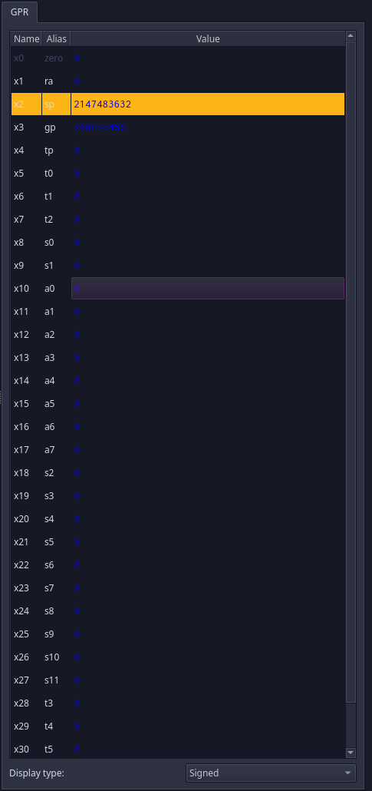
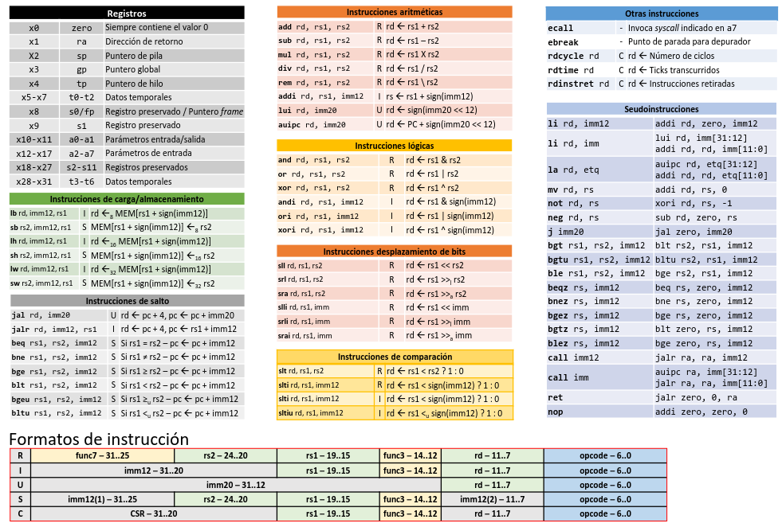

# Capitulo 1 del Manual de Ripes - AC

En las prácticas trabajamos con lenguaje ensamblador de la **ISA RISC-V** y sus registros usando el simulador **Ripes**.

ISA (_Intstruction Set Architecture_) es la interfaz que determina cómo (mediante software) se controla el hardware de un microprocesador.

Las partes de **ISA** son:

- El **banco de registros**
- Los **modos de direccionamiento**
- El **conjunto de instrucciones**

## Banco de registros

Los registros son pequeñas porciones de memoria interna cuya finalidad es mantener temporalmente los datos con los que se opera y los resultados que producen las operaciones. En **RV32I** (nuestra arquitectura) contamos con **32 registros** de **32 bits**. Están enumerados de x0 a x31.

Cada uno de estos registros se usa para fines específicos segun una convención para el desarrollo de compiladores para RISC-V, llamada ABI (_Application Binary Interface_)



#### ¿Cual es el propósito de cada registro?

| Nombre            | Alias    | Uso                                                                     |
| ----------------- | -------- | ----------------------------------------------------------------------- |
| **x0**            | zero     | Siempre contiene el valor 0 (útil para operaciones)                     |
| **x1**            | ra       | (return addres) Es una dirección de retorno                             |
| **x2**            | sp       | (stack pointer) Puntero de pila                                         |
| **x3**            | gp       | (global pointer) Puntero Global                                         |
| **x4**            | tp       | (thread pointer) Puntero de hilo                                        |
| **x5** a **x7**   | t0 a t2  | (Temporary) Guardamos valores temporales                                |
| **x8**            | s0/fp    | (saved register/frame pointer) Registro preservado / Puntero de _frame_ |
| **x9**            | s1       | Registro preservado                                                     |
| **x10**, **x11**  | a0 a a1  | Parámetro de función o Valor de retorno                                 |
| **x12**, **x17**  | a2 a a7  | Parámetro de función                                                    |
| **x18** a **x27** | s2 a s11 | Registro preservado                                                     |
| **x28** a **x31** | t3 a t6  | Valores temporales                                                      |

(falta explicar un poco más los registros, sigo esta tarde)

## Conjunto de instrucciones

El conjunto de instrucciones que necesitamos para escribir programas también cambia según las extensiones de la ISA


# Capitulo 1 del Manual de Ripes - AC

En las prácticas trabajamos con lenguaje ensamblador de la **ISA RISC-V** y sus registros usando el simulador **Ripes**.

## Conjunto de instrucciones

El conjunto de instrucciones que necesitamos para escribir programas también cambia según las extensiones de la ISA

En RISC_V contaremos con un RISC (conjunto de instrucciones reducido) con solo **40 instrucciones** 

| Grupo | Registro | Inmediato |
| -- | -- | -- | 
| **Aritmético** | `add`,`sub`,`mul`,`div`,`rem` | `addi`,`lui`,`auipc` | 
| **Lógico** | `and` , `or`, `xor` | `andi`,`ori`,`xori` | 
| **Desplazamiento** | `sll`,`srl`,`sra` | `slli` , `srli`,`srai` |
| **Comparación** | `slt`,`sltu` | `slti`, `sltiu` | 
| **Carga** | | `lb`,`lbu`,`lh`,`lhu`,`lw`,`lwu`,`ld` | 
| **Almacenamiento** | | `sh`,`sb`,`sw`,`sd` | 
| **Salto** | | `beq`,`bne`,`bge`,`bgeu`,`blt`,`bltu`,`jar`,`jalr` | 
| **Otras** | `ecall`,`ebreak` | | 

## Seudoinstrucciones 

Los procesadores en una ISA son unas pocas instrucciones encargadas de facilitar operaciones básicas. 

El inconveniente de esto es que se necesitan más instrucciones que complejan el RISC, se emplean las seudoinstrucciones como instrucciones algo más complejas procesadas por el **ensamblador** y **no por el microprocesador** , cada una genera una o múltiples instrucciones


## Intefaz de RISC-V


El **Editor** es la parte donde escribimos las instrucciones, cuenta con distintas acciones:
* **Ayuda**: se obtiene una descripción de cualquier registro al situar el puntero del ratón sobre su nombre
* **Formato**: Con la lista desplegable en la parte inferior podemos elegir como que remos visualizar los números
* **Notificación**: Se notifica la escritura, color de fondo ....
* **Modificación**: permite cambiar su contenido

> El registro **sp** actúa como putnero de pila. RISC-Vno cuenta con un registro específico para esta función como ocurre ne otras arquitecturas de procesador 

Cuando introducimos instrucciones en el editor, en el panel de la derecha aparece el código máquina que generan (en binario) o su versión ensamblada

> En RISC no existe una instrucción para cargar un registro inmediatamente, usamos `addi` con el registro `zero` y el valor que queramos. Tampoco hay de copia de un registro a otro, usamos la seudoinstrucción `mv` rd 

**Controles de ejecución**


**Consola**
Es la parte donde se muestra la información recibida por el programa . El resultado de la operación que queramos mostrar se debe almacenar en el registro `a0` y para mostrarlo en consola debemos llamar a la instrucción `ecall` que espera que se entregue en el registro `a7` el servicio que queramos ejecutar 


*Ejemplo*: Con el servicio `1`, valor asignado a `a7` se envia el **Número entero** almacenado en `a0`

**Profudización en Instrucciones Aritméticas**

* `sub` destino,minuendo,sustraendo
> destino = sustraendo-minuendo

* `mul` destino,multiplicando,multiplicador
> destino=multiplicando * multiplicador

* `div` destino,dividendo,divisor
> destino=dividendo/divisor

* `rem` destino, dividendo, divisor
> destino=dividendo%divisor

**Diferencia entre instrucciones terminadas con `i`**
> Difieren solo en el tercer argumento. Es una sola instrucción que permite **dos modos de direccionamiento** si lleva `i` el tercer argumento será un número que metamos inmediatamente

## Espacio de direccionamiento y mapa de memoria
La ISA de RISC-v contempla un tamaño de palabra de 32 bits y un espacio de direccionamiento de 32 bits. Por lo tanto hay disponibles 2^32 posiciones de memoria , cada una tiene 1 byte (8 bits) de capacidad. Este espacio será necesario para almacenar código dle programa , datos, reservar zona para dispositivos de E/S.....

**Partes del código**

`.data` -> contiene datos **inicializados**

`.bss` -> contiene datos **sin inicializar** en el que reservamos memoria 

`.text` -> contiene el código del programa

Para  hacer con `.word` de la siguiente manera:
```
n1: .word 7
```
## Leer y escribir datos en memoria
La lectura de un dato que está almacenado en memoria conlleva asignar la dirección de memoria a un registro y usarlo como puntero para leer el dato

`lw` rd, simbolo -> copia el dato desde memoria a un registro

`sw` rd, simbolo -> copia un dato desde un registro a ram

`la` rdir, simbolo -> actua como un puntero

* Para ver como se lamacenan datos en memoria de forma más explícita  podemos verlio en la pestaña de **memory**


## Formato general de la instrucciones
La longitud de las instrucciones en RISC a diferencias de los procesadores CISC optan por la longitud fija para instrucciones. Todas ellas ocupan `32 bits` , estos tienen que codificar no sola la operación que quiere llevarse a cabo, sino también sus operandos. Según el tipo de instrucción estos se estructurarán de una forma u otra según el número de operandos y su tipo 

## Instrucciones tipo R
Todos los oprandos se encuentran alojados en registros -> `direccionamiento por registros`


Los registros implicandos (`rs1`,`rs2` y `rd`) aporatn los operandos sobre los que se actuará y el destino almcenará el resultado. A cada uno le corresponde 5 bits (2⁵ = 32) ya que hay 32 registros 

El código de operación **opcode** siempre ocupa los 7 bits de menor peso de la instrucción 

Ejemplo de instrucciones tipo R: `add`,`sub`,`and`,`or`,`xor` ..

## Instrucciones tipo I y U
Asociadas a `direcionamiento inmediato` 


* En el tipo **I** el valor inmediato ocupa los 5 bits que le corresponden a `rs2` y los de `fund7` (12 en total)

    * Ejemplos de instrucciones tipo I: `adni`,`ori`,`xori`....

> Consideraciones: RISC-V procesa losv alores inmediatos como números enteros con signo. interpreta si el bit mayor es `1` o `0` , por lo que usa `11 bits` para su magnitud, pudiendo representar números entre [-2048,2047]

En el tipo I también se emplea el **direccionamiento indexado** que consiste en tomar el contenido de un registro y sumarle el desplazamiento indicado por el valor inmediato para obtener una dirección de memoria resultante (como en `lw` a0,128,t0)

* En el tipo **U** el valor inmediato tiene longitud de 20 bits porque el valor se interpreta como un entero sin signo. Además solo se cuenta con un registro como operando (`rd` que actua como destino)
    * Instrucciones tipo **U**: `lui` t0, valor  o `auipc` rd, imm

`auipc` permite usar el **direccionamiento relativo** donde uno de los operandos es fijo: `pc`

## Instrucciones tipo S 
Vinculada con el **direccionamiento relativo** usado para salto condicional. Se cuenta con dos oeprandos de entrada alojados en sendo registros donde su instrucción dependerá de `pc`


* Ejemplo de instrucción: `beq` a0,a2,imm que compara a0 y a2 y si son iguales modifica pc según imm


## Aspectos Avanzados
Se usan las instrucciones `lui` y `addi` para cargar en el registro `t0` que se usará como puntero 

Podemos descomponer una dirección de memoria mediante los operadores `%hi` y `%lo` (la primera de 20 bits y la seg unda de 12).  Que nos sirve para leer datos como con la instrucción `lw`


## Uso de punteros
Los accesos a memoria se pueden optimizar con el uso del **puntero global** . Actua como dicho puntero el registro `gp` (el `x3`). 

El programa puede operar sobre pocos datos (como máximo 2KB), se puede asignar a `gp` la dirección de inicio de la sección de datos y usar el desplazamiento para acceder a cada dato.

Se puede usar la etiquedta `_datastart` para marcar el inicio de la sección de datos y con la seudpinstrucción `la` cargar en el registro `gp` la dirección de dicha etqieuta

```
.data
_datastart:
x: .word 7
y: .word 3
z: .word 0

.text
# Global Pointer apuntando al inicio de los datos
la gp, _datastart

lw a0, x-_datastart, gp # Desplazamientos para
lw a1, y-_datastart, gp # cada carga y almacenamiento

add a0, a0, a1
sw a0, 8, gp

addi a7, zero, 10
ecall
```

Si los datos superan los 2KB el registro `gp` se inicializa con una dirección intermedia en lugar de con la de inicio de la sección de datos


## Resumen
| Instrucción | Significado | ¿Para qué sirve? | Ejemplo de uso | 
| -- | -- | -- | -- |
| `li` | Load Immediate | Poner un **número directo** en un registro | `li a0,5` (a0=5) | 
| `la` | Load Addres | Carga la **dirección de memoria** de una etiqueda de `.data` o `.bss` | `la t0,numero` (t0=dir de número) | 
| `lw` | Load Word | **Leer/Treaer un dato desde memoria RAM** a un registro | `lw a0,0(t0)` a0=lo q hay dentr de a ram | 
| `sw` | Store Word | **Guardar/Escribir un registro** en memoria | `sw a0, 0(t2)` (guarda 0 en ram) | 
| `add` | Add | Suma **dos registros** | `add a0,a1,t1` (a0=a1+t1) | 
| `addi` | Add Immediate | Sumar **un registro y un número constante** | `addi a0,a0,5` (a0=a0+5) | 
| `ecall` | Enviorment Call | Hacer una **llamada al sistema** (según el valor puesto en a7) | `li a7,1` + `ecall` |
| `mv` | Move | **Copia el valor** de un registro a otro | `mv a0,t0` |
| `sub` | Sustract | **Resta dos registros** | `sub a0,t0,t1` (a0=t0+t1) |
| `mul` | Multiply | **Multiplica dos registros** | `mul a0,t0,t1` | a0=t0*t1 |
| `div` | Divide | **Divide dos registros** | `div a0,t0,t1` (a0=t0/t1) | 
| `rem` | Rest | **Obtiene el resto de dos registros** | `rem a0,t0,t1` (a0=t0%t1) | 
| `and` / `andi` | And | **hace operación lógica Y** | `and a0,t0,t1` (a0=t0^t1) |
| `or` / `ori` | Or | **hace operación lógica O** | `or a0,t0,t1` (a0=t0 v t1) | 
| `beq` | Jump | **salta a etiqueta si `reg1==reg2` | `beq t0,zero,fin` |
