# TEMA 1: Introducción a la arquitectura de computadores 

* **Computador digital:** Máquina capaz de **aceptar unos datos de entrada,** efectuar con ellos **operaciones lógicas y aritméticas** y proporcionar la info por un medio de **salida** 

| ¿qué hace la máquina? | ¿Cómo se implementa? | 
| --  | -- |
| Representa la perspectiva de la programación de sistemas | Representa el hardware | 
| Conjunto de instrucciones (ISA) que define el lenguaje máquina | Forma concreta en la que se implementan las instrucciones del hardware | 
| Registros visibles para la instrucción del usuario | Unidades funcionales físicas (ALU, decodificadores) | 
| Modo de direccionamiento de la memoria y de paralelisomo | Buses internos de comunicación y señales de control | 
| Mecanismos de protección y direccionamiento virtual | Técnica física de la memoria y la lógica electrónica | 
| Independiente de la tecnología del hardware | Se puede cambiar la organización sin cambiar la arquitectura (ISA) | 

**Objetivos:** buscan **optimizar el rendimiento, incrementar velocidad y eficiencia en procesamiento de datos** y tareas a través de búsqueda del equilibrio entre hardware y software

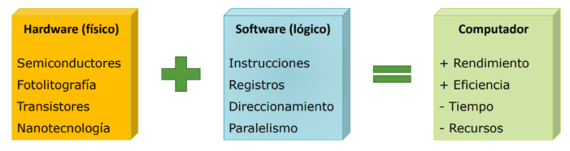

**Avances fundamentales:** tanto en aspectos físicos como en lógicos hecho posible el acceso a los ordenadores al público general y ha mejorado su experiencia de uso  

| Causas físicas | Causas no físicas | 
| -- | -- | 
| Electromecánica | Ejecución Secuencial | 
| Electrónica primitiva | Segmentación | 
| ransistores circuitos integrados | Superescalar | 
| Nanotecnología | Paralelismo | 


## **Niveles de descripción de un computador** 

### **Estrategia de estudio de sistemas complejos**: Dividir el sistema en múltiples niveles , de forma que **la salida del nivel inferior se convierte en la entrada para el superior**

Cada nivel de abstracción se caracteriza por:

* Elementos de entradas disponibles que procedan del nivel inferior  
* Elementos de salida destinados al nivel superior  
* Una metodología de análisis y síntesis de los elementos de salida en términos de los de entrada

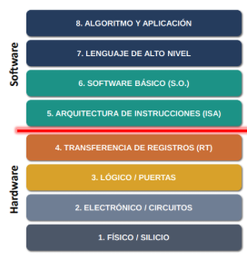

Los niveles se representan como **capas que se apilan unas sobre otras**. **Las inferiores aportan funciones más a bajo nivel**, sobre cuyas abstracciones se construyen en capas superiores.

### **Construcción de niveles:** 

* **Síntesis**: se parte de una especificación y se implementa mediante los componentes de la capa inferior  
* **Análisis**: se parte de la implementación y determina las funciones de la capa inferior , su especificación

### **Niveles de descripción de interés:**
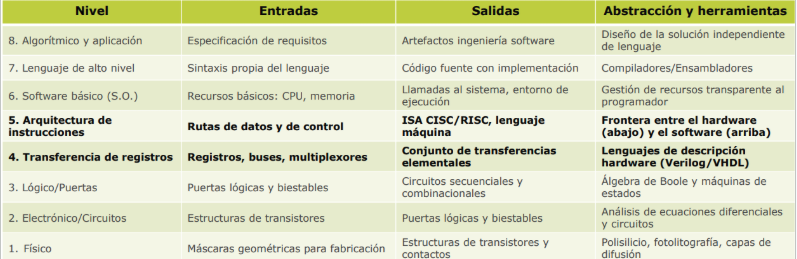

* **Físico, Electrónico y Lógico:** en asignaturas como Física y Electrónica digital  
* **Transferencia de registros y Arquitectura de computadores**  
* **Niveles superiores:** SSOO, Diseño de Algoritmos , FIS

## **El nivel RT- Microarquitectura  [rt.mp4](https://drive.google.com/file/d/1WhKQTwxj1Zvvos-sSbnN-gOhMTJD8lJq/view?usp=drive_link)**

**Elementos de entrada:** registros, módulos combinacionales, buses y multiplexores  
**Elementos de salida:** transferencia básicas en la ruta de datos construida con esas entradas

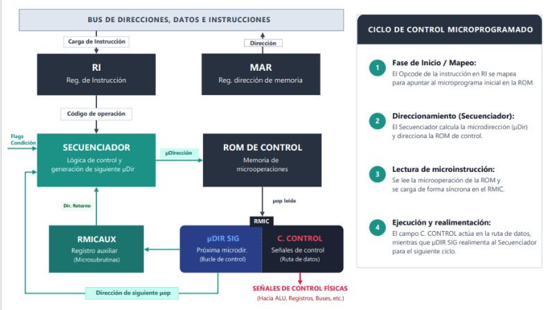
- **MAR**: Almacena la dirección de memoria que se va a leer o escribir  
- **RI**: Contiene la instrucción máquina actual cargada desde memoria. Se extraen los campos de operación y direcciones  
- **Secuenciador**: Genera la secuencia de microoperaciones ( μops ) que debe ejecutar la ALU ( Unidad de Control) . Se encarga de terminar cuál es la siguiente μop según las condiciones actuales  
- **ROM de control:** Es una memoria de solo lectura que almacena las μops que implementan el conjunto de instrucciones ( ISA ) del procesador  
- **RMIC ( Registro de Microinstrucción de control ):** Guarda la μop en ejecución. Sus campos general las señales de control para el procesador y guarda la dirección de la siguiente μop  
- **RMICAUX**: Apoyo del RMIC para almacenar μops condicionales, de salto o de apoyo al secuenciador

## **El nivel ISA- Arquitectura   [isa.mp4](https://drive.google.com/file/d/1VKCadF0FNZbPO5T8HCt2cI0QHLDGYNm5/view?usp=drive_link)**

**Elementos de entrada:** el datapath ofrecido por RT con su unidad de control  
**Elementos de salida:** banco de registros, direccionamientos y repertorio de instrucciones.

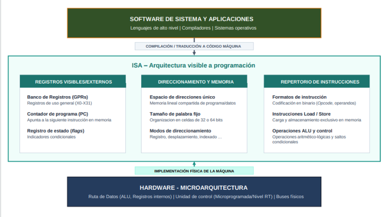

**\-  CISC – Complex Instruction Set Computer**

* Repertorio de instrucciones muy amplio  
* Instrucciones complejas  
* Gran variedad de modos de direccionamiento  
* Operaciones sobre registros y sobre memoria

**\-  RISC – Reduced Instruction Set Computer**

* Repertorio de instrucciones compacto  
* Instrucciones simples  
* Pocos modos de direccionamiento  
* Operaciones sobre registros

> **Misma ISA – Distintas implementaciones**  
Cuenta con distintas implementaciones según el datapath definido en el nivel RT: secuencias, segmentado, superescalar, etc

## **Arquitectura Von Neumann [Arquitectura\_Von\_Neumann.mp4](https://drive.google.com/file/d/1uuC1vacy768TnJ2079TIiqgjljlFuqSz/view?usp=drive_link)**
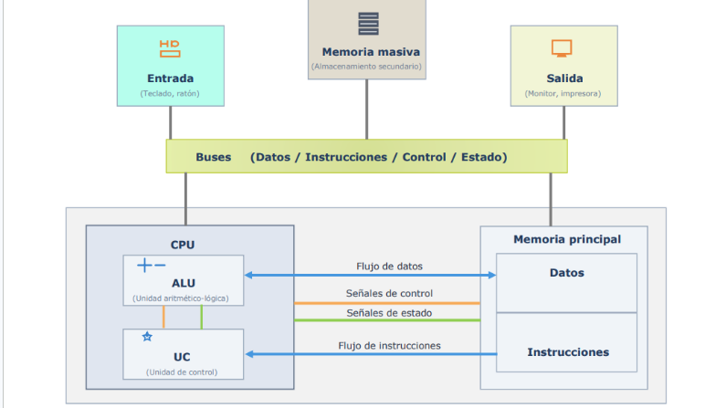

**Componentes principales:**

* **CPU**  
  * Lee instrucciones desde memoria y las ejecuta  
  * La ejecución se apoya en el datapath ofrecido por la microarquitectura : buses, ALU, registros  
  * La Unidad de control gestiona las señales hacia y desde memoria y dispositivos  
  * Ejecución secuencial solo alterada por instrucciones de bifurcación

* **Memoria principal:**  
  * Almacena programas y datos iniciales/finales  
  * Estructura lineal : byte por dirección  
  * Tamaño de palabra de longitud fija: 32 o 64 bits  ( vamos a usar la de 64 )  
  * Lectura/Escritura desde CPU y dispositivos

* **Entrada / Salida**  
  * Un conjunto de buses conectan los demás dispositivos a la CPU y memoria  
  * La ISA puede ofrecer instrucciones específicas de E/S o tratarla igual q la memoria  
  * El ancho de los buses (nº de bits) suele ser el ancho de la palabra de la CPU  
     

## **SISTEMAS DE BUSES**  
**Bus:** medio compartido de comunicación formado por un conjunto de líneas ( conductores) que conecta dos o más unidades del computador

**Master**: unidad que controla un bus en un cierto momento

**Slave**: unidad que participa en el uso de un bus sin controlarlo  

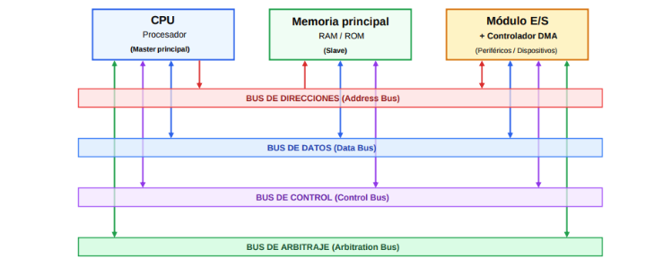

**Tipos de buses y sus funciones:**

* **Direcciones**  
  * Transporta una dirección de memoria o E/S a la que acceder  
  * El master – CPU o controlador DMA – pone en él la dirección de la que quiera leerse / escribirse  
  * El slave – memoria o periférico – lee la dirección y hace la operación  
* **Datos**  
  * Transporta datos entre dos unidades del ordenador  
  * Es bidireccional  
  * Su ancho (num de lineas) establece el tamaño de la palabra  
* **Control**  
  * Indica la operación a realizar: RD/WR, ACK, CS, IRQ  
  * Master lo usa para coordinar una operación  
  * Incluye señales de sincronización entre master y slave  
* **Arbitraje**  
  * Evita colisiones en el uso de buses cuando dos master acceden a la vez  
  * Opera con un sistema de prioridades para decidir quien toma el control

## **SISTEMAS DE MEMORIA**

**Jerarquía de memoria:** la memoria se estructura en varios niveles que resultan transparentes para la CPU. Esta solo ve un espacio común y lineal de almacenamiento / recuperación de instrucciones y datos

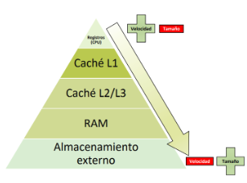


### **Tipos de memoria:**

* **Interna / Registros**  
  * interna a la propia CPU  
  * Tamaño muy recurrido, muy pocos registros de 32/64 bits  
  * Alta velocidad, funciona a la propia velocidad de la CPU

* **Caché**  
  * Cercana a la CPU, en el mismo circuito  
  * Tamaño mayor que los registros pero menor que la ram  
  * 10 veces más lenta que los registros  
      
* **Principal / RAM**  
  * Externa a la CPU y suele estar fuera del circuito integrado  
  * Órdenes de mayor en tamaño  
  * Órdenes de menor velocidad  
      
* **Externa / Almacenamiento masivo**  
  * Discos duros, SSD..  
  * Puede utilizarse como memoria pero es más lenta

## **SISTEMAS DE E/S**

**Interrupción:** Señal que interrumpe el flujo de ejecución secuencial de instrucciones en la CPU a petición de un dispositivo externo. Es la base de E/S que permite atender periféricos lentos sin ralentizar la CPU

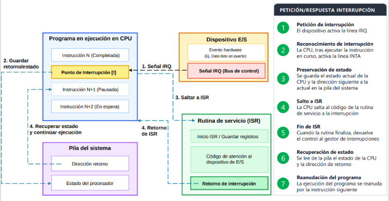

### **Comunicación E/S**

* **Diferencia de velocidad:**  
  * Los periféricos son MUY lentos  
  * Atender la E/S detiene la CPU durante largos intervalos de tiempo  
  * En sistemas antiguos sin interrupciones, la E/S no detenía todas las tareas  
  * No se podía usar el teclado mientras se cargaba un dato

* **Solución:**  
  * Los periféricos operan de forma automática  
  * Cuando precisan la atención de la CPU, la solicitan con una interrupción  
  * La CPU se interrumpe durante poco tiempo  
  * Se ejecuta la rutina de atención a la interrupción y se reanuda el programa

## **Paralelismo**  
**Paralelismo**: Capacidad para ejecutar múltiples operaciones de forma simultánea , reduciendo el tiempo total a emplear para  ejecutar dos o más tareas.

**Clasificación**

* **Solapamiento de E/S** : consiste en descargar a la CPU de las tareas de E/S de forma que pueda continuar la ejecución de un programa mientras la transferencia de datos tiene lugar  
* **Al nivel de instrucción:** divide el procesamiento en pasos posibles de completar de forma paralela con granularidad  
* **Al nivel de arquitectura:** define diferentes arquitecturas de paralelismo caracterizándose por el número de flujos de instrucciones y datos que es posible procesar.

**E/S programada:** la CPU se comunica con el dispositivo y espera a que este complete la operación de E/S mediante espera activa o polling

**E/S solapada:** la CPU delega el control de la operación de E/S en circuitería especializada , permite continuar en paralelo la ejecución del programa  

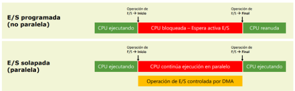

## **Categorización:**  
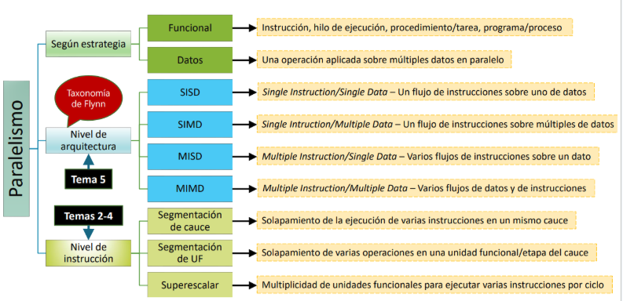

## **Niveles de granularidad:**  
**Granularidad:** determina el tamaño de la unidad de trabajo en paralelo, los elementos de hardware implicados y la frecuencia de sincronización entre ellos

* La granularidad **más fina se implementa en la microarquitectura/arquitectura** hardware  por lo que es transparente para el software. **La más gruesa depende del software**: SO e infraestructura de comunicación

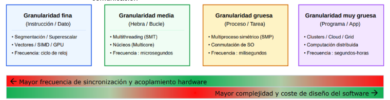

## **Rendimiento:**  
**Es la inversa del tiempo de ejecución (T) para completar una tarea**

* **Tiempo vs velocidad:** a mayor velocidad de funcionamiento menor será el tiempo de procesamiento. La velocidad viene determinada por varios factores: físicos, microarquitectura y arquitectura

* **Estimación del tiempo de ejecución:** es posible expresar T como el producto del tiempo del n**úmero de instrucciones que forman un programa (N),** el n**úmero promedio de ciclos que tarda en ejecutarse una instrucción (CPI)** y el **tiempo que tarda en ejecutarse un ciclo (Tc)**

**Formulas:**  
> R \= 1 / T            

> T= N \* CPI \* TC

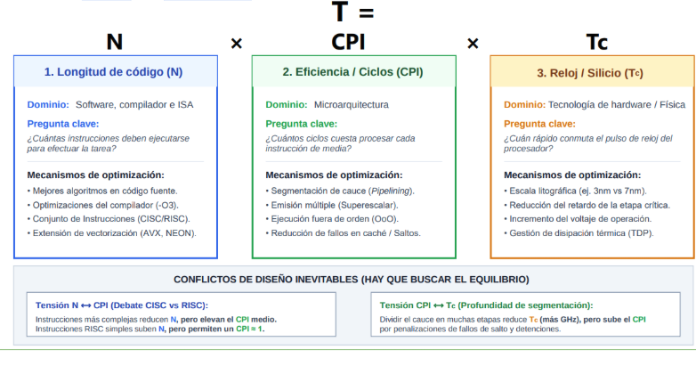

## **Rendimiento \- Rankings públicos**

**Utilidad**: Medir el rendimiento de los sistemas que permite clasificarlos y crear rankings según su potencia

* **Top500**: clasifica los 500 sistemas más potentes del mundo en términos de rendimiento bruto  
* **Green500**: evalúa los sistemas con benchmark ( como top500) pero se ordena según rendimiento por vatio de energía consumida 

**Parámetros del rendimiento**   

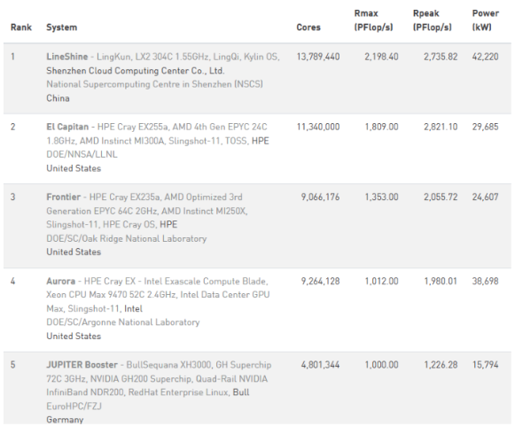
**Columnas:**

* **Rank**: indica la posición del ranking  
* **System**: nombre de sistemas, características y ubicación  
* **Cores**: número de nuclesos de procesamiento sin diferenciar su tipo: CPU, GPU…  
* **Rmax**: rendimiento máximo medido en pruebas con benchmark Linkpack  
* **Rpeak**: rendimiento máximo teórico que podría alcanzar al 100%  
* **Power**: potencia eléctrica

**Unidades:**

* **PFflops/s** : Rmark yRpeak se expresan en PetaFlops por segundo (10^15 ) operaciones en punto flotante.  
* **kW**: consumo eléctrico por unidad de tiempo en miles de vatios.

## **Mejora de rendimiento: Ley de Amdahl**  
Mejorar el rendimiento implica reducir el tiempo que se emplea para completar una operación

Medimos la ganancia de rendimiento para calcular la máxima ganancia teórica:
>  **(G-1) x 100** (expresada en %)

```
G=1 T_original = T_mejorada → sin cambios  
G< 1 T_original < T_mejorada → peor rendimiento  
G> 1 T_original > T_mejorada → mejor rendimiento  
```
Si f representa la fracción del tiempo de un programa dedicado a tareas que utilizan la parte mejorada de un sistema, la ganancia global estará limitada a la fracción de tiempo durante la cual se usa la parte no mejorada

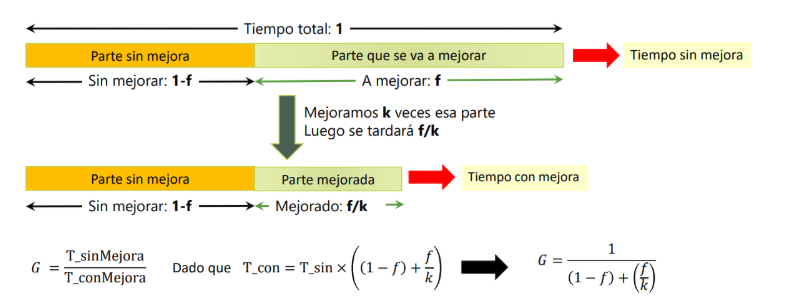

La mejora de rendimiento (`G`) que se puede obtener cuando se mejora un componente de un sistema en un factor k está limitada por la fracción del tiempo de ejecución durante la que no se utiliza dicho componente, por mucho que se incremente k se alcanzará un límite sin mayor posibilidad de mejora 

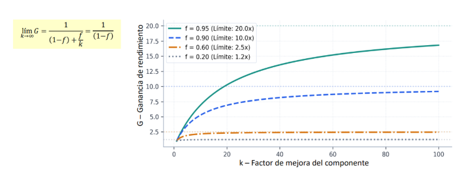

## **Áreas estratégicas – HiPEAC**

* **HiPeac**: Red europea de excelencia en arquitectura de computadores, modelos de programación, compilación y sistemas operativos, integrada por 2000 investigadores de reputación mundial, representantes de empresas y gobiernos.

* **Objetivos**: Determinar los desafios a los q se enfrenta el campo de computación, sobre todo arquitectura de computadores  
Visión: Establecer una planificación a largo plazo para el futuro de los sistemas de computación

* **NPC**: `Next Computing Paradigm` que fija los pilares claves para el avance futuro 

* **Eficiencia energética:** Expertos estiman que en 2024 los móviles o computadores consumirá más energía de la que se genera a nivel global
