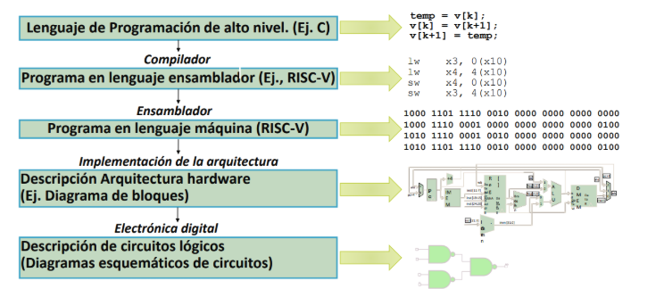
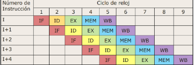
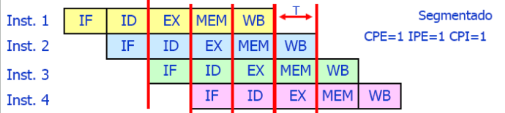
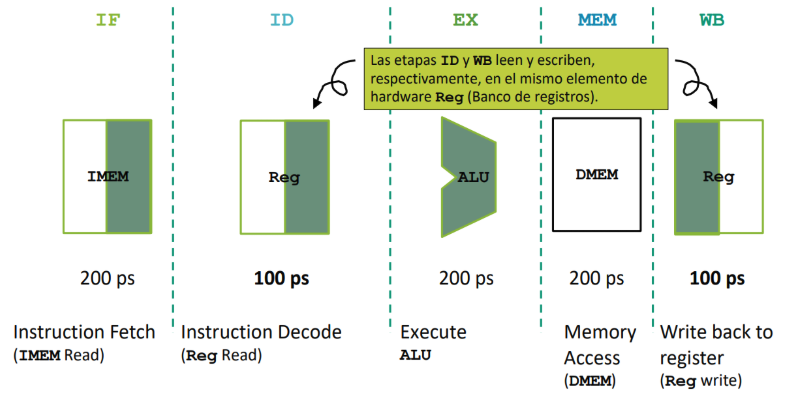
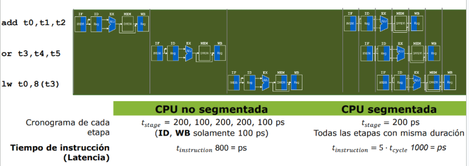
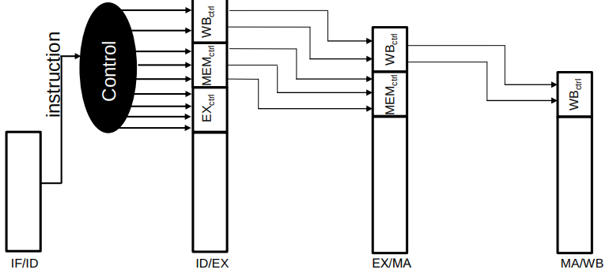
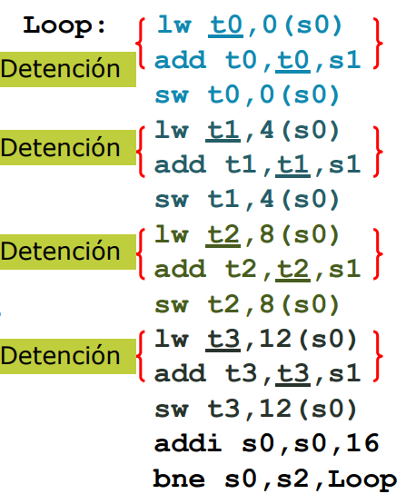

## Tema 2: Procesos Segmentados

### Nivel de Abstracción



### Conceptos Iniciales:

* **Procesador (CPU)**: es la parte activa del ordenador que realiza todo el trabajo (manipulación de datos y toma de decisiones)
* **Datapath (ruta de procesos)**: Es la parte del procesador que contiene el hardware necesario para realizar las operaciones requeridas por el procesador
* **Control**: Es la parte del procesador que indica el datapath lo que debe hacer

### Tipo de Programa
> T = N x CPI x Tc

`N` = Número de instrucciones:
* Está determinado por:
    * Algoritmo
    * Lenguaje de programación
    * Compilador
    * Arquitectura del conjunto de Instrucciones (ISA)


`CPI` = Ciclos de reloj por instrucción:
* Está determinado por:
    * ISA
    * Implementación del procesador
    * Procesador simple: RISC_V de ciclo único CPI= 1 
    * Instrucciones de varios ciclos, CPI > 1
    * Procesadores superescalares , CPI < 1 

`Tc` = Tiempo de ciclo (T=1 /frecuencia) 
* Determinado por:
    * Microarquitectura
    * Técnica
    * Presupuesto de energía

## Introducción a la segmentación (Pipeline)

* **Pipeline:** Dividir el procesador de una instrucción en etapas y solapar varias instrucciones a la vez. Mientras una instrucción está en una etapa, otra puede utilizar otra etapa del procesador. Puede hacer las CPUs rápidas



* `IF`: Captar instrucción
* `ID`: Decodificar / Leer registros
* `EX`: Ejecutar
* `MEM`: Acceso a memoria
* `WB`: Escribir resultado en registros

Se intenta equilibrar las etapas, el periodo de reloj queda limitado por la etapa más lenta


## Rendimiento en un procesador Segmentado
Si el pipeline tiene `K` etapas equilibradas, la mejora máxima ideal de rendimiento puede aproximarse a:

> $Tsegmentado$ = $TsinSegmentar / K$

* La segmentación (pipeline) **mejora el rendimiento** al permitir que varias instrucciones se procesan simultáneamente en diferentes etapas del procesador

* Su principal beneficio es aumentar la productividad (`throughput`): una vez lleno el pipeline, puede completarse una instrucción por ciclo

* La segmentación no reduce la latencia de una instrucción individual. Puede aumentarla ligeramente debido al coste de registro entre etapas

* La segmentación mejora principalmente el rendimiento no el tiempo necesario para ejecutar una instrucción

* El rendimiento depende de cómo se emiten las instrucciones

## Emisión de instrucciones:

La emisión es el momento en el que una instrucción pasa de la etapa de decodificación a la parte de ejecución

> Es decir cuando pasa de ID a EX

* **CPE (Ciclos por emisión):** número de ciclos de reloj que transcurren entre la emisión de una instrucción y la siguiente

* **IPE (Instrucciones por Emisión)**: número de instrucciones que pueden emitirse simultáneamente

**Formulas**

> CPI = CPE / IPE

>Tcpu = N x CPE / IPE x Tc

**Pipeline Ideal**



* Una vez lleno el pipeline se emite una nueva instrucción en cada ciclo de reloj

* Un CPI próximo a 1 indica que el pipeline mantiene un flujo continuo de instrucciones

### Definiciones Adicionales:

* **Latencia:** Tiempo total transcurrido desde que un elemento entra al sistema hasta que se completa. Es la suma de las duraciones de cada etapa individual y no disminuye por el uso del pipeline.
* **Throughput (Rendimiento)**: Cantidad de elementos completados por unidad de tiempo. En régimen permanente (pipeline lleno), la velocidad de salida la dicta únicamente el tiempo de procesamiento de la etapa más lenta.
* **Ganancia (Speedup)**: Factor de mejora en rendimiento respecto a un procesamiento secuencial. Nunca alcanza el máximo teórico (igual al número de etapas) debido a las ineficiencias de inicio y fin: las fases de llenado y vaciado, donde no todas las etapas del pipeline operan al 100% de su capacidad.


## RISC-V Segmentado

### Representación de las 5 etapas


**¿Qué sucede secuencialmente?¿Y Simultáneamente?**
* **Simultáneamente**: Instrucciones diferentes están siendo procesadas durante el mismo ciclo 
* **Secuencialmente**: Una misma instrucción mientras avanza por: `IF -> ID -> EX -> MEM -> WB`


**CPU no segmentada:**

* Una instrucción completa su recorrido antes de comenzar la siguiente
* No existe solapamiento entre instrucciones
* Una instrucción necesita `800 ps`



## Ruta de Datos Encauzada y Control
Un camino de datos necesita separar las 5 etapas del camino de datos , cada etapa puede estar procesando una ejecución diferente (es decir, secuencialmente)

> Se utilizan registros (pipeline registers) para llevar los datos de la instrucción entre las etapas

### ID/IS Pipeline Registers
* **IF/ID**: tiene dos pipeline registers:
    * **$PCid$**
    * **$INSTid$**
    * Incremento PC a `PC+4` para los siguientes ciclos del `IF` stage

### ID/EX Pipeline Registers
* **ID/EX**: conserva los datos y señales de control que necesitará esa misma instrucción al avanzar hacia EX

> Operando leídos, inmediatos, registros fjente/destino , PC cuando procesa y señales de control

### EX/MEM Pipeline Registers
rs2 (*dato a almacenar*) debe ser enviado a **MEM**, ya que `sw` calcula la dirección en **EX** pero escribe el dato en memoria durante MEM

### MEM/WB Pipeline Registers
MEM/WB conserva el resultado que deberá escribirse en el banco de registros durante WB en instrucciones ALU y dato leído de memoria (Cargas)

## El Control También está Encauzado
* No solo deben avanzar los datos, las señales de control también 
* Las señales de control se generan en la etapa **ID** a partir de la instrucción
* Las señales necesarias en etapas posteriores se almacenan en los registros de segmnetación
* Datos y señales de conttrol avanzan juntos por el cauzce
* Cada etapa utiliza únicamente las señaeles de control que necesita



## "Riesgos" - Situaciones Peligrosas
> **Riesgo (hazard)**: Situación que impide que una instrucción avance en el ciclo previsto sin comprometer la ejecución correcta

**Consecuencia**: Puede ser necesario detener temporalmente el cauce ocasionando una pérdida de rendimiento

### Detención o Inserción de Burbuja
* Cuando se encuentra el riesgo, **se impide temporamente que una o varias instrucciones avancen**

> Una detección o inserción de una burbuja es un ciclo en el que una etapa no realiza trabajo útil. El procesador introduce detenciones para obtener un resultado correcto

* Estas implican retrasos de la ejecución de instrucciones y reducción del rendimiento global

* Simbolizaremos la insercción de una burbuja como: 


### Estructura de riesgos
* `Riesgo estructural`: Dos o más instrucciones necesitan el mismo recurso **hardware**

**Posibles Soluciones**:
    
    * Detener temporalmente una instrucción
    * Incluir instrucciones Nops
    * Duplicar o aumentar los recursos hardware
    * Diseñar el procesador para permitir accesos simultáneos

* `Riesgo de datos`: Una instrucción **necesita un dato que se produce por otra instrucción** y no está disponible aún

**Posibles Situaciones**

    * Escritura / Lectura del banco de registros
    * Resultado producido por la ALU
    * Resultado producido por la carga (lw)
* `Riesgos de control`: Todavía no conocemos cuál es la siguiente instrucción que debe ejecutarse


## Reordenamiento de Código
El compilador **puede cambiar el orden de las instrucciones** para reducir las detenciones del cauce siempre que no cambie el resultado del programa

* Las **instrucciones independientes** pueden cambiar de posición
* Las **instrucciones dependientes** deben mantener el orden necesario para obtener un resultado correcto
* También deben respetarse las **dependencias asociadas a accesos a memoria y cambios en el flujo de control**

* `Objetivo`: Colocar una instrucción independientemente del burbuja , en otro caso habría que introducir una burbuja


## Riesgos de Control  (Parte 3 del temario)
**¿Qué ocurre cuando una instrucción modifica el flujo de programa?**
* El procesador obtiene las instrucciones de forma secuencial
> PC siguiente = PC + 4

Una instrucción de `salto` puede cambiar la secuencia del programa (Pc siguiente != PC + 4)

* Mientras se determina si el salto debe realizarse y cuál será el nuevo valor de `PC` el pipeline sigue captando instrucciones
* Si pertenecen al camino incorrecto se descartarán

* Se **ralentizan la ejecución del programa** porque pueden causar que el pipeline deba vaciarse o reorganizarse debido a que las instrucciones incorrectas siguieron avanzando

### Instrucciones de Salto
* **Saltos Incondicionales**
Se realiza siempre independientemente de la condición

* Ejemplos:
    * Saltos
    * Llamadas a funciones
    * Retornos

>PC se actualiza con la dirección de destino del salto

* **Saltos Condicionales**
    * Si la condición es verdadera
        > PC= Dirección destino
    * Si la condición es falsa
        > PC= PC + 4 

**¿Cuándo se conoce el resultado del Salto?**

* Se determina si el salto es tomado (`taken`) o no (`not taken`)
* Se selecciona el nuevo valor del `PC`
* En el siguiente ciclo se comienza a captar la instrucción correspondiente al camino correcto

**Problema**

* Hasta ese momento pueden haberse introducido en el pipeline instruccione pertenecientes al camino incorrecto

> En la etapa MEM: EX/MEM el cauce alimenta al MUX de la etapa IF. Se activa el control PC. En el siguiente ciclo de reloj en la etapa IF, el PC se actualiza y se obtiene la instrucción correcta

---
### Coste de los Saltos
**Cuando un salto modifica el flujo del programa**
* Puede haberse introducido instrucciones incorrectas en el pipeline
* Estas deben ser anuladas
* El procesador debe comenzar a captar instrucciones desde la dirección correcta

> Implica ciclos perdidos y reducción del rendimiento

**¿Podemos reducir esta penalización?**
* Una posibilidad consiste en no esperar a conocer el resultado del salto
* El procesador puede:
    * Predecir qué camino seguirá el programa
    * Si la **predirección es correcta**, se evita parte de la penalización
    * Si la **predirección `no` es correcta**, las instrucciones son descartadas

### Desenrollado de Bucles
* El **desenrollado de bucles** es una técnica de optimización que mejora la eficiencia y el rendimiento de los programas al trabajar con estructuras repetitivas (bucles)

* El objetivo del desenrollado de bucle es:
    * Reducir la cantidad de operaciones repetidas
    * Minimizar las instrucciones redundantes
    * Aprovechar al máximo los recursos de hardware disponibles

* El desarrollo de bucles implica la reestructuración del código fuente original para eliminar ineficiencias y mejorar la velocidad y el rendimiento

Funcionamiento de un **bucle**
```cpp
for(i=0;i<1000;i++)
x[i] = x[i] + s;
```
Cada iteracción necesita comprobar si el bucle debe continuar

**Técnica para reducir coste de bucles**:
    
* **Desenrollado de bucles**: Consiste en realizar varias iteraciones del bucle dentro de una única iteración del nuevo código

* **Objetivo**:
    * Reducir el número de saltos
    * Reducir las instrucciones de control
    * Disminuir el coste asociado a la gestión del bucle

**Ejemplo de código**
```assembler
Loop: lw t0,0(s0)
add t0,t0,s1
sw t0,0(s0)
addi s0,s0,4
bne s0,s2,Loop
```
> Importante: Este desenrollado funciona si el tamaño del vector es múltiplo de 4 ( es decir si trabajamos con enteros por ejemplo )

**Comparativa**:

- Antes:
**1 elemento -> 1 salto**

- Después: **4 elementos -> 1 salto**

Para un vector de 1000 elementos
**1000 iteraciones -> 250 iteraciones**

> Importante: Debemos usar diferentes registros (t0,t1,t2 y t3) para no generar detenciones por dependencia de datos

**Modificación**
```
lw t0,0(s0)
lw t1,4(s0)
lw t2,8(s0)
lw t3,12(s0)
```
### Atención en las detenciones por carga de Datos
Si después de una carga se utiliza una instrucción que utiliza como operando fuente el registro destino de la carga se produce una detención



Tenemos 4 situaciones con los pares de instrucciones `lw` y `add`

Por cada vuelta del bucle se perderían 4 ciclos por detencioens por riesgos de datos en la carga

**Solución**: **Recordenamiento del código**

**Combinación de 2 técnicas**
* **Desenrollado de bucles**
    * Reduce el número de saltos
* **Reordenamiento de código**
    * Reduce las detenciones producidas por dependencias de datos

### Predicción de Saltos
**Ejecución especulativa**: Ejecutar instrucciones antes de saber con certea si realmente deberán ejecutarse

* **Si la predicción es correcta**
Las instrucciones ejecutadas pertenecen al camino correcto y la ejecución continua
* **Si es incorrecta**
Se descarta

* Los resultados de las instrucciones especulativas no pueden hacerse visibles inmediatamente en el estado del procesador

* Se mantiene de forma temporal hasta conocer si pertenece o no a su camino

* **Coste de la ejecución especulativa**: Puede mejorar el rendimiento pero también:

        **1. Utiliza recursos del procesador**

        **2. Consume energía**

        **3. Puede ejecutar instrucciones cuyos resultados terminarán siendo descartados**