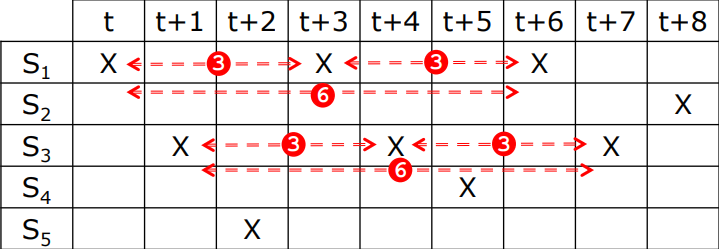
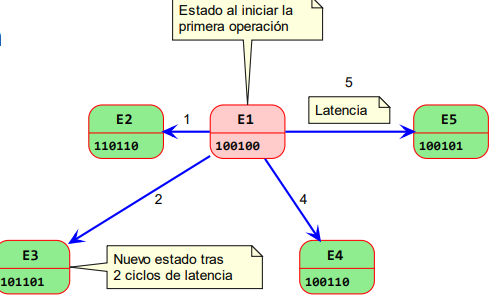
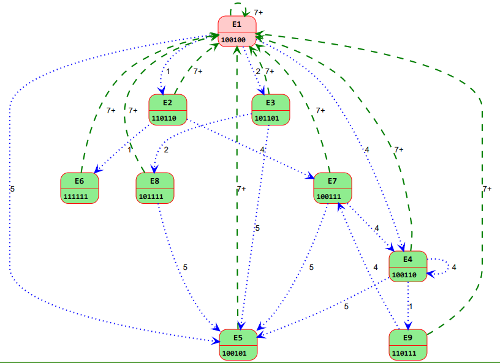
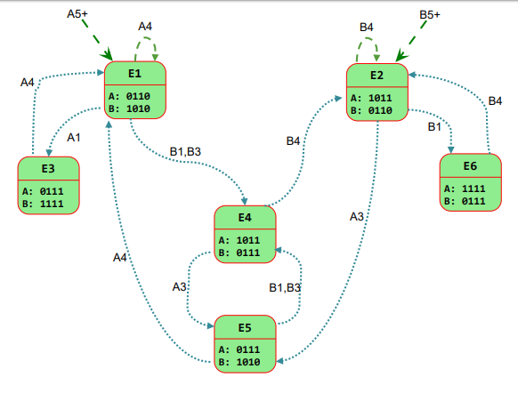

# Tema 3: Segmentación de Unidades Funcionales

## 1. Introducción
* Nos interesa que las etapas del cauce de ejecución sean lo **más homogéneas** posibles a fin de facilitar la ejecución paralela

* Las etapas **IF,ID,MEM y WB** siempre realizan la misma tarea 

* En la etapa **EX** han de efectuarse operaciones diversas de complejidad variable

* **Problema**: Igualar el tiempo de todas las etapas a la más lenta reduciría el rendimiento

* **Solución**: Segmentar las UF de la etapa **EX** (Sumador, multiplicador,etc) de forma que cada subetapa precise un timepo similar al del registro de etapas del caue

## Segmentación de las UF en la etapa EX
* La segmentación es una técnica por la que se divide la ejecución de instrucciones en una **unidad funcional** (`UF`) en varias etapas más simples para mejorar su rendimiento

* Gracias a la segmentación se permite la coexistencia de **datos de distintas operaciones** de varias instrucciones en las ddiferentes etapas en la misma UF

* Nos centraremos en la segmentación de las `UF` **de la etapa EX** en la que varias UF pueden operar en paralelo sobre datos de distintas instrucciones

## Tipos de Segmentación en las UF
**Según ocupación de etapas**
* **Lineal**: Las operaciones pasan por todas las etapas del cauce en orden
    
* **No Lineal**: Las operaciones `no` pasan por todas las etapas del cauce y/o no lo hacen en orden

* **Según funciones soportadasa**
    * **Unifuncional**: El cauce solo contempla la ejecución de un tipo de operación o función
    * **Multifuncoinal**: El cauce contempla la ejecución de `dos o más` tipos de operación o función

## Tablas de Reservas
* Es una matriz en la que los **ciclos** (1,2,...) aparecen como columnas y las **etapas** del caucle de ejecución (S1,S2..) como filas

* Se marca con una **letra identificativa** (A,B,X) el uso de cada etapa a lo largo del tiempo para completar una función

* A partir de la tabla de reservas se obtienen las **latencias prohibidas** y el vector o matrices de **colisiones**

|  | 1 | 2 | 3 | 4 | 
| -- | -- | -- | -- | -- |
| **S1** | `X` |  |  |  | 
| **S2** |  | `X` |  |  | 
| **S3** |  |  |  `X` |  | 
| **S4** |  |  |  |  `X` | 

### Conceptos sobre Latencias
* **Latencia de Inicio**: Númer ode ciclos que tarda una operación para ser completada pasando por todas las etapas

* **Latencia**: tiempo (nº de ciclos) que es necesario esperar antes de introducir una nueva operación en el cauce de la unidad funcional

> En un ciclo **N** se introduce una operación. Transcurridos **X** ciclos (latencia) es posible iniciar una nueva operación

* **Latencia Óptima**: Aquella que produce la menor espera posible y la máxima ocupación potencial del cauce

> La latencia ideal es **1**, algo que es posible en la segmentación lineal pero raramente en la no lineal

* **Colisión**: Situación en el que una etapa del cauce sería ocupada de forma simultánea por dos o más operaciones (**NO** es posible)

* **Latencia Prohibida**: Número de ciclos entre le inicio de dos operaciones que da lugar a una colisión

## Cauces Unificados
* Las latencias prohibidas son aquellas en las que **no resulta posible iniciar** una operación por la ocupación actual del cauce

> Para un cauce **unifuncional** se notan como un conjunto

*Ejemplo* : F = {1,3,6}

* El vector de colisiones es una secuencia de **dígitos binarios** que se forman a partir del conjunto de latencias prohibidas:

`1` en las posiciones en las que no se puede iniciar una nueva operación

`0` en las demás posiciones

*Ejemplo* : F= {1,3,6} -> C= (1 0 0 1 0 1)

(ponemos 1 donde empiecen los números leyendolos desde el final)

* El vector de colisiones nos permitirá después de obtener las **transiciones válidas** entre estados del cauce segmentado

### Ciclos Importantes
* **Ciclo de Latencia**: Secuencia de latencias que se repiten sin que exita una colisión

*Ejemplo*: (1,3) = 1,3,1,3,1,3,1,3 ....

* **Ciclo constante**: Aquel que solo tiene una latencia

*Ejemplo*: (3) = 3,3,3,3,3,3....

* **Ciclo Avaricioso**: Se obtiene a partir de cada estado, seleccionando la opción correspondiente al mínimo tiempo de espera

* **Latencia Media (`LM`)** : suma de las latencias de un ciclo entre el número de operaciones

*Ejemplos*
    * LM(1,3)= (1+3)/2 = 2
    * LM(3) = 3/1 = 3

> LM(Ciclo) = Suma_latencias_ciclo / Nº estados

* El objetivo es encontrar el ciclo con la **mínima latencia media** (MLM). Al minimizar la latencia se consigue un **mayor rendimiento** de la unidad funcional

### Segmentación Lineal
* Todas las **etapas** de la unidad se **ejecutan secuencialmente** y sin repetir etapas ni volver a etapas anteriores

* Las etapas de una unidad funcional también se denominan **estados** o **fases**

* Cada etapa ha de producir su **resultado** antes del siguiente ciclo de reloj

* Los resultados de cada etapa se guardan en registros intermedios (`latches`)

* En una unidad con segmentación lineal, la **tabla de reservas** es trivial ya que coincide **siempre** con la diagonal principal

#### Ejemplo de cauce lineal unifuncional

**T=1**

|  | 1 | 2 | 3 | 4 | 
| -- | -- | -- | -- | -- |
| **S1** | `X1` |  |  |  | 
| **S2** |  | `X1` |  |  | 
| **S3** |  |  |  `X1` |  | 
| **S4** |  |  |  |  `X1` | 

**T=2**

|  | 1 | 2 | 3 | 4 | 
| -- | -- | -- | -- | -- |
| **S1** | `X2` |  |  |  | 
| **S2** | `X1` | `X2` |  |  | 
| **S3** |  | `X1` |  `X2` |  | 
| **S4** |  |  | `X1` |  `X2` | 

**T=3**

|  | 1 | 2 | 3 | 4 | 
| -- | -- | -- | -- | -- |
| **S1** | `X3` |  |  |  | 
| **S2** | `x2` | `X3` |  |  | 
| **S3** | `X1` |  `X2`|  `X3` |  | 
| **S4** |  |  `X1`| `X2` |  `X3` | 

> Este tipo de cauce permite iniciar una nueva operación tras otra con 1  solo ciclo de espera. La latencia de inicio de cauce es 4 y el conjunto de latencias prohibidas está vacío F={} -> C= () , por lo que tiene latencia 1

### Segmenación Lineal

* Las etapas en la unidad funcional **no se ejecutan en orden secuencial** ya que existen etapas que se pueden repeti o saltos hacia atrás

* La latencia de inicio del cauce de una unidad funcional de **3 etapas** que se ejecutan en orden: `S1`,`S2`,`2`,`S3`,`S1`,`S1`y `S3` es de **7 ciclos**

|  | 1 | 2 | 3 | 4 | 5 | 6 | 7 | 
| -- | -- | -- | -- | -- | -- | -- | -- |
| **S1** | `X1` |  | |  | `X1` | `X1` |  
| **S2** |  | `X1` | `X1` | | | | 
| **S3** |  |  |  | `X1` | |  | `X1` | 

### Ejemplo de segmentación no lineal
Tenemos una unidad funcional de **5 etapas** ejecuta el orden de : `S1`,`S3`,`S5`,`S1`,`S3`,`S4`,`S1`,`S3` y `S2`

Intentaremos introducir otra **operación con 1 ciclo de latencia**

**Tabla normal** 

|  | t | t+1 | t+2 | t+3 | t+4 | t+5 | t+6 | t+7 | t+8 | t+9 | t+10 | t + 11 | 
| -- | -- | -- | -- | -- | -- | -- | -- | -- | -- | -- | -- | -- | 
| **S1** | `X1`  | | | `X1` | | `X1` | | | | | | 
| **S2** | | | | | | | | | `X1` | | | |
| **S3** | | `X1` | | `X1` | | `X1` | | | | 
| **S4** | | | | | | `X1` | | | | | 
| **S5** | | | `X1` | | | | | | 

**Intentamos Introducir el ciclo de latencia** 

|  | t | t+1 | t+2 | t+3 | t+4 | t+5 | t+6 | t+7 | t+8 | t+9 | t+10 | t + 11 | 
| -- | -- | -- | -- | -- | -- | -- | -- | -- | -- | -- | -- | -- | 
| **S1** | `X1`  | `X2`| | `X1` |`X2` | `X1` | `X2` | | | | | 
| **S2** | | | | | | | | | `X1` |`X2` | | |
| **S3** | | `X1` | `X2`| `X1` | `X2`| `X1` | `X2` | | | 
| **S4** | | | | | | `X1` | `X2` | | | | 
| **S5** | | | `X1` |`X2` | | | | | 

Como no choca ningún proceso de tipo `X1` con otro de `X2` se puede introducir sin que se produzcan colisiones

**Intentamos el mismo ejercicio pero con 2 ciclos de reloj**

|  | t | t+1 | t+2 | t+3 | t+4 | t+5 | t+6 | t+7 | t+8 | t+9 | t+10 | t + 11 | 
| -- | -- | -- | -- | -- | -- | -- | -- | -- | -- | -- | -- | -- | 
| **S1** | `X1`  | | `X2`| `X1` | | **`X2`** | **`X1`** | |`X2` | | | 
| **S2** | | | | | | | | | `X1` | |`X2` | |
| **S3** | | `X1` | | **`X2`** | **`X1`**|  | **`X2`** | **`X1`** | | **`X2`** |  
| **S4** | | | | | | `X1` | | **`X2`** | | | 
| **S5** | | | `X1` | |`X2`  || | | 

Podemos ver que aún no se producen colisiones

**Observamos el de 3 ciclos donde `SI` se producen colisiones**

|  | t | t+1 | t+2 | t+3 | t+4 | t+5 | t+6 | t+7 | t+8 | t+9 | t+10 | t + 11 | 
| -- | -- | -- | -- | -- | -- | -- | -- | -- | -- | -- | -- | -- | 
| **S1** | `X1`  | | | `X1` `X2` | |   | `X1` `X2` | | | `X2`| | 
| **S2** | | | | | | | | |  `X1`| | | |
| **S3** | | `X1` | |  | `X1` , `X2`|  | |`X1`,`X2` | | | `X2` 
| **S4** | | | | | | `X1` | | |`X2` | | 
| **S5** | | | `X1` | | | `X2`| | | 

**Podemos ver que dos procesos coinciden en el mismo instante por lo que no se podrá introducir dicha operación**

### Procedimiento para un cauce unifuncional no lineal 
1. Se crea la **tabla de reservas** a partir de la operación determinada
2. De la tabla de reservas calculando las distancias entre ocupacioens de cada etapa se obtiene el conjunto de **latencias prohibidas** $F$
3. Se define el **vector de colisiones** $C$ a partir de $F$
4. Partiendo del vector de colisiones se genera el **diagrama de estados** del cauce con los distintos estados en que podrían encontrarse y sus transiciones
5. Del diagrama de estados se obtienen las **latencias de estados** y la **MLM** (Mínima Latencia media)

### Ejemplo paso a paso 
> una Uf que usa un cauce de **5 etapas** en el orden: `S1`,`S3`,`S5`,`S1`,`S3`,`S4`,`S1`,`S3` y `S2`

* La **latencia de inicio** es de 9 ciclos

### Paso 1: Creamos la tabla de Reservas

| t | t+1 | t+2 | t+3 | t+4 | t+5 | t+6 | t+7 | t+8 |
| -- | -- | -- | -- | -- | -- | -- | -- | -- | 
| **S1** | `X` |  |`X` |  |  | `X` |  
| **S2** |  |  |  | | | | |  `X` |
| **S3** |  | `X` |  | `X` | |  | `X` | 
| **S4** | | | | | `X` | | | | 
| **S5** | | `X` | | 

### Paso 2: Obtención de Latencias prohibidas

* Formamos el conjunto de latencias prohibidas quedandonos con las distancias pero sin repeticiones**
F = {3,6}

* Dado F={3,6} podriamos decir que las **latencias permitidas** son las del conjunto P={1,2,4,5} y otras iguales o superiores que 7

###  Paso 3: Definir el vector de colisiones

* La **longitud del vector** de colisiones $C$ será la que indique la latencia prohibida más alta

* El dígito **más a la derecha** de $C$ corresponde con 1
 
* El vector $C$ se forma colocando un `1` en la posición que indique los **elementos del conjunto $F$** de latencias prohibidas y `0` en las demás

*Ejemplos*
Para F={3,6} -> C= (100100)

Para F={2,4,5,7} -> C=(1011010)

Para F={3,5} -> C=(10100)

### Paso 4: Generar el diagrama de estados

* El diagrama de estados es un **grafo cíclico dirigido** en el que los **nodos** representan el estado del cauce segmentado y las **aristas** las transiciones entre ellos y la latencia con la que se producen

* Este grafo se inicia disponiendo como **primer nodo el vector de colisiones** inicial ya que sería el estado del cauce al iniciar la primera operación

* De este estado **surgirán tantas aristas** como dígitos `0` que haya en $C$

* En el cálculo del estado resultante de una transición intervienen: el estado desde que se parte ($E_A$), el estado inicial ($E_I$) y la latencia $l$

* El diagrama de la derecha muestra el estado inicial $E1$ -> 100100 y los estados tras **inicial una nueva operación** pasados 1,2,4 y 5 ciclos que son las **latencias permitidas**

**Para obtener el nuevo vector de colisiones se aplica el siguiente procedimiento**:

1. Se **desplaza** el vector de $E_A$ tantas posicones **a la derecha** como indique la latencia, rellenando con `0` por la izquierda

    $E_A$ = $E_1$ = 100100
    
    1=1

2. Se **hace un or bit a bit** entre el vector desplazado y $E_I$, obteniendose el vector $E_N$

    $E_N$= 010010
    
    $E_I$= 100100  $OR$
    
    __________________.

    $E_N$= 110110
3. Si $E_N$ **coincide** con el vector de algún estado ya existente, se dirige la arista a ese nodo

    $E_N$ <> $E_1$
4. Si $E_N$ **no coincide** con el vector del diagrama de estado, se agrega un nuevo estado al diagrama

    $E_N$ -> $E_2$

* Siguiendo esos 4 pasos, repetimos el procedimiento para todas las latencias permitidas desde el estado inicial $E_1$

* A continuación tomamos como $E_A$ el estado $E_2$ y repetimos los mismos pasos

* El proceso se aplicará a todos los demás estados hasta qu ya no surjan otros nuevos

* Cuando tengamos todos los estados posibles hay que completar el diagrama **agregando** todas las aristas correspondientes a la transición desde cualquier estado **al estado inicial** tras esperar 7 o más ciclos 

* La latencia siempre será la *longitud del vector** de colisiones + 1 

* El signo + añadido tras la latencia denota que esa tansición se produce para el valor indicado y **cualquier valor mayor**, de forma que el mismo arco sirve para 7 ciclos de espera o más

* En lugar de aristas desde todos los estados iniciales también lo podemos denotar como una **sola arista entrante** en $E_1$ sin origen

## Cauces Multifuncionales

* Es un **cauce dinámico** que permite la ejecución de distintas funciones, en lugar de una función fija en el caso de los cauces estáticos o unifuncionales

* Las etapas del cauce serán ocupadas en un **orden diferente según la operación** a ejecutar , de forma que múltiples etapas estarán activas con partes de distintas funciones

* Los **conceptos aprendidos** sobre cauces unifuncionales son aplicables en su mayor parte a los multifuncionales, extendidos para considerar la existencia de varias operaciones

* **Denominaremos** a cada operación de forma distintiva, no genérica: `A` y `B` en vez de `X`

* Exitirán **mútliples conjuntos de latencias** prohibidas según el orden en que se inicien las operaciones

* En lugar de un solo vector de colisiones contaremos con **matrices de colisiones**

> Ejemplo de Matriz de Reservas
Tenemos un cauce con tres etapas que ejecutará dos operaciones posibles. La popración `A` sigue la secuencia `S1`,`S2`,`S3`,`S1`,`S3` y `B` que sigue `S3`,`S1`,`S3`,`S2` y `S1`

|  | t | t+1 | t+2 | t+3 | t+4 | 
| -- | -- | -- | -- | -- | -- |
| **S1** | `A` | `B` | | `A` | `B` | 
| **S2** | | `A` | `B` | | 
| **S3** | `B` |  | `AB` | `A` |

El cauce podría ocuparse por distintas secuencias de operaciones 

**Latencias Prohibidas**Tendremos un conjunto de latencias prohibidas por cada pareja de operaciones posibles en el cauce: `AA`,`BB`,`AB` y `BA` 

* **Notación**: $F_Xy$ para el caso en que se tiene en el cauce una operación $Y$ y se va a introducir una operación $X$ 

$Faa$= {2,3} $Fba$ = {2,4} | $Caa$ = (0110) y $Cba$ = (1010) | $M_A$ = [0110][1010]

* El procedimiento para generar el diagrama de estados es parecido al de lso cauces unifuncionales con las siguientes consideraciones

* Se tienen hasta **dos estados iniciales** cuyos estados son las dos matrices de colisiones

* Cada **arista ha de indicar** no solo la latencia sino también la operación que se inicia en cada una de las latencias permitidas. Se obtendrá una **nueva matriz de colisiones** tras desplazar a la derecha el número adecuado de posiciones y hacer el $OR$ con la matriz inicial 

Para la matrices:
$M_A$= [0110][1010] 
$M_B$= [1011][0110]

