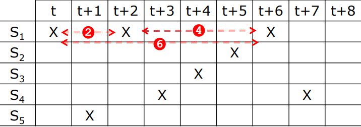
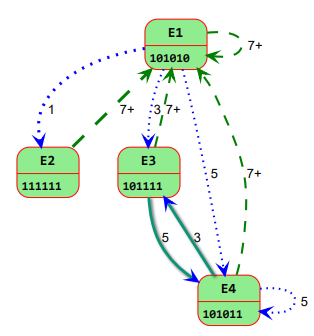
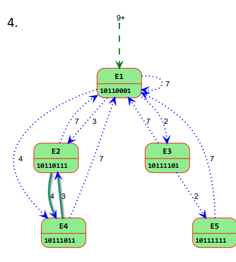
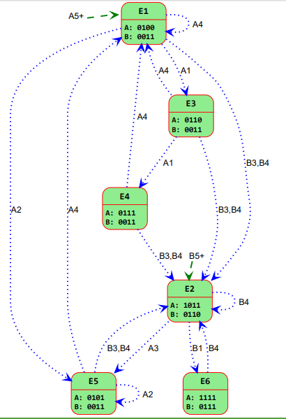
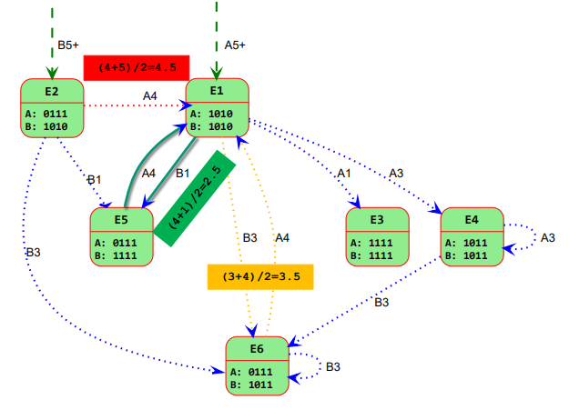

# Ejercicios del Tema 3 AC
**Tenemos un cauce unifuncional no lineal que ejecuta una operación que ocupa las etapas según la secuencia**
> S1, S5, S1, S4, S3, S2, S1, S4. 
Determinar:
1. La tabla de reservas
2. El conjunto de latencias prohibidas
3. El vector de colisiones inicial
4. El diagrama de estados
5. La mínima latencia media (MLM)

> Explicación para estos ejercicios

### **Para la tabla de resevas:** 
**Definición:** Representa la ocupación de las distintas etapas del cauce ($S_1$ a $S_5$) a lo largo del tiempo (instantes $t, t+1, \dots$) al procesar una única tarea

| | t | t+1 | t+2 | t+3 | t+4 | t+5 | t+6 | t+7 | t+8 | 
| -- | -- | -- | -- | --- | -- | -- | -- | -- | -- | 
| **S1** | `X` | | `X`| | | | `X` | | 
| **S2** | | | | | |`X`
| **S3** | | | | |`X` | | |  `X`
| **S4** | | | | `X` | | | 
| **S5** | |`X`| | | | | 

---
### **Para el conjunto de latencias prohibidas:** 
* **Latencia:** Número de ciclos de reloj de diferencia entre la introducción de dos tareas en el cauce

* **Latencias prohibidas ($F$)**: Tiempos entre los cuales la introducción de una nueva tarea causaría una colisión (dos tareas intentando usar la misma etapa simultáneamente). Se obtienen restando las posiciones de las "`X`" en la misma fila

En $S_1$: $\vert{}2 - 0\vert{} = 2$, $\vert{}6 - 2\vert{} = 4$, $\vert{}6 - 0\vert{} = 6$  

$S_4$: $\vert{}7 - 3\vert{} = 4$

$F = \{2, 4, 6\}$

**Latencias permitidas ($P$): Latencias que no provocan colisión ($P = \mathbb{N} \setminus F$)**

$P = \{1, 3, 5, 7+\}$ (donde $7+$ indica cualquier latencia mayor o igual a 7).   

---
### **Para el  vector de colisiones inicial**
**Definición:** Vector binario de longitud $m$ (donde $m$ es la máxima latencia prohibida, aquí $m=6$) que resume qué latencias están prohibidas

* **Formato:** $C = (b_6, b_5, b_4, b_3, b_2, b_1)$ donde el bit $b_k = 1$ si $k \in F$, y $b_k = 0$ en caso contrario

* **Resultado:**
    * $b_6=1, b_5=0, b_4=1, b_3=0, b_2=1, b_1=0$
    * $C = (101010)$

---
### **Diagrama de estados**
* **Definición:** Es un autómata que muestra todas las transiciones válidas entre estados (vectores de colisión) al introducir una tarea tras una latencia permitida $p$

* **Operación de transición**: El nuevo estado $C'$ tras una latencia $p$ se calcula desplandando el estado actual $p$ posiciones a la derecha y haciendo una operación OR lógica ($\vert{}$) con el vector inicial $C$: $C' = (C \gg p) \mid C$

**Estados generados:**
1. **$E_1 = (101010)$ (Estado inicial)**

Latencia $1$: $(101010 \gg 1) \mid 101010 = 010101 \mid 101010 = 111111 \rightarrow$ $E_2 = (111111)$

Latencia $3$: $(101010 \gg 3) \mid 101010 = 000101 \mid 101010 = 101111 \rightarrow$ $E_3 = (101111)$

Latencia $5$: $(101010 \gg 5) \mid 101010 = 000001 \mid 101010 = 101011 \rightarrow$ $E_4 = (101011)$

Latencia $7+$: Vuelve a $E_1$

2. **$E_2 = (111111)$**

Única latencia permitida posible: $7+ \rightarrow$ vuelve a $E_1$

3. **$E_3 = (101111)$**
* **Latencia $5$**: Vuelve a $E_4$   
* **Latencia $7+$**: Vuelve a $E_1$

4. **$E_4 = (101011)$**
* **Latencia $3$**: Vuelve a $E_3$
* **Latencia $5$:** Se mantiene en $E_4$
* **Latencia $7+$:** Vuelve a $E_1$

----
* **Mínima Latencia Media (MLM)**
* **Definición:** Es el promedio de ciclos por tarea que se logra al operar en régimen permanente siguiendo un ciclo simple (secuencia cerrada de transiciones)
* **Ciclos simples identificados:**
* **Ciclo A:** $(1, 7)$ desde $E_1 \rightarrow$ Latencia Media ($LM$) = $\frac{1 + 7}{2} = 4$   
* **Ciclo B:** $(5, 3)$ entre $E_3$ y $E_4 \rightarrow$ Latencia Media ($LM$) = $\frac{5 + 3}{2} = 4$  
* **Resultado:**
$$\text{MLM} = \min(4, 4) = 4$$

## Ejercicio 2
**Tenemos un cauce unifuncional no lineal que ejecuta una operación que ocupa las etapas según la secuencia**
> S1, S2, S2, S3, S4, S4, S5, S2, S1
**Determinar:**
1. La tabla de reservas.
2. El conjunto de latencias prohibidas.
3. El vector de colisiones inicial.
4. El diagrama de estados.
5. La mínima latencia media (MLM)

| | t | t+1 | t+2 | t+3 | t+4 | t+5 | t+6 | t+7 | t+8 |
| -- | -- | -- | -- | -- | -- | -- | -- | -- | -- |
| **S1** | `X` | | | | | | | | `X`
| **S2** | | `X` | `X` | | | | |`X`
| **S3** | | | | `X`
| **S4** | | | | |`X`| `X` 
| **S5** | | | | | | | `X`

### **2. Conjunto de latencias prohibidas ($F$) y permitidas ($P$)**

$S_1$: $\vert{}8 - 0\vert{} = 8$

$S_2$: $\vert{}2 - 1\vert{} = 1$, $\vert{}7 - 1\vert{} = 6$, $\vert{}7 - 2\vert{} = 5$

$S_4$: $\vert{}5 - 4\vert{} = 1$
$$\mathbf{F = \{1, 5, 6, 8\}}$$

> Nota: En $S_2$, las diferencias son: $\vert{}2-1\vert{}=1$, $\vert{}7-2\vert{}=5$ y $\vert{}7-1\vert{}=6$. Por tanto, el conjunto de latencias prohibidas correcto es $F = \{1, 5, 6, 8\}$.$$\mathbf{P = \{2, 3, 4, 7, 9+\}}$$

### **3. Vector de colisiones inicial ($C$)**
Dado $m = 8$ (máxima latencia prohibida), se define como 

$C = (b_8, b_7, b_6, b_5, b_4, b_3, b_2, b_1)$

$$\mathbf{C = (10110000)}$$

### **4. Diagrama de estados**
Transiciones entre estados

* $E_1 = (10110000)$

$p = 2$ → $(00101100) \mid (10110000) = \mathbf{10111100 = E_2}$

$p = 3$ → $(00010110) \mid (10110000) = \mathbf{10110110 = E_3}$

$p = 4$ → $(00001011) \mid (10110000) = \mathbf{10111011 = E_4}$

$p = 7$ → $(00000001) \mid (10110000) = \mathbf{10110001 = E_5}$

$p = 9+$ → $\mathbf{E_1}$

* $E_2 = (10111100)$

$p = 3$ → $(00010111) \mid (10110000) = \mathbf{10110111 = E_6}$

$p = 4$ → $(00001011) \mid (10110000) = \mathbf{10111011 = E_4}$

$p = 7$ → $(00000001) \mid (10110000) = \mathbf{10110001 = E_5}$

$p = 9+$ → $\mathbf{E_1}$

* $E_3 = (10110110)$

$p = 3$ → $(00010110) \mid (10110000) = \mathbf{10110110 = E_3}$

$p = 4$ → $(00001011) \mid (10110000) = \mathbf{10111011 = E_4}$

$p = 7$ → $(00000001) \mid (10110000) = \mathbf{10110001 = E_5}$

$p = 9+$ → $\mathbf{E_1}$

* $E_4 = (10111011)$

$p = 3$ → $(00010111) \mid (10110000) = \mathbf{10110111 = E_6}$

$p = 7$ → $(00000001) \mid (10110000) = \mathbf{10110001 = E_5}$

$p = 9+$ → $\mathbf{E_1}$

* $E_5 = (10110001)$

$p = 2$ → $(00101100) \mid (10110000) = \mathbf{10111100 = E_2}$

$p = 3$ → $(00010110) \mid (10110000) = \mathbf{10110110 = E_3}$

$p = 4$ → $(00001011) \mid (10110000) = \mathbf{10111011 = E_4}$

$p = 7$ → $(00000001) \mid (10110000) = \mathbf{10110001 = E_5}$

$p = 9+$ → $\mathbf{E_1}$

* $E_6 = (10110111)$

$p = 3$ → $(00010111) \mid (10110000) = \mathbf{10110111 = E_6}$

$p = 7$ → $(00000001) \mid (10110000) = \mathbf{10110001 = E_5}$

$p = 9+$ → $\mathbf{E_1}$

### **5. Mínima Latencia Media (MLM)**
Ciclos simples de latencia mínima:

* Ciclo (3) desde $E_3$: $\text{LM} = 3$
* Ciclo (3) desde $E_6$: $\text{LM} = 3$

$$\mathbf{MLM = 3}$$

## Ejercicio 3
**Tenemos un cauce multifuncional que ejecuta dos operaciones que ocupan las etapas según las secuencias**
A -> S1, S2, S3, S1, S2 y B -> S3, S1, S3, S2, S1. Determinar:
1. La tabla de reservas.
2. Los conjuntos de latencias prohibidas.
3. Las matrices de colisiones cruzadas.
4. El diagrama de estados.

| Etapa/Tiempo | t | t+1 | t+2 | t+3 | t+4 | 
| -- | -- | -- | -- | -- | -- |
| **S1** | A | B | | A | B | 
| **S2** | | A | | B | A | 
| **S3** | B | | A,B | | 

---

### **2. Conjuntos de latencias prohibidas**

Se calculan analizando las distancias entre ocupaciones de la misma etapa.

**Función A — $F_{AA}$**

$S_1$: $|3-0|=3$
$S_2$: $|4-1|=3$
$F_{AA}={3}$

**Función B — $F_{BB}$**

$S_1$: $|4-1|=3$
$S_3$: $|2-0|=2$
$F_{BB}={2,3}$

**Colisión cruzada A seguida de B — $F_{AB}$**

$S_1$: $(1,4)-(0,3)\rightarrow1,4,-2,1\Rightarrow{1,4}$
$S_2$: $(3)-(1,4)\rightarrow2,-1\Rightarrow{2}$
$S_3$: $(0,2)-(2)\rightarrow-2,0\Rightarrow{0}$
$F_{AB}={0,1,2,4}$

**Colisión cruzada B seguida de A — $F_{BA}$**

$S_1$: $(0,3)-(1,4)\rightarrow-1,2,-4,-1\Rightarrow{2}$
$S_2$: $(1,4)-(3)\rightarrow-2,1\Rightarrow{1}$
$S_3$: $(2)-(0,2)\rightarrow2,0\Rightarrow{0,2}$
$F_{BA}={0,1,2}$

Tomando los vectores de dimensión $m = 4$ con el formato $(b_4, b_3, b_2, b_1)$, donde la posición $k$ representa la latencia $k$:

* **Vector de autocolisión de A ($C_{AA}$)**: Prohibida latencia 3
$$C_{AA} = (0, 1, 0, 0)$$

* **Vector de autocolisión de B ($C_{BB}$)**: Prohibidas latencias 2 y 3
$$C_{BB} = (0, 1, 1, 0)$$

* **Vector de colisión cruzada de A a B ($C_{AB}$)**: Prohibidas latencias 1, 2 y 4 para iniciar $B$ tras $A$
$$C_{AB} = (1, 0, 1, 1)$$

* **Vector de colisión cruzada de B a A ($C_{BA}$)**: Prohibidas latencias 1 y 2 para iniciar $A$ tras $B$
$$C_{BA} = (0, 0, 1, 1)$$

### **4. Diagrama de estados**

Los estados se representan mediante $(C_A,C_B)$, que indican las colisiones para la siguiente tarea según sea A o B.

Estado inicial: $E_1=(C_{AA},C_{AB})=(0100,1011)$

* Lanzar A ($p\notin F_{AA}$):

$p=1$: $C_A'=(0010)\mid(0100)=0110$, $C_B'=(0101)\mid(1011)=1111\Rightarrow E_2=(0110,1111)$

$p=2$: $C_A'=(0001)\mid(0100)=0101$, $C_B'=(0010)\mid(1011)=1011\Rightarrow E_3=(0101,1011)$

$p=4+$: $\Rightarrow E_1$

* Lanzar B ($p\notin F_{AB}$):

$p=3$: $C_A'=(0000)\mid(0011)=0011$, $C_B'=(0001)\mid(0110)=0111\Rightarrow E_4=(0011,0111)$

$p=5+$: $\Rightarrow E_B=(C_{BA},C_{BB})=(0011,0110)$

### **5. Mínima Latencia Media (MLM)**

Ciclo puro de A: $(1,2)$ repetido: $E_1\xrightarrow{1}E_2\xrightarrow{2}E_3\xrightarrow{2}\dots$
$\text{LM}=\frac{1+2}{2}=1.5$

Ciclo mixto A-B: transición alternativa usando la latencia mínima permitida $1$.

$\boxed{\text{MLM}=1.5}$

## Ejercicio 4
Tenemos un cauce multifuncional que ejecuta dos operaciones que ocupan las etapas según las secuencias
A -> S1, S3, S2, S3, S1, S4 y 
B -> S1, S4, S1, S2, S3, S4. Determinar:
1. La tabla de reservas.
2. Los conjuntos de latencias prohibidas.
3. Las matrices de colisiones cruzadas.
4. El diagrama de estados.
5. La mejor latencia media para ejecutar la secuencia de operaciones ABABABABABA.

| Etapa Tiempo | t | t+1 | t+2 | t+3 | t+4 | t+5 | 
| -- | -- | -- | -- | -- | -- | -- | 
| **S1** | A,B | | B | | A | 
| **S2** | | | A | B | | 
| **S3** | | A | | A | B | | 
| **S4** | | B | | | A | B | 

### **2. Conjuntos de latencias prohibidas**

Se calculan analizando las diferencias absolutas de tiempo entre accesos a la misma etapa:

#### Para la función A ($F_{AA}$):
* **$S_1$:** $|4 - 0| = 4$
* **$S_3$:** $|3 - 1| = 2$

$$F_{AA} = \{2, 4\}$$

---

#### Para la función B ($F_{BB}$):
* **$S_1$:** $|2 - 0| = 2$
* **$S_4$:** $|5 - 1| = 4$

$$F_{BB} = \{2, 4\}$$

---

#### Colisión cruzada de A seguida de B ($F_{AB}$):
Diferencias (Posición B − Posición A $\ge 0$):

* **$S_1$:** $B\{0, 2\}, A\{0, 4\} \Rightarrow 0 - 0 = 0,\ 2 - 0 = 2$
* **$S_2$:** $B\{3\}, A\{2\} \Rightarrow 3 - 2 = 1$
* **$S_3$:** $B\{4\}, A\{1, 3\} \Rightarrow 4 - 1 = 3,\ 4 - 3 = 1$
* **$S_4$:** $B\{1, 5\}, A\{5\} \Rightarrow 5 - 5 = 0$

$$F_{AB} = \{0, 1, 2, 3\}$$

---

#### Colisión cruzada de B seguida de A ($F_{BA}$):
Diferencias (Posición A − Posición B $\ge 0$):

* **$S_1$:** $A\{0, 4\}, B\{0, 2\} \Rightarrow 0 - 0 = 0,\ 4 - 0 = 4,\ 4 - 2 = 2$
* **$S_2$:** $A\{2\}, B\{3\} \Rightarrow \text{Ninguna } \ge 0$
* **$S_3$:** $A\{1, 3\}, B\{4\} \Rightarrow \text{Ninguna } \ge 0$
* **$S_4$:** $A\{5\}, B\{1, 5\} \Rightarrow 5 - 1 = 4,\ 5 - 5 = 0$

$$F_{BA} = \{0, 2, 4\}$$

### **3. Matrices de colisiones cruzadas (Vectores iniciales)**
Con dimensión $m = 4$, representamos los vectores binarios $(b_4, b_3, b_2, b_1)$:

$C_{AA} = (1010)$ (prohibidas latencias 2 y 4)

$C_{BB} = (1010)$ (prohibidas latencias 2 y 4)

$C_{AB} = (0111)$ (prohibidas latencias 1, 2 y 3)

$C_{BA} = (1010)$ (prohibidas latencias 2 y 4)

### **4. Diagrama de estados**

Los estados se definen por el par $(C_A, C_B)$ según si la siguiente tarea a lanzar sea $A$ o $B$.

#### Estado inicial ($E_1$ - tras lanzar A):
$$E_1 = (C_{AA}, C_{AB}) = (1010, 0111)$$

---

#### Transiciones principales desde $E_1$:

1. **Lanzar A en $E_1$** ($p \notin F_{AA} \rightarrow p \in \{1, 3, 5+\}$):
   * **$p = 1$:** 
     * $C_A' = (0101) \mid (1010) = \mathbf{1111}$
     * $C_B' = (0011) \mid (0111) = \mathbf{0111}$
     * $\rightarrow \mathbf{E_2 = (1111, 0111)}$

   * **$p = 3$:** 
     * $C_A' = (0001) \mid (1010) = \mathbf{1011}$
     * $C_B' = (0000) \mid (0111) = \mathbf{0111}$
     * $\rightarrow \mathbf{E_3 = (1011, 0111)}$

   * **$p = 5+$:** Vuelve a $E_1$

---

2. **Lanzar B en $E_1$** ($p \notin F_{AB} \rightarrow p \in \{4, 5+\}$):
   * **$p = 4$:** 
     * $C_A' = (0000) \mid (1010) = \mathbf{1010}$
     * $C_B' = (0000) \mid (1010) = \mathbf{1010}$
     * $\rightarrow \mathbf{E_4 = (1010, 1010)}$

   * **$p = 5+$:** Vuelve al estado inicial de $B$: 
$$E_B = (C_{BA}, C_{BB}) = (1010, 1010)$$

### **5. Mejor latencia media para la secuencia $ABABABABA$**

Para ejecutar la secuencia alternada $A \rightarrow B \rightarrow A \rightarrow B \dots$, nos interesan los tiempos mínimos para transicionar de $A$ a $B$ ($p_{AB}$) y de $B$ a $A$ ($p_{BA}$):

* **De $A$ a $B$** ($F_{AB} = \{0, 1, 2, 3\}$): La menor latencia permitida es **$p_{AB} = 4$**.
* **De $B$ a $A$** ($F_{BA} = \{0, 2, 4\}$): La menor latencia permitida es **$p_{BA} = 1$**.

---

#### Secuencia de ejecución:

* **Tarea 1 (A):** $t = 0$
* **Tarea 2 (B):** $t = 0 + 4 = 4$
* **Tarea 3 (A):** $t = 4 + 1 = 5$
* **Tarea 4 (B):** $t = 5 + 4 = 9$
* **Tarea 5 (A):** $t = 9 + 1 = 10$
* **Tarea 6 (B):** $t = 10 + 4 = 14$
* **Tarea 7 (A):** $t = 14 + 1 = 15$
* **Tarea 8 (B):** $t = 15 + 4 = 19$
* **Tarea 9 (A):** $t = 19 + 1 = 20$
* **Tarea 10 (B):** $t = 20 + 4 = 24$
* **Tarea 11 (A):** $t = 24 + 1 = 25$

---

#### Cálculo de la latencia media:

* **Número de intervalos entre las 11 tareas:** 10 intervalos (5 de $p = 4$ y 5 de $p = 1$).
* **Tiempo total transcurrido para lanzar las 11 tareas:** 25 ciclos.

$$\text{LM} = \frac{5 \times 4 + 5 \times 1}{10} = \frac{25}{10} = \mathbf{2.5 \text{ ciclos/tarea}}$$