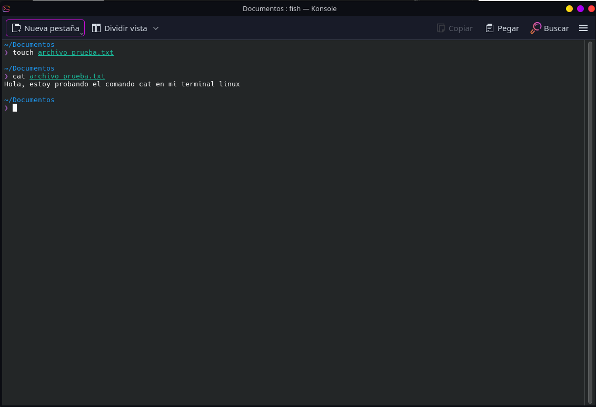

# Apuntes Linux (Básico)

# ¿Qué es Linux?

Para empezar vamos a ver que es linux. Debemos saber antes que nada que Linux **no es un sistema operativo** como lo son Windows o macOS sino que es linux es el núcleo o kernel y a partir de este núcleo es que se crean las **distribuciones/distros** que son los sistemas operativos que podemos usar.

#### ¿Hace falta poner 10000 comandos hasta para cambiar el fondo de pantalla en linux?
Evidentemente no. Hay muchas grandes distribuciones que tienen una **interfaz gráfica** amigable y muy fáciles de usar.
El uso de terminal aunque al principio asusta y no se entiende es mucho más simple de lo que parece. Veremos como usar los comandos necesarios para manejar una distribución de linux decentemente.

### ¿Por qué usar la terminal en vez de usar la interfaz gráfica como siempre?
* **Velocidad y Automatización:** Es mucho más rápido escribir `mkdir carpetas_{1..100}` (crea 100 carpetas) que hacer clic derecho -> "Nueva carpeta" cien veces.
* **Consumo de recursos:** Al usar un servicio en una empresa en un servidor en la nube con Linux no tiene interfaz gráfica (ventanas, botones, fondos de pantalla). Todo ese ahorro de memoria RAM se usa para que las aplicaciones web vuelvan volando.  (Porque sí, cualquier gran empresa usa Linux en sus servidores y servicios por que es mucho más eficiente, rápido y permisivo que Windows).

 Y ya no solo en un servidor si no en nuestro ordenador personal; mientras que usando Windows nuestro ordenador usa de 6 a 8 GB de RAM nada más encenderse o por tener un par de pestañas en el navegador por culpa de todos los servicios innecesarios que usa Windows, una distro de linux usará unas 2GB al encenderse ya que gestiona muchísimo mejor los recursos.

### ¿Cómo se estructura una distro de linux?

Debemos saber que a diferencia de windows que todo parte del disco C: en linux todo parte del directorio raiz `/`. También en linux **todo** es un archivo desde un fichero de texto hasta un teclado que enchufes es interpretado como un archivo:

Aquí podemos ver las carpetas que componen el sistema. 

¿Qué contiene cada carpeta?

### Ejecutables y Sistema Core
* **`/bin`** *(Binaries)*: Contiene los comandos esenciales que usan todos los usuarios (como `ls`, `cd`, `cp`).

* **`/sbin`** *(System Binaries)*: Similar a `/bin`, pero guarda comandos exclusivos para el administrador del sistema (como herramientas para formatear discos, apagar el PC, etc.).
* **`/boot`**: Aquí residen los archivos necesarios para que el ordenador pueda arrancar, incluyendo el mismísimo corazón de Linux (el Kernel) y el gestor de arranque (GRUB).

### Configuración, Usuarios y Librerías

* **`/etc`**: El cerebro del sistema. Aquí dentro se guardan prácticamente todos los archivos de configuración de el PC y de los programas que instalemos. Son archivos de texto que puedes editar.

* **`/home`**: Dentro habrá una carpeta con tu nombre (ej. `/home/<nombre_usuario>/`) donde se guardan tus descargas, documentos y configuraciones personales. Aquí está a los que estamos acostumbreados de "Descargas", "Documentos, "Imagenes"...

* **`/root`**: Es la carpeta personal del súper-usuario administrador (`root`).

* **`/lib` y `/lib64`** *(Libraries)*: Contienen las bibliotecas de código esenciales que los comandos de `/bin` y `/sbin` necesitan para poder ejecutarse. Son el equivalente a los archivos `.dll` de Windows.

###  Hardware y Archivos Virtuales

* **`/dev`** *(Devices)*: Como hemos dicho Linux trata a los componentes físicos como archivos. Aquí dentro encontramos accesos al disco duro (como ese `nvme0n1p6` que aparece arriba en la captura), el teclado, los puertos USB o el ratón.

* **`/proc`** *(Processes)*: Es una carpeta virtual "fantasma". No existe en el disco duro, sino en la memoria RAM. Contiene información en tiempo real sobre el procesador y los programas que se están ejecutando en este preciso instante.

* **`/sys`** *(System)*: Otra carpeta virtual creada por el Kernel para interactuar directamente con los controladores (*drivers*) y el hardware del ordenador.

### Almacenamiento, Servicios y Temporales

* **`/mnt`** *(Mount)*: El lugar donde se "montan" o conectan temporalmente discos duros externos, particiones de Windows o unidades de red para poder usarlas.

* **`/opt`** *(Optional)*: Carpeta para programas de terceros que no siguen la estructura clásica de Linux (por ejemplo, si instalas Google Chrome, Discord o DaVinci Resolve, suelen meterse aquí ya que no pertenecen nativamente a linux).

* **`/srv`** *(Service)*: Si usamos nuestro ordenador como servidor para alojar una página web o un servidor, los archivos que se muestran al público se suelen guardar aquí.

* **`/run`**: Guarda datos técnicos sobre el sistema que se está ejecutando desde el último arranque (como qué usuarios han iniciado sesión). Se vacía al apagar el PC.

* **`/tmp`** *(Temporary)*: Aquí los programas guardan archivos temporales mientras los usan. En la captura tiene un **reloj** porque todo lo que dejemos aquí dentro **se borrará automáticamente** cuando reiniciemos el ordenador.

### El grueso del sistema
* **`/usr`** *(User System Resources)*: Históricamente significaba "User", pero hoy en día es donde se instala gran parte de los programas, iconos, fuentes y fondos de pantalla que usamos día a día. Tiene su propio `/usr/bin` y `/usr/lib` dentro.

* **`/var`** *(Variable)*: Guarda archivos cuyo tamaño cambia constantemente mientras usamos el ordenador. El ejemplo más claro son los registros del sistema (*logs*, que anotan cada error o evento), cachés y bases de datos.

**No es necesario** saber toda esta información para poder usar linux pero es algo que está bien saber.
 
 

### Comandos básicos para movernos por el sistema

Para abrir una terminal la podemos abrir desde la interfaz gráfica o con el atajo `Ctrl +  Alt + T`.

Nada más abrir una terminal esta se abrirá en el directorio personal, es decir, la carpeta "home" que hemos visto antes.

Igualmente, si en algún momento no sabemos exactamente en que directorio estamos podemos usar:
 
 > `pwd`

 y esto nos dirá donde estamos exactamente. 

 Ejemplo: 

 Si queremos ver el contenido del directorio en el que estamos usamos:

 > `ls`

 Esto nos muestra una lista de los archivos y carpetas que hay en el directorio en el que nos encontramos.

 Ejemplo:  

 `ls` tiene muchos parámetros para mostrar más o menos información en la lista, para verlo más en detalle podemos consultarlo aquí:

 * [Información para `ls`](https://cheat.sh/ls)

Para movernos entre carpetas utilizamos `cd`. Por ejemplo, si queremos ir a la carpeta Documentos hacemos:

> `cd Documentos/`

Tenemos dos opciones para movernos:
1. **Ruta relativa:** Usar la ruta a partir de donde estemos (`cd Documentos/`).
2. **Ruta absoluta:** Usar la ruta completa desde nuestra carpeta personal usando el símbolo `~` (`cd ~/Documentos`, donde la `~` representa nuestro *home* o directorio personal).

Si queremos movernos un directorio hacia arriba (volver atrás), usamos:

> `cd ..`

Es útil saber que cuando estamos poniendo rutas o comandos siempre podemos usar la tecla 'tabulador' que nos "autocompletará" lo que estamos escribiendo por ejemplo: 

Hay diferentes tipos de terminales, aunque el autocompletado no aparezca en pantalla podemos usar tabulador y lo escribirá igualmente.

### Comandos para crear y eliminar cosas

Si queremos crear una carpeta es tan sencillo como:

> `mkdir <nombre_carpeta>`

y nos creará un directorio con el nombre que hemos puesto en el directorio donde estemos en ese momento.
('mkdir' viene de 'make directory')

O si queremos crear una rama de carpetas como por ejemplo "Documentos/universidad/primer_curso/apuntes/" podemos usar:

> `mkdir -p Documentos/universidad/primer_curso/apuntes/`

Tambien podemos crear archivos con:

> `touch <nombre_archivo>.txt`

Eso nos creará un archivo de texto (al poner la extensión 'txt' pero podemos poner la extensión que queramos y creará un archivo de ese formato). Además touch sirve para modificar los archivos ya existentes como la fecha de creación u otras propiedades. Podemos consultar más información aquí:

[Comando `touch` completo](https://cheat.sh/touch)

Si queremos mover un archivo o una carpeta a otro sitio usaremos `mv`, por ejemplo vamos a mover un archivo de la carpeta Descargas a nuestra carpeta Documentos:

> `mv ~/Descargas/archivo.txt ~/Documentos/mi_carpeta`

La estructura a seguir es `mv` + ruta donde está el archivo + ruta donde queremos moverlo.

**¡Ojo!** `mv` no solo sirve para mover archivos o carpetas, tambien sirve para renombrar, para eso solo tenemos que 'mover' un archivo o carpeta al mismo sitio donde está poniendole un nombre diferente, por ejemplo, voy a cambiarle el nombre de un archivo de "apuntes.txt" a "ejercicios.txt"

> `mv ~/Documentos/apuntes.txt ~/Documentos/ejercicios.txt`

Para ver los distintos parámetros que podemos aplicar al comando `mv` para que, por ejemplo, sobreescriba los archivos que movemos, podemos consultarlo aqui:

[Comando mv completo](https://cheat.sh/mv)

Si lo que queremos es copiarlo a otro directorio usaremos `cp`:

> `cp ~/Descargas/archivo.txt ~/Documentos/mi_carpeta` 

Si queremos copiar un directorio usaremos:

> `cp -r ~/Descargas/mis_fotos ~/Documentos/mi_carpeta`

[Comando cp completo](https://cheat.sh/cp)

Ahora vamos a ver el comando para eliminar cosas con el que hay que tener mucho ojo:

Si queremos eliminar un archivo usamos:

> `rm ~/Documentos/mi_archivo.txt`

Y si queremos borrar recursivamente una carpeta y todas sus subcarpetas de dentro usamos:

> `rm -rf ~/Documentos/mis_carpetas`

Con esto hay que tener cuidado ya que como hemos visto en linux todo son carpetas y archivos, es decir, que si ponemos `rm -rf /` eliminará **todo** desde el directorio raiz, es decir, nos quedamos sin sistema. De normal este comando no nos dejará ejecutarlo ya que necesitará permisos de administrador el cual se concede poniendo `sudo` al inicio del comando. Además en las versiones de hoy en día el propio sistema te dirá "tu pc va a implosionar si haces esto" y no te permitirá hacerlo a no ser que por alguna razón quieras hacerlo y le especifiques en el comando `--no-preserve-root`

Siempre que pongamos `sudo` al inicio ese comando se ejecutará con permisos de administrador y nos pedirá la contraseña de usuario antes de ejecutarse.

[Comando rm completo](https://cheat.sh/rm)

### Comandos para ver o editar archivos

Si queremos ver lo que hay dentro de un archivo sin tener que abrirlo podemos usar `cat`, por ejemplo:

> `cat ~/Documentos/archivo_prueba.txt`

En caso de que sepamos que el archivo es muy grande, para que no pete la terminal podemos usar  `less`:

> `less ~/Documentos/archivo_muy_largo.txt`

Nos muestra el contenido como cat pero en el que podremos ir subiendo o bajando para no crashear la terminal, si queremos salir de esta lectura usaremos `Q`

Por otro lado, si queremos editar un archivo sin necesidad de abrir un editor de texto podemos hacerlo desde el propio editor que tiene la terminal `nano`, ejemplo:

**¿Cómo se maneja Nano?**
Como estás dentro de la terminal, los ratones no funcionan. Te mueves con las flechas del teclado y abajo del todo verás un menú con atajos. El símbolo `^` significa la tecla **`Ctrl`**:

* **Para Guardar:** Pulsa `Ctrl + O` y luego dale a `Enter` (confirma el nombre).
* **Para Salir:** Pulsa `Ctrl + X`. (Si hiciste cambios y no guardaste, te preguntará si quieres guardarlos con `Y` o `N`).

### Sistema de permisos 

El sistema de permisos en linux es muy importante debido a que es un sistema muy seguro y muy cerrado con respecto a quien puede tocar que cosas. Por eso habrá veces que si intentas mover algún archivo o ejecutar algún script te dirá `Permission denied`.

Para ver los permisos que tiene cada archivo podemos usar como vimos `ls` con la flag `-l`:

#### ¿Qué significa cada cosa?

1. **El primer carácter:** Te dice qué tipo de objeto es:
   * `-` = Es un archivo normal.
   * `d` = Es un directorio (carpeta).
   * `l` = Es un enlace (acceso directo).

2. **Los siguientes 9 caracteres:** Se dividen en **3 bloques de 3 letras**:
   * **Bloque 1 (`rw-`):** Permisos del **Dueño** (*User* / el usuario que creó el archivo).
   * **Bloque 2 (`r--`):** Permisos del **Grupo** (*Group* / usuarios que pertenecen al mismo grupo de trabajo).
   * **Bloque 3 (`r--`):** Permisos del **Resto del mundo** (*Others* / cualquier otra persona en el PC).

### ¿Y qué significa cada letra?
    
* **`r`**: (*Read*) Es el permiso de **lectura**, es decir, puedes abrirlo y ver lo que hay dentro 
* **`w`**: (*Write*) Permiso de **escritura**. Permite modificar o editar lo que hay dentro o  borrar el archivo
* **`x`**: (*Execute*) Permiso de **ejecución**. Permite ejecutar el archivo como si fuera un programa (usado sobre todo en scripts)
* **`-`**: (*Guión*) Permiso desactivado.

#### ¿Cómo cambiamos los permisos?

Para cambiar los permisos de un archivo usamos `chmod` (*Change Mode*). Podemos usarlo de la manera fácil (con las letras) o la manera difícil (con números).

1. Usando letras:

Usamos **`+`** o **`-`** para añadir o quitar permisos y especificamos a quien (`u` dueño, `g` grupo, `o` otros, `a` todos)

- Dar permiso de ejecución: 
> `chmod u+x script.sh`
- Quitar permisos de escritura a todo el mundo:
> `chmod a-w archivo.txt`
- Dar permiso de ejecucion a todo el mundo:
> `chmod +x programa`

2. Usando números:
Consiste en darle un valor numérico a cada permiso:
* **Read (`r`)** = 4
* **Write (`w`)** = 2
* **Execute (`x`)** = 1
* **Sin permiso (`-`)** = 0

Para dar permisos, simplemente **sumamos los números** de lo que quieres permitir para cada uno de los 3 bloques (Dueño, Grupo, Otros):

* Si quieres que el Dueño tenga **Lectura (4) + Escritura (2) = 6**, y el resto solo **Lectura (4)**:
  > `chmod 644 notas.txt`
* Si quieres que sea un programa ejecutable donde el Dueño hace todo **(4+2+1 = 7)** y los demás leen y ejecutan **(4+1 = 5)**:
  > `chmod 755 mi_programa.sh`

Hacer `chmod 777` es una chapuza y un agujero de seguridad ya que le estás dando **todos** los permisos a **todos** los usuarios.

[Comando chmod completo](https://cheat.sh/chmod)

La diferencia entre **`chmod`** y **`chown`** es que como hemos visto `chmod` cambia los permisos y `chown` cambia el dueño de un archivo.
Por ejemplo si un archivo pertenece a `root` y quiero que sea mio hago:

> `sudo chown valentin_villa05 archivo.txt`

¿Por qué usamos `sudo`? Un cambio de propietario suele ser imortante, por lo tanto, necesitaremos permisos de administrador.

### Redirecciones, pipes y filtros...

El punto de todos estos comandos está en que no solo podemos usarlos uno a uno individualmente sino que podemos conectarlos entre sí.

1. Para empezar tenemos las **redirecciones** (`>` y `>>`):
Cuando hacemos un `cat`, `less`, `ls`, etc el contenido sale por pantalla directamente en la terminal pero podemos hacer que en vez de eso se guarde en un archivo. Para hacerlo hacemos:

> `cat ~/Documentos/archivo_prueba.txt > ~/Documentos/redirecciones.txt`

o 

> `cat ~/Documentos/archivo_prueba.txt >> ~/Documentos/redirecciones.txt`

#### ¿Qué diferencia hay entre uno y otro?

* `>` Sobreescribe lo que haya en el archivo.
* `>>` Añade a lo que ya haya en el archivo.

2. También tenemos las 'pipes' (`|`):

Esto sirve para canalizar datos. Es decir, coge lo que genera el comando de la izquierda y se lo envía al comando de la derecha.

3.  El buscador `grep`:

Es un comando que sirve para buscar una palabra dentro de un archivo.

Ejemplo:

> `grep "universidad" ~/Documentos/apuntes.txt`

*(Te mostrará en pantalla únicamente las líneas del archivo donde aparezca la palabra "universidad").*

Podemos combinarlo junto al pipe. Ejemplo: 

Vamos a ver el historial de comandos que hemos usado pero solo quiero ver los comandos de git que haya puesto:

> `history | grep "git"`

[Comando `grep` completo](https://cheat.sh/grep)

4. `find`:

Mientras que `grep` sirve para buscar alguna palabra dentro de un archivo, `find` sirve para buscar archivos. Útil por si no sabes donde guardaste un archivo.

La estructura básica es: `find [dónde buscar] [criterio] [qué buscas]`.

* **Buscar un archivo por su nombre exacto en la carpeta actual (`.`) y sus subcarpetas:**
> `find . -name "ejercicios.txt"`

* **Buscar sin importar mayúsculas o minúsculas:**
> `find . -iname "EjErCiCiOs.txt"`

*(El flag `-iname` ignora si está en mayúsculas o minúsculas).*

* **Buscar solo carpetas que contengan una palabra:**
> `find . -type d -name "*universidad*"`

*(El flag `-type d` le dice que busque solo directorios/carpetas. Si quisieramos buscar solo archivos usarías `-type f`).*

[Comando `find` completo](https://cheat.sh/find)