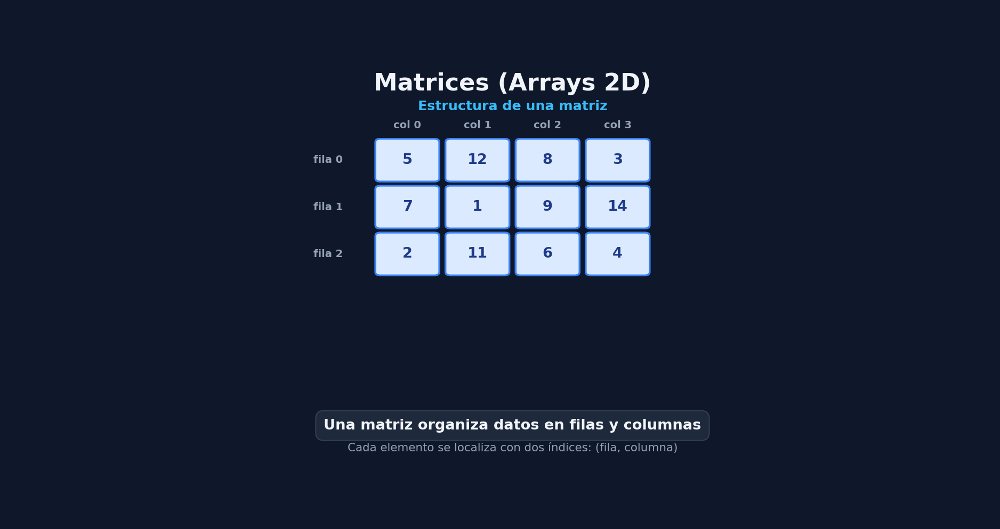

# Matrices y Conjuntos de Bits

En esta lección se estudian dos formas avanzadas de organización de datos: **las matrices** (arrays bidimensionales/multidimensionales) y **los conjuntos de bits** (Bitset), analizando su representación en memoria, implementación mediante plantillas en C++ y su eficiencia algorítmica.

#### Representación:

## Parte I : Matrices
### 1. Definición:
Una matriz o array bidimensional de tamaño $n \times m$ es **un contenedor secuencial que almacena objetos del mismo tipo en una zona contigua de memoria**, utilizando dos índices: uno para las **filas** ($n$) y otro para las **columnas** ($m$)

#### Tipos de asignación:
* **Estática (Stack):** Tamaño fijo definido en **tiempo de compilación**
```cpp
int a[5][4]; // Matriz estática de 5 filas y 4 columnas
```
* **Dinámica (Heap):** Mediante un array de punteros a vectores
```cpp
int n = 5, m = 4;
int** b = new int*[n]; // Array de n punteros a fila
for (int i = 0; i < n; i++) {
    b[i] = new int[m]; // Cada fila reserva m columnas
}

// Liberación obligatoria
for (int i = 0; i < n; i++) delete[] b[i];
delete[] b;
```

### 2.La Clase Matemática Matriz<T> en C++ 
Implementación genérica mediante **plantillas (*templates*)** que **permite operar con matrices de cualquier tipo** (enteros, reales, números complejos) sobrecargando los operadores matemáticos estándar

```cpp
#include <iostream>
#include <stdexcept>

template <typename T>
class Matriz {
private:
    unsigned n, m; // Filas (n) y Columnas (m)
    T** mat;

public:
    // Constructor y Destructor
    Matriz(unsigned nn, unsigned mm, const T& dato);
    Matriz(const Matriz<T>& orig); // Constructor copia
    ~Matriz();

    // Operadores
    Matriz<T>& operator=(const Matriz<T>& orig);
    T& operator()(unsigned i, unsigned j); // Acceso L/E

    Matriz<T> operator+(const Matriz<T>& a) const;
    Matriz<T>& operator+=(const Matriz<T>& a);
    Matriz<T> operator*(const Matriz<T>& a) const;

    unsigned nFilas() const { return n; }
    unsigned nColum() const { return m; }
};
```

#### Implementación del acceso y multiplicación:
``` cpp
// Acceso Lectura/Escritura con control de rango
template <typename T>
T& Matriz<T>::operator()(unsigned i, unsigned j) {
    if (i >= n || j >= m) throw std::out_of_range("Índice fuera de rango");
    return mat[i][j];
}

// Multiplicación de matrices: O(n * m * p)
template <typename T>
Matriz<T> Matriz<T>::operator*(const Matriz<T>& a) const {
    if (m != a.n) throw std::invalid_argument("Dimensiones incompatibles");
    Matriz<T> result(n, a.m, T());
    for (unsigned i = 0; i < n; i++) {
        for (unsigned j = 0; j < a.m; j++) {
            result.mat[i][j] = 0;
            for (unsigned k = 0; k < m; k++) {
                result.mat[i][j] += mat[i][k] * a.mat[k][j];
            }
        }
    }
    return result;
}
```

## Parte II: Conjuntos y Conjuntos de Bits (Bitset)
### 1. Definición de Conjunto
Un conjunto $P$ es una **colección de elementos sin orden predeterminado y sin elementos repetidos**

**Definiciones: **

| Representación | Significado|
| ------------- | ---------- |
| **x ∈ P** | x es miembro del conjunto P |
| **P = ∅** | P es el conjunto vacío |
| **P⊆Q** |  P es un subconjunto del conjunto Q| 
| **P⋃Q** | (unión) todos los elementos de P OR Q|
| **P⋂Q** | (intersección) los elementos de P AND Q|
|**P-Q** |  resta, los elementos de P que no estén en Q |

#### Representación:

### 2. Comparativa: Vectores de Datos vs. Conjunto de Bits (Bitset)
| Criterio | Conjunto basado en Vector | Conjunto de Bits (Bitset) |
| --- | -- | --- |
| **Representación** | Un elemento por cada posición del vector | Un bit por cada elemento posible (1 = presente, 0 ausente) |
| **Cosumo de memoria** | Alto $(n \times sizeof(T))$ | Muy bajo (1 byte empaqueta 8 elementos/bits)|
| **Inserción / Borrado / Existe** | O(n) (recorrido previo para evitar repetidos) | O(1) (operaciones de desplazamiento bit a bit)|
| **Unión / Intersección / Resta** | O(n²) (bucle anidado comprobando existencia ) | O(n) (Operaciones `OR`,`AND`, `NOT` a nivel de byte)
| **Versatilidad** | Alta (admite cualquier Tipo T) | Limitada (enteros acotados a un rango conocido) |

### 3. Implementación del `Bitset` en C++

Para mapear un entero $n$ dentro de la estructura de bytes:
* **Byte a acceder**: $n/8$
* **Bit dentro del byte**: n%8

``` cpp
#include <iostream>
#include <cmath>

class Bitset {
protected:
    char* arr;
    int tama; // Tamaño físico en bytes

public:
    Bitset(int max) {
        tama = std::ceil((float)(max + 1) / 8); // Cálculo de bytes necesarios
        arr = new char[tama](); // Inicializado a 0
    }

    ~Bitset() { delete[] arr; }

    // Inserción mediante máscara OR: O(1)
    void inserta(int ele) {
        char mascara = 1 << (ele % 8);
        arr[ele / 8] |= mascara;
    }

    // Eliminación mediante máscara AND y NOT (~): O(1)
    bool elimina(int ele) {
        char mascara = 1 << (ele % 8);
        arr[ele / 8] &= ~mascara;
        return true;
    }

    // Comprobación de pertenencia: O(1)
    bool contiene(int ele) const {
        char mascara = 1 << (ele % 8);
        return (arr[ele / 8] & mascara) != 0;
    }

    // Unión (A U B) mediante operador de bit OR (|): O(n)
    Bitset operator+(const Bitset& b) const {
        int minTama = (tama < b.tama) ? tama : b.tama;
        int maxTama = (tama > b.tama) ? tama : b.tama;
        
        Bitset res(maxTama * 8 - 1);
        
        // Copiar el más grande
        const Bitset& mayor = (tama > b.tama) ? *this : b;
        for (int i = 0; i < mayor.tama; i++) res.arr[i] = mayor.arr[i];

        // Aplicar OR con el más pequeño
        for (int i = 0; i < minTama; i++) {
            res.arr[i] = arr[i] | b.arr[i];
        }
        return res;
    }
};
```
## Ventajas y Desventajas
### Matrices
#### Ventajas:
* **Acceso directo inmediato**: Lectura y escritura en tiempo constante O(1) usando los índices de fila y columna
* **Localidad espacial**: Al ocupar posiciones contiguas en memoria , aprovechan eficientemente la caché del procesador
* **Modelado matemático directo**: Permiten representar de forma natural tablas, imágenes, grafos (matrices de adyacencia) y sistemas de ecuaciones mediante la sobrecarga de operadores
#### Desventajas:
* **Tamaño rígido o costoso de redimensionar**: En matrices dinámicas, cambar la dimensión exige relocalizar y copiar bloques de memoria completos
* **Insumo de memoria estático**: Se debe reservar espacio para la totalidad de las casillas ($n \times m$), resultado ineficiente si la matriz es dispersa (cntiene mayoritariamente ceros)
---
### Bitset
#### Ventajas:
* **Ahorro masivo de memoria**: Reduce el consumo hasta en un factor de 8 (1 byte empaqueta 8 elementos) en comparación con un array de `bool` o de enteros
* **Operaciones superrápidas ($O(1)$ y $O(n)$)**: Inserción, borrado y comprobación se realizan en $O(1)$ mediante desplazamiento de bits. Operaciones de conjuntos (unión, intersección, resta) se ejecutan a nivel de hardware con instrucciones lógicas nativas (`AND`, `OR`, `NOT`). 

#### Desventajas:
* **Rango acotado**: Solo sirve para conjuntos cuyos elementos sean enteros no negativos dentro de un rango prefijado.  
* **Poco versátil**: No permite almacenar objetos complejos o tipos de datos genéricos (cadenas, estructuras) como sí lo hace un vector estándar