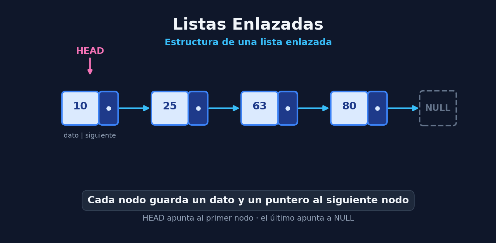

# Listas enlazadas (Linked List)

### ¿ Qué es una Lista Enlazada? 
Es una estructura de datos similar a los arrays formada por elementos llamados **nodos**. 

Un nodo se representa de la siguiente manera:
```text
┌─────────┬─────────────┐
│  Dato   │  Siguiente  │
└─────────┴─────────────┘
```
* Dato: valor que queremos almacenar
* Siguiente: una referencia/puntero que indica donde está el **siguiente nodo**

> Aclaración: El último nodo debe de tener el puntero asignado a `nullptr`

A diferencia de un array, **los nodos no tienen porqué estar juntos en memoria**. Pueden estar en posiciones completamente diferentes y conectadas por punteros

Al primero de los nodos se le conoce como **`cabecera`** y al último **`cola`**


## Representación

---

### 1. Comparativa de Complejidad: Vector Dinámico vs. Lista Enlazada

| Operación | Vector Dinámico | Lista Simplemente Enlazada |
|---------- | --------------- | -------------------------- | 
| **Acceso / Lectura por índice** | O(1) | O(n)|
| **Inserción al inicio** | O(n) | O(1) |
| **Inserción al final** | O(1) | O(1) |
| **Borrado al Inicio** | O(n) | O(1) | 
| **Borrado al Final** | O(1) | O(n) | 
| **Inserción / Borrado en Medio** | $O(n)$ | $O(1)$ *(si el iterador ya está posicionado)* / $O(n)$ *(si hay que buscar)* |

---
### 2. Estructura del Nodo y de la lista
#### Nodo
``` cpp
template <class T>
class Nodo {
public:
    T dato; 
    Nodo<T>* sig; 

    Nodo(const T& aDato, Nodo<T>* aSig = nullptr) 
        : dato(aDato), sig(aSig) {} 
};
```

#### Lista Enlazada
``` cpp
#include <iostream>
#include <stdexcept>

template <class T>
class Iterador; 

template <class T>
class ListaEnlazada {
private:
    Nodo<T>* cabecera; 
    Nodo<T>* cola;     

    friend class Iterador<T>; 

public:
    ListaEnlazada() : cabecera(nullptr), cola(nullptr) {} 
    ~ListaEnlazada();

    // Inserciones
    void insertarInicio(const T& dato); 
    void insertarFinal(const T& dato);  
    void insertarDetras(Iterador<T>& i, const T& dato);

    // Borrados
    void borrarInicio(); 
    void borrarFinal();  

    // Consultas e Iteración
    bool estaVacia() const { return cabecera == nullptr; }
    Iterador<T> iterador() const; 
};
```
---
### 3. Operaciones Principales de Inserción y Borrado
#### Inserción al Inicio — $O(1)$
``` cpp
template <class T>
void ListaEnlazada<T>::insertarInicio(const T& dato) {
    Nodo<T>* nuevo = new Nodo<T>(dato, cabecera); 
    if (cola == nullptr) { 
        cola = nuevo; 
    }
    cabecera = nuevo; 
}
```
#### Inserción al Final — $O(1)$
``` cpp
template <class T>
void ListaEnlazada<T>::insertarFinal(const T& dato) {
    Nodo<T>* nuevo = new Nodo<T>(dato, nullptr); 
    if (cola != nullptr) { 
        cola->sig = nuevo; 
    }
    if (cabecera == nullptr) { 
        cabecera = nuevo; 
    }
    cola = nuevo; 
}
```
#### Borrado al Final -- $O(n)$
``` cpp
template <class T>
void ListaEnlazada<T>::borrarFinal() {
    if (estaVacia()) return;

    // Caso de un solo nodo
    if (cabecera == cola) {
        delete cabecera;
        cabecera = cola = nullptr;
        return;
    }

    // Recorrido O(n) para buscar el penúltimo nodo
    Nodo<T>* anterior = cabecera; 
    while (anterior->sig != cola) { 
        anterior = anterior->sig; 
    }

    delete cola; 
    cola = anterior; 
    cola->sig = nullptr; 
}
```
---
### 4. Recorrido Mediante Iteradores
Para evitar recorridos ineficientes o acceso aleatorio O(n) mediante índices, se utiliza la clase **`Iterador`** que encapsula el desplazamiento de punteros
```cpp
template <class T>
class Iterador {
private:
    Nodo<T>* nodo; 
    friend class ListaEnlazada<T>; 

public:
    Iterador(Nodo<T>* aNodo) : nodo(aNodo) {} 

    bool fin() const { return nodo == nullptr; } 
    void siguiente() { if (nodo) nodo = nodo->sig; } 
    T& dato() { return nodo->dato; } 
    T& operator*() { return nodo->dato; } 
};

template <class T>
Iterador<T> ListaEnlazada<T>::iterador() const {
    return Iterador<T>(cabecera); 
}
```

### 5. Ventajas y Desventajas
* **Ventajas**: Inserciones y borrados inmediatos *$O(1)$* en la cabecera. No requieren reservar bloques continuos de memoria previa.

* **Desventajas**: El borrado al final es coste *$O(n)$*. No permite iteración hacia atrás ni acceso directo *$O(1)$* a posiciones arbitrarias.

* Para solventar los inconvenientes del borrado en la cola y la navegación bidireccional, se emplean las **Listas Doblemente Enlazadas**.