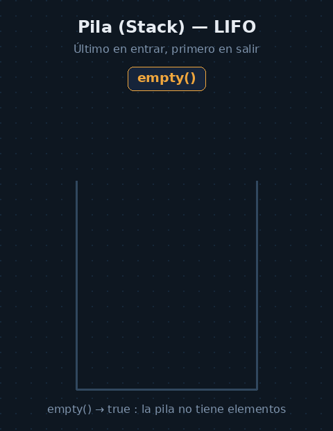
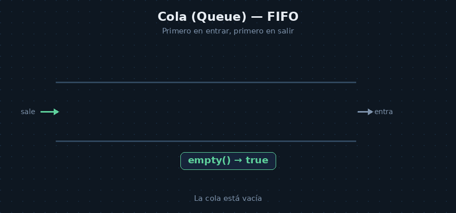
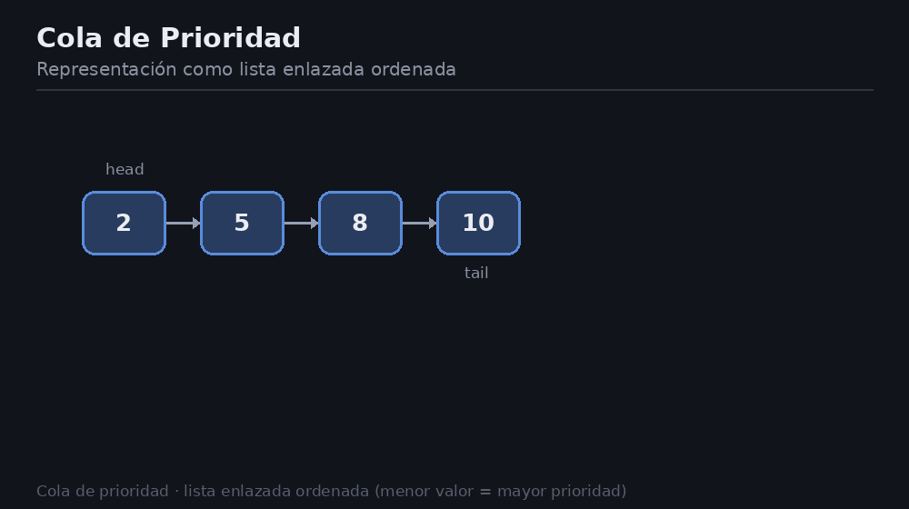

# Pilas, colas y colas con prioridad
## Parte I: Pilas (`stack`)
### 1. Concepto

Una **pila** (O stack) es una estructura de datos lineal que se basa  en la filosofía **LIFO** *(Last in, First Out)*, es decir el último en entrar es el primero en salir

* **Operaciones Básicas**:
    * `push(dato)`: Añade un elemento en la parte superior
    * `top()`: Devuelve el elemento situado en el tope (sin eliminarlo)
    * `pop()` : Elimina el elemento situado arriba del todo
    * `empty()`: Comprueba si la lista está vacía



### 2. Implementaciones Básicas de una Pila

### A. Mediante Vector Estático / Dinámico
El tope de la pila se ubica en el extremo final del vector para garantizar tiempo constante $O(1)$

``` cpp
#include <vector>

template <class T>
class PilaDin {
    std::vector<T> datos;

public:
    void push(const T &dato) {
        datos.push_back(dato); // Inserción al final: O(1)
    }

    void pop() {
        datos.pop_back(); // Eliminación al final: O(1)
    }

    T top() const {
        return datos.back(); // Consulta del tope: O(1)
    }

    bool vacia() const {
        return datos.empty();
    }
};
```

### B. Mediante Listas Enlazadas

Se mantiene únicamente el puntero a la `cabecera`. El tope se sitúa al inicio de la lista, realizando los `push` y `pop` por la cabecera en tiempo constante $O(1)$

## Parte II: Colas (`queue`)
Una **cola** (O queue) es una estructura lineal de datos basada en la filosofía **FIFO** *(First in, First out)*, (el primer elemento en entrar es el primero en salir)

* Uso principal: Listas de espera y gestión de recursos 

* Operaciones básicas:
    * `push(dato)`: Añade un elemento al final de la cola
    * `front()`: Consulta el primer elemento(el más antiguo)
    * `pop()`: elimina el primer elemento



### 3. Implementaciones Básicas de una Cola
### A. Cola Estática mediante Vector Circular
Para evitar que tarde $O(n)$ se utilizan los dos índices: `inicio` y `final` para que avancen sobre el  vector estático 

``` cpp
template <class T>
class ColaEstatica {
    T *datos;
    int inicio, final;
    int tamMax;

public:
    ColaEstatica(int max) : tamMax(max), inicio(0), final(0) {
        datos = new T[tamMax];
    }

    ~ColaEstatica() { delete[] datos; }

    void push(const T &dato) {
        datos[final] = dato;
        final = (final + 1) % tamMax; // Avance circular
    }

    void pop() {
        inicio = (inicio + 1) % tamMax; // Avance circular
    }

    T front() const { return datos[inicio]; }
    bool vacia() const { return inicio == final; }
};
```

### B. Cola Dinámica mediante Lista Enlazada
Se suele implementar mediante una lista enlazada que mantiene los dos punteros `inicio` para extraer con `pop` y `final` para insertar con `push`

## Parte III: Colas con Prioridad (priority queue)
### 1.Concepto
Es una estructura de datos donde cada elemento tiene asociada una **prioridad**. El elemento que se extrae con `pop()` o se consulta con `top()` es siempre el de **mayor prioridad**. 


---

### 2.Formas de Implementación

### 1. Lista Enlazada Ordenada:
Mantiene los eleentos ordenados en una lista.
    
* `pop()`: Extrae de la cabecera en $O(1)$

* `push()`: Requiere una inserción ordenada recorriendo la lista en $O(n)$

### 2. Vector de Listas:
Si las prioridades son enteras y en un **rango pequeño** (ej 0 a 4), se usa un vector donde cada posición almacena una lista para esa prioridad

* **Acceso , inserción y extracción** operan en $O(1)$

### 3. Árboles / Heaps: 
(Se profundizará más en la lecciones 7, 8 y 9), permiten inserciones y extracciones en tiempo logarítmico *O(log n)*

## Parte IV: Adaptadores de STL en C++

> En la STL de C++, `stack`, `queue` y `priority_queue` **no son contenedores puros** , sino **adaptadores de contenedores**. No almacenan los datos directamente ni soportan iteradores 

| Adaptador | Encabezado | Contenedor por defecto | Contenedores alternativos permitidos | Método de consulta |
|---|---|---|---|---|
| `std::stack` | `<stack>` | `std::deque` | `std::vector`, `std::list` | `top()` |
| `std::queue` | `<queue>` | `std::deque` | `std::list` | `front()` / `back()` |
| `std::priority_queue` | `<queue>` | `std::vector` | `std::deque` | `top()` |

## Ejemplos de Uso
### A. Ejemplo con std::stack y std::queue
``` cpp
#include <iostream>
#include <stack>
#include <queue>
#include <list>

int main() {
    // Pila usando el contenedor por defecto (std::deque)
    std::stack<char> pila;
    for (char c = 'A'; c <= 'Z'; ++c) pila.push(c);

    std::cout << "Pila (LIFO): ";
    while (!pila.empty()) {
        std::cout << pila.top() << " ";
        pila.pop(); // pop() es void en STL
    }
    std::cout << std::endl;

    // Cola cambiando el contenedor subyacente a std::list
    std::queue<char, std::list<char>> cola;
    for (char c = 'A'; c <= 'Z'; ++c) cola.push(c);

    std::cout << "Cola (FIFO): ";
    while (!cola.empty()) {
        std::cout << cola.front() << " ";
        cola.pop();
    }
    std::cout << std::endl;

    return 0;
}
```

### B. Ejemplo con std::priority_queue y Clases de Comparación
Por defecto, `priority_queue` ordena de mayor a menor utilizando la plantilla `std::less<T>` (el elemento mayor queda en el tope).

``` cpp
#include <iostream>
#include <queue>
#include <string>

// Estructura de datos personalizada
struct TrabajoImpresion {
    std::string usuario;
    long tam;
};

// Criterio de comparación personalizado (Functor)
struct CompararTamano {
    // Retorna true si 'a' tiene MENOR prioridad que 'b'
    // Al priorizar trabajos más pequeños, un trabajo con menor tamaño gana prioridad
    bool operator()(const TrabajoImpresion &a, const TrabajoImpresion &b) const {
        return a.tam > b.tam; 
    }
};

int main() {
    // Cola de prioridad por defecto (Mayor a Menor)
    std::priority_queue<int> colapri;
    colapri.push(7);
    colapri.push(2);
    colapri.push(8);
    // Impresión: 8, 7, 2

    // Cola de prioridad con Functor personalizado
    std::priority_queue<TrabajoImpresion, std::vector<TrabajoImpresion>, CompararTamano> colaTrabajos;
    colaTrabajos.push({"UsuarioA", 500});
    colaTrabajos.push({"UsuarioB", 100});

    // Saldrá primero UsuarioB por tener menor tamaño (100)
    return 0;
}
```

## Parte V: Aplicación Práctica — Eliminación de Recursividad
### 1. El Problema de la Recursividad
Las funciones recursivas pueden resultar ineficientes debido a la sobrecarga en la llamada a funciones y corren el riesgo de desbordar la pila del sistema (Stack Overflow). Además, en operaciones con ficheros/directorios, las llamadas recursivas acumulan descriptores abiertos sin cerrar los previos


### 2. Patrón General para Transformación Iterativa
Casi cualquier proceso recursivo puede convertirse en iterativo empleando explícitamente una pila de datos (`std::stack`)
1. **Inicialización:** Insertar los parámetros iniciales en la pila
2. **Bucle de Procesamiento** : Mantener un bucle `while(!pila.empty())`
3. **Sustitución de Llamada**:
*  La ejecución del cuerpo se realiza extrayendo el elemento del tope con `top()` y `pop()`

* cada llamada recursive se sustituye por hacer `push()` de los nuevos parámetros sobre la pila

