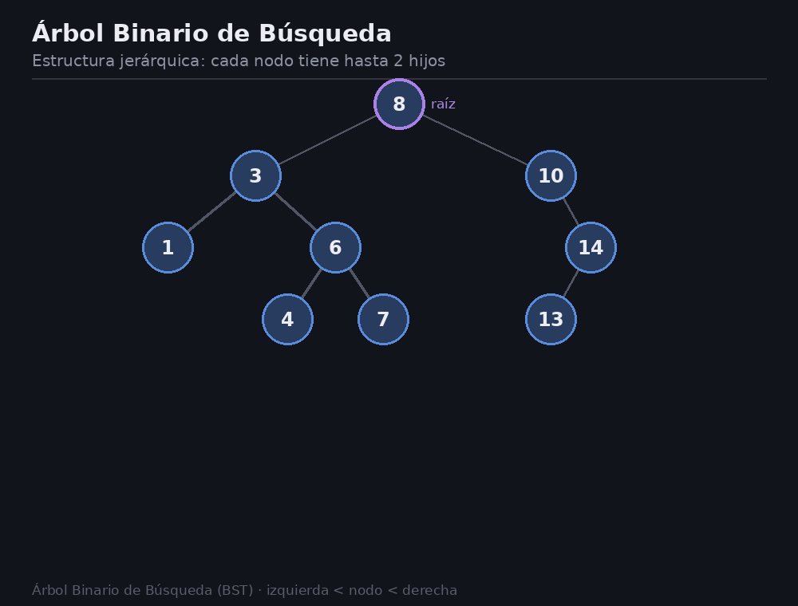
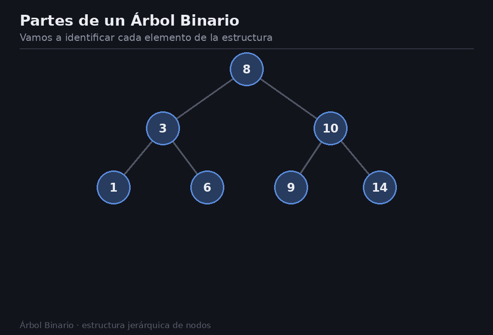
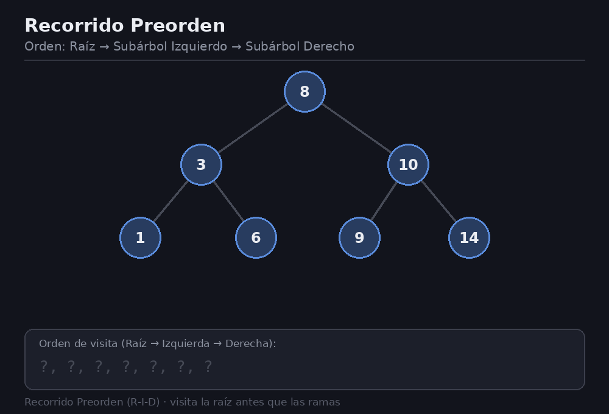
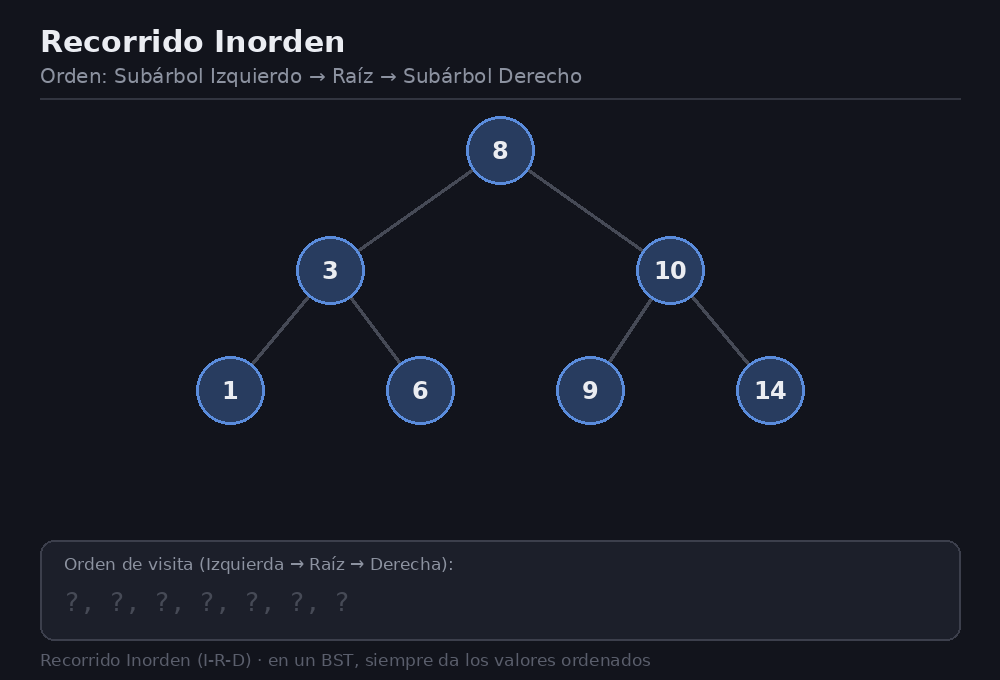
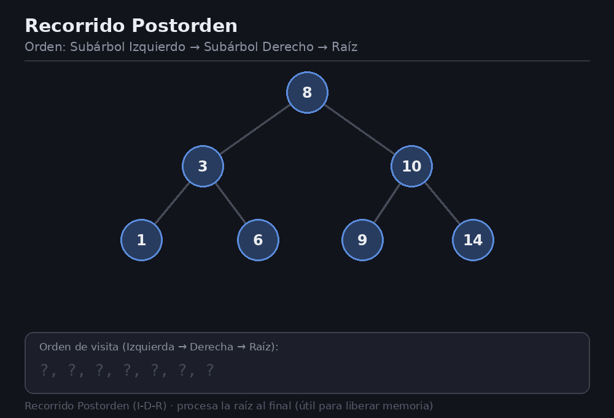
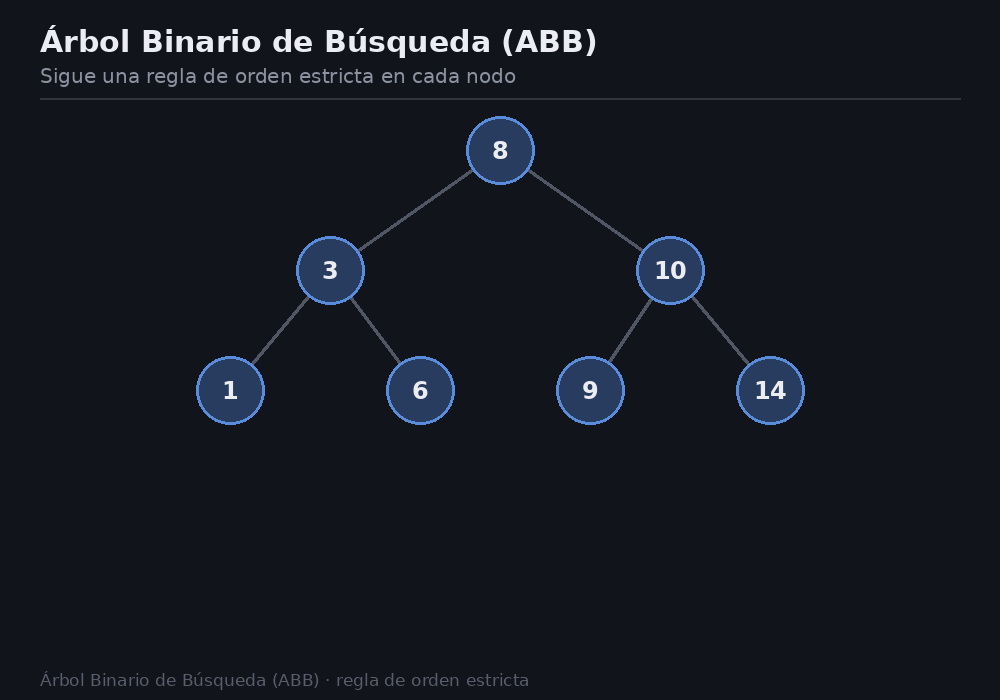

# Árboles
> Un árbol es una estructura de datos jerárquica no lineal que organiza los datos en nodos enlazados, permitiendo búsquedas , inserciones y borrados mucho más eficiente que estructuras lineales como vectores o listas


## 1. Conceptos fundamentales
En estructuras lineales , gestionar muchos datos no es suficientemente eficaz:

* **Vector no ordenado**: Búsqueda lineal $O(n)$.
* **Vector Ordenado**: Busqueda eficiente O(log n), pero inserción cuesta O(n) porq hay que desplazar elementos
* **Lista enlazada**: Insercción rápida pero busqueda lenta $O(n)$

## Estructuras Jerárquicas
Un arbol es un **grafo conexo sin ciclos** donde:
* Cada nodo tiene 0 o más hijos
* Cada nodo tiene como **máximo un padre**

#### Conceptos:
*   **Raíz**: Único nodo que no tiene padre
*   **Hoja**: Nodo sin hijos
*   **Altura de un nodo**: Longitud del camino más largo de dicho nodo hasta una hoja
*   **Altura del árbol**: Longitud del camino más largo desde la raíz hasta cualquier hoja (Debe coincidir con la altura de la raíz)
*   **Profundiad de un nodo**: Longitud del camino desde la raiz hasta dicho nodo

## 2. Árboles binarios
Son similares a los árboles, su única diferencia es que es de orden 2, cada nodo tiene como **máximo 2 hijos** (llamados izquierdo y derecho)

### Representación


### Representación en C++
#### **Estructura de un Nodo**
```cpp
template <class T>
class Nodo {
public:
    T dato;
    Nodo<T> *izq; // Puntero al subárbol izquierdo
    Nodo<T> *der; // Puntero al subárbol derecho

    Nodo() : izq(nullptr), der(nullptr) {}
    Nodo(T &ele) : dato(ele), izq(nullptr), der(nullptr) {}
};
```
#### **Estructura de la Clase**
```cpp
template <class T>
class Abb {
private:
    Nodo<T> *raiz; // Un árbol se gestiona mediante el puntero a su raíz
    
    // Funciones recursivas privadas
    void preorden(Nodo<T> *p, int nivel);
    void inorden(Nodo<T> *p, int nivel);
    void postorden(Nodo<T> *p, int nivel);

public:
    Abb() : raiz(nullptr) {}
    void recorrePreorden()  { preorden(raiz, 0); }
    void recorreInorden()   { inorden(raiz, 0); }
    void recorrePostorden() { postorden(raiz, 0); }
};
```

### 3. Recorridos en Árboles Binarios
En un árbol existen 3 recorridos según el orden en el que procese la **Raíz (R)**, el **Subárbol Izquierdo(I)** y el **Subárbol Derecho (D)**

### 1. Preorden (R - I - D)
Procesa la ráiz **antes** que las ramas.
**Pasos**:
1. Visita la Raíz
2. Recorrer Subárbol Izquierdo
3. Recorrer Subárbol Derecho


```cpp
template <class T>
void Abb<T>::preorden(Nodo<T> *p, int nivel) {
    if (p) {
        std::cout << p->dato << " "; // 1. Procesar raíz
        preorden(p->izq, nivel + 1); // 2. Izquierda
        preorden(p->der, nivel + 1); // 3. Derecha
    }
}
```

### 2. Inorden (I - R -D)
Procesa la raíz **en medio** de ambas ramas
> Este siempre muestar los elementos ordenados de menor a mayor


```cpp
template <class T>
void Abb<T>::inorden(Nodo<T> *p, int nivel) {
    if (p) {
        inorden(p->izq, nivel + 1);  // 1. Izquierda
        std::cout << p->dato << " "; // 2. Procesar raíz
        inorden(p->der, nivel + 1);  // 3. Derecha
    }
}
```

### 3. Postorden (I - D - R)
Procesa la raíz después de haber procesado completamente sus hijos. Útil para liberar memoria (destruir el árbol de abajo a arriba)

1. Recorrer Subárbol Izquierdo
2. Recorrer Subárbol Derecho
3. Visitar la Raíz


```cpp
template <class T>
void Abb<T>::postorden(Nodo<T> *p, int nivel) {
    if (p) {
        postorden(p->izq, nivel + 1); // 1. Izquierda
        postorden(p->der, nivel + 1); // 2. Derecha
        std::cout << p->dato << " ";  // 3. Procesar raíz
    }
}
```
## 4. Árboles Binarios de Búsqueda (ABB)
Está bajo una **regla de orden escricta** para garantizar búsquedas rápidas

**Regla del ABB** para cualquier nodo x
* Todas las claves en su subárbol izquierdo son **estrictamente menores** que x
* Todoas las claves en su subárbol derecho son **esctrictamente mayores** que x
* **NO** se permiten elementos duplicados


## 5. Operaciones Fundamentales en un ABB
### A. Búsqueda
```cpp
template <class T>
Nodo<T>* Abb<T>::buscaClave(T &ele, Nodo<T> *p) {
    if (!p) 
        return nullptr; // No encontrado
    else if (ele < p->dato) 
        return buscaClave(ele, p->izq); // Buscar en rama izquierda
    else if (ele > p->dato) 
        return buscaClave(ele, p->der); // Buscar en rama derecha
    else 
        return p; // Encontrado
}
```

### B. Inserción
Los nodos nuevos **siempre se insetar como una hoja nueva**

```cpp
template <class T>
bool Abb<T>::insertaDato(T &ele, Nodo<T>* &p) {
    if (!p) {
        p = new Nodo<T>(ele); // Se crea en la hoja encontrada
        return true;
    } else if (ele < p->dato) {
        return insertaDato(ele, p->izq);
    } else if (ele > p->dato) {
        return insertaDato(ele, p->der);
    }
    return false; // Elemento duplicado no permitido
}
```

### C. Eliminación
Hay 3 casos posibles según el número de hijos

1. **El nodo es una hoja (0 Hijos)**:  Se elimina el nodo directamente y el puntero del padre pasa a nullptr

2. **El nodo tiene 1 Hijo**: Se reconecta el padre del nodo a eliminar directamente con su único hijo, saltandose el nodo a borrar

3. **El nodo tiene 2 Hijos**: No se puede borrar directamente
    * Se busca el mínimo del subárbol derecho (o el máximo del subárbol izquierdo)

    * Se sustituye el valor del nodo a borrar por ese mínimo

    * Se elimina la hoja sobrante de donde sacamos el mínimo.

```cpp
template <class T>
Nodo<T>* Abb<T>::borraMin(Nodo<T>* &p) {
    if (p->izq) 
        return borraMin(p->izq); // El mínimo siempre está lo más a la izquierda posible
    Nodo<T> *result = p;
    p = p->der; // Reengancha si tenía hijo derecho
    return result;
}

template <class T>
Nodo<T>* Abb<T>::borraDato(T &ele, Nodo<T>* &p) {
    if (!p) return nullptr;

    if (ele < p->dato) {
        borraDato(ele, p->izq);
    } else if (ele > p->dato) {
        borraDato(ele, p->der);
    } else { // Nodo encontrado
        Nodo<T> *temp = p;
        
        if (!p->izq) p = p->der;      // Caso 0 o 1 hijo
        else if (!p->der) p = p->izq; // Caso 1 hijo
        else {                        // Caso 2 hijos
            temp = borraMin(p->der);  // Busca el mínimo a la derecha
            p->dato = temp->dato;     // Reemplaza el valor
        }
        delete temp; // Libera memoria
    }
    return p;
}
```

## 6. Problema de Desequilibrio
### Eficiencia real de un ABB

* **Caso Promedio / Árbol Equilibrado**: Altura $h \approx \log_2(n)$. Las operaciones tardan $O(\log n)$.

* **Peor Caso / Árbol Degenerado**: Si los datos entran en orden (ej. 1, 2, 3, 4, 5), el árbol se convierte en una lista enlazada. Su altura pasa a ser $h = n$ y la búsqueda empeora a $O(n)$.

``` text
Árbol Equilibrado O(log n)           Árbol Degenerado O(n)
         (2)                                (1)
        /   \                                 \
      (1)   (3)                               (2)
                                                \
                                                (3)
```

### Solución:
Para evitar tener un Árbol Degenerado $O(n)$ , requierre que el árbol se mantenga **equilibrado** tras cada inserción o borrado

> Para todo nodo, la diferencia de alturea entre su subárbol izq y su subárbol der no debe diferir en más de 1 unidad (| altura(izq)- altura(der)| <= 1)

