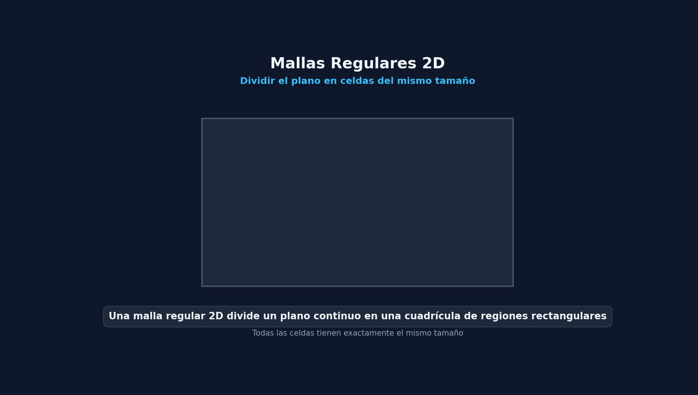
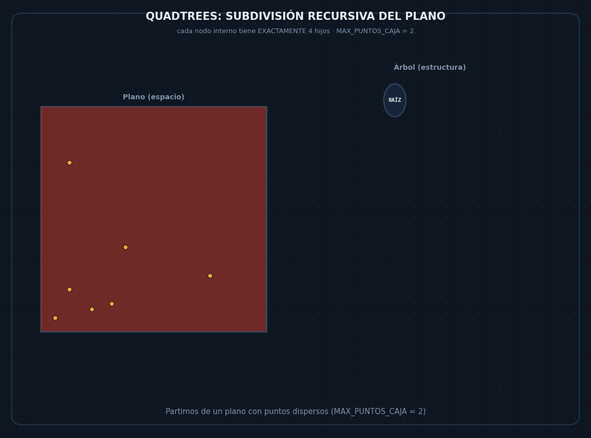
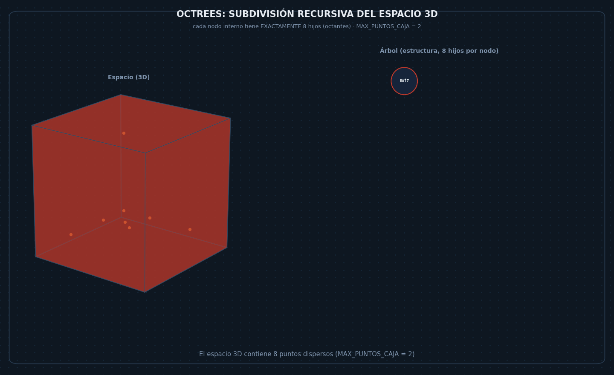

# Mallas regulares y Quadtrees

## Parte I:Mallas Regulares
### Definición
Una **malla regular 2D** divide un plano en una cuadrícula de regiones rectangulares , **Todas del mismo tamaño**

Funciona como una matriz 2D pero permitiendo **acceso directo a la celda/casilla correspondiente mediante una relación matemática


### Operaciones en Mallas Regulares
* **Creación**: Se define una superficie $[x_{\min}, y_{\min}][x_{\max}, y_{\max}]$  y el número de divisiones $n$

* **Recomendación**: Crear la malla con unos márgenes un pelín superiores a los datos que tenemos para evitar desbordamientos en los límites extremos

**Búsqueda**:
1. Calcular el índice de la fija $j$ e columna $i$ matemáticamente a partir de $(p_x, p_y)$
2. Realizar una búsqueda secuencial dentro de la lista interna de esa casilla

**Inserción**:
1. Obtener la casilla correspondiente
2. Añadir el dato al final de la lista de esa casilla

**Borrado**:
1. Obtener la casilla
2. Buscar el elemetno secuencialmente en la lista de la casilla y eliminarlo

**Vecino más cercano**:
1. Identificar la casilla de puntero p
2. Buscar el más cercano dentro de la propia casilla
3. Revisar las 8 casillas vecinas colindantes y quedarse con el menor de los candidatos
4. Si la casilla inicial está vacía, extendder la búsqueda a los siguientes anillos de vecinos

**Búsqueda por rangos $[x1, x2][y1, y2]$:**
1. Localizar las casillas extremas que contienen a $(x1, y1)$ y $(x2, y2)$
2. Recorrer las casillas contenidas dentro de esos límites
3. Devolver los punteros de esas casillas que satisfagan que $x1 < x < x2$ y $y1 < y < y2$.


## Implementación en C+
### Mallas Regulares
```cpp
#include <iostream>
#include <list>
#include <vector>

template<typename T>
class MallaRegular; // Declaración adelantada

template<typename T>
class Casilla {
    std::list<T> puntos;

public:
    friend class MallaRegular<T>;
    Casilla() : puntos() {}

    void insertar(const T &dato) { 
        puntos.push_back(dato); 
    }

    T *buscar(const T &dato);
    bool borrar(const T &dato);
};

template<typename T>
T* Casilla<T>::buscar(const T& dato) {
    typename std::list<T>::iterator it = puntos.begin();
    for (; it != puntos.end(); ++it) {
        if (*it == dato)
            return &(*it);
    }
    return nullptr;
}

template<typename T>
bool Casilla<T>::borrar(const T& dato) {
    typename std::list<T>::iterator it = puntos.begin();
    for (; it != puntos.end(); ++it) {
        if (*it == dato) {
            puntos.erase(it);
            return true;
        }
    }
    return false;
}
```

### Eficiencia de las Mallas Regulares
*   **Caso Óptimo**: Si los datos están uniformemente distribuidos el acceso es inmediato $O(1)$

* **Inconveniente**: No son adaptativas:
    * Si los datos están aglomerados en una zona, algunas casillas tendrán muchísimos puntos (provocando búsquedas secuenciales lentas) mientras que muchas otras quedarán completamente vacías (desperdiciando memoria)

## Parte II: Quadtrees

### 1. Definición y Propiedades
* **Definición**: Son estructuras de datos especiales adaptativas que descomponen el plano de forma recursiva en 3 cuadrantes disjuntos el mismo tamaño
* **Representación de Árbol**: La raíz representa todo el palno inicial. Cada nodo interno posee exactamente 4 nodos hijos que parten el plano de forma ortogonal
* **Criterio de subdivisión**: Una región se divide recursivamente si no cumple una condición de parada (por ejemplo: cuando supera un umbral `MAX_PUNTOS_CAJA`)
* **Balanceo y Eficiencia**: No es una estructura necesariamente equilibrada, ya uqe se adapta a la densidad / distribución de los datos en el espacio. Presenta un timepo esperado de acceso de $O(log_4 n)$


### 2. Estrucura del Nodo y Clases en C++
#### A. Representación Geométrica y Entradas
```cpp
// Representa el bounding box / límites del cuadrante
class Rect {
public:
    float xi, yi, xs, ys; // Coordenadas inferior (i) y superior (s)
    
    Rect(float aXi=0.0f, float aYi=0.0f, float aXs=1.0f, float aYs=1.0f)
        : xi(aXi), yi(aYi), xs(aXs), ys(aYs) {}

    void centro(float& xc, float& yc) const {
        xc = 0.5f * (xi + xs);
        yc = 0.5f * (yi + ys);
    }
};

// Objeto almacenado con coordenadas (x, y) y su dato asociado
template<typename T>
class Entrada {
    float x, y;
    T dato;
public:
    Entrada(float aX, float aY, const T& aDato) : x(aX), y(aY), dato(aDato) {}
};
```

#### B. Clase Nodo y descomposición de Hijos
Cada nodo maneja 4 punterosa sus hijos correspondientes a los 4 cuadrantes espaciales; `00`(NO), `01`(NE), `10`(SO), `11`(SE)

```cpp
#define MAX_PUNTOS_CAJA 10

template<typename T>
class Nodo {
    Nodo<T>* hijos[4]; // Array de 4 punteros a cuadrantes
    list<Entrada<T>> datos; // Lista de datos (solo usada en nodos hoja)
public:
    Nodo() { hijos[0] = hijos[1] = hijos[2] = hijos[3] = 0; }

    bool esHoja() {
        return !(hijos[0] || hijos[1] || hijos[2] || hijos[3]);
    }
};
```

### 3. Operaciones Principales
| Operación | Pasos y Funcionamiento Interno |
| :--- | :--- |
| **Localizar / Buscar** | **1.** Inicia en la raíz y calcula el centro del rectángulo actual.<br>**2.** Se desciende de forma recursiva determinando el cuadrante donde caen las coordenadas $(x, y)$.<br>**3.** Al alcanzar un nodo hoja, realiza una búsqueda secuencial/lineal sobre su lista interna de datos. |
| **Inserción** | **1.** Localiza el nodo hoja correspondiente a la posición $(x, y)$.<br>**2.** Añade el nuevo elemento a la lista `datos`.<br>**3. Reestructuración / División:** Si `datos.size() > MAX_PUNTOS_CAJA`, calcula el centro geométrico, redistribuye todos los elementos acumulados insertándolos recursivamente en los nuevos nodos hijos recién creados y vacía la lista del nodo padre (`nodo->datos.clear()`). |
| **Borrado** | **1.** Localiza la entrada en el nodo hoja y la elimina de su lista.<br>**2. Reestructuración / Fusión:** Si tras la eliminación la suma de datos del nodo actual y sus 3 hermanos cae por debajo de $\frac{2}{3} \times \text{MAX\_PUNTOS\_CAJA}$, se transfieren todos los datos al nodo padre y se eliminan los 4 nodos hijos. |

### 4. Buenas Prácticas
* **Octrees (Extensión 3D)**: Mismo concepto pero extendido a un espacio tridimensional , donde cada nodo no hoja se divide recursivamente en **8 subespacios** o subdivisiones


* **Detección de Colisiones**: Está más orientado a videojuegos y gráficos. Clasifica regiones en nodos blancos (libres/sin colisión), negros(colisión confirmada) o grises(posible colisión) para acotar comprobaciones complejas

* **Compresión de Imagenes**: Agrupa áreas monocolor en nodos hoja únicos; el espacio se sigue dividiendo hasta que todas las hojas contengan un solo color homogéneo