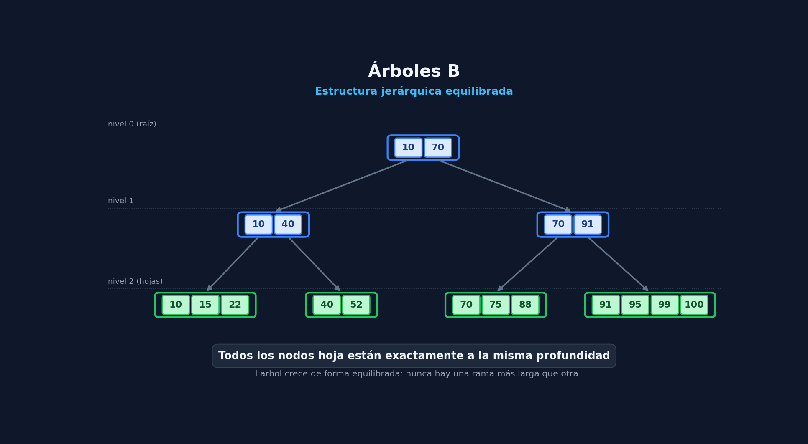

# Arboles B

## 1. Motivación y Problema de Memoria
* **Problema**: En catálogos muy grandes mantener los índices primarios y secjndarios totalmente en RAM requierre muchos gibas de memoria, lo que provoca un tiempo de carga excesivo e inmanejable
* **Solución**: El Árbol B permite indexar ficheros sin consumir la memoria primaria (RAM) y manteniendo un rendimiento cercano al de un índice simple

## 2. Definición y Propiedades de un Árbol B
* **Estructura jerárquica equilibrada** : La profundidad de cada nodo hoja es siempre exactamente la misma

* **nodos en disco**: Guarda en cada nodo tuplas : `(clave, posición)`
    * En **nodos interiores**, la `posición` apunta al nodo hijo dentro del *fichero de indice*
    * En **nodos hoja**, la `posición` apunta al registro correspondiente dentro del dichero de datos

* **Capacidad por nodo**: Si el orden del árbol es $m$ , todos los nodos (salvo la raíz) deben contener entre $m/2$ y $m$ tuplas , siempre ordenadas por clave
* **Indización por niveles**: Cada nivel del árbol indexa a los nodos del nivel inferior utilizando la primera clave de cada uno
* **Parámetro de diseño**: Para ser eficiente en entronos reales, el orden $m$ suele ser grande 



## 3. Operaciones Principales y Complejidad

Todas las operaciones principales presentan una complejidad logarítmica de orden **$O(log_m n)$** accesos a disco. Por ejemplo, com $m = 256$, se localiza un dato entre 10 milllones con solo 4 accesos a disco

| Operación | Pasos Principales | Casos de Control / Reestructuración |
| :--- | :--- | :--- |
| **Búsqueda** | **1.** Cargar nodo raíz en RAM.<br>**2.** Buscar la clave mayor $k \le x$.<br>**3.** Si es hoja, leer el registro en disco; si no, pasar el nodo hijo a RAM y repetir el paso 2. | — |
| **Inserción** | **1.** Localizar el nodo hoja correspondiente.<br>**2.** Insertar la clave y la posición de forma ordenada. | • **Cambio de clave en padre:** Si cae en la primera posición del nodo.<br><br>• **División/Overflow (Caso 2.2):** Si el nodo se llena, se duplica/crea un nuevo nodo, se reparten las claves y se promueve la primera clave al nodo padre (puede propagarse hacia arriba y crear una nueva raíz). |
| **Borrado** | **1.** Localizar la clave en la hoja.<br>**2.** Eliminar la clave y la posición del fichero de datos. | • **Actualizar padre:** Si se elimina la primera clave del nodo.<br><br>• **Redistribución/Underflow (<50% de ocupación):**<br>&nbsp;&nbsp;**a)** *Transferir a hermano:* Mover claves restantes a un nodo hermano y eliminar el nodo vaciado.<br>&nbsp;&nbsp;**b)** *Rebalanceo/Préstamo:* Traer una clave de un nodo hermano para alcanzar el 50% de ocupación mínima. |

## 4. Programación en C++
### 1. Estructurade Datos de un Nodo (Guardado en Disco)
Cada nodo tiene un número de claves, sus registros/hijos y un array de posiciones físicas (`long`) dentro del fichero de índice
```cpp
#include <iostream>
#include <fstream>
#include <cstring>

const int M = 4; // Orden del Árbol B (en producción sería ej. 64 o 256)

// Estructura de un elemento/tupla dentro del nodo
struct Elemento {
    int clave;           // Clave de búsqueda (ej. ISBN o ID)
    long posDatos;       // Dirección en el fichero de datos (si es hoja)
};

// Estructura del Nodo que representa un bloque en disco
struct NodoB {
    int numClaves;                // Cantidad de claves actuales en el nodo
    bool esHoja;                  // true si es hoja, false si es nodo interno[cite: 3]
    Elemento elementos[M];        // Claves alojadas en este nodo[cite: 3]
    long hijos[M + 1];            // Posiciones (bytes) de los nodos hijos en el fichero índice[cite: 3]

    NodoB() : numClaves(0), esHoja(true) {
        for (int i = 0; i <= M; ++i) hijos[i] = -1; // -1 indica puntero/posicion nula
    }
};
```

### 2. Lectura y Escritura Física de Nodos (E/S a Disco)
Estas dos funciones auxiliares permiten tratar el fichero `.idx``como si fuera la memoria principal
```cpp
// Lee un nodo del fichero de índice dada su posición física (byte)
NodoB leerNodo(std::fstream& fIndice, long posNodo) {
    NodoB nodo;
    fIndice.seekg(posNodo, std::ios::beg); // Mover el puntero de lectura
    fIndice.read(reinterpret_cast<char*>(&nodo), sizeof(NodoB)); // Leer el bloque binario
    return nodo;
}

// Escribe/actualiza un nodo en una posición determinada del fichero de índice
void escribirNodo(std::fstream& fIndice, long posNodo, const NodoB& nodo) {
    fIndice.seekp(posNodo, std::ios::beg); // Mover el puntero de escritura
    fIndice.write(reinterpret_cast<const char*>(&nodo), sizeof(NodoB)); // Escribir bloque
}
```

### 3. Algorítmo de Búsqueda
Pasa el nodo raíz a memoria , busca la meclave y desciende por el fichero de índice hasta llegar al fichero de datos
```cpp
// Retorna la posición en el fichero de datos del registro buscado (-1 si no existe)[cite: 3]
long buscar(std::fstream& fIndice, long posNodoActual, int claveBuscada) {
    if (posNodoActual == -1) return -1; // Nodo no existente

    // 1. Cargar el nodo actual desde disco a RAM[cite: 3]
    NodoB nodo = leerNodo(fIndice, posNodoActual);

    // 2. Buscar la mayor clave en el nodo tal que k <= x[cite: 3]
    int i = 0;
    while (i < nodo.numClaves && claveBuscada > nodo.elementos[i].clave) {
        i++;
    }

    // Caso A: La clave está en este nodo
    if (i < nodo.numClaves && claveBuscada == nodo.elementos[i].clave) {
        if (nodo.esHoja) {
            // Si es hoja, retornamos la posición del registro en el fichero de datos[cite: 3]
            return nodo.elementos[i].posDatos;
        } else {
            // Si es nodo interno en este diseño, seguimos bajando al hijo izquierdo/correspondiente
            return buscar(fIndice, nodo.hijos[i], claveBuscada);
        }
    }

    // Caso B: La clave no está en este nodo y es un nodo hoja -> No existe
    if (nodo.esHoja) {
        return -1; 
    }

    // Caso C: Descender al nodo hijo correspondiente en el fichero de índice[cite: 3]
    return buscar(fIndice, nodo.hijos[i], claveBuscada);
}
```

### 4. Ejemplo de Uso Principal (`main`)
```cpp
int main() {
    // Abrir fichero de índice binario para lectura y escritura
    std::fstream fIndice("indice.idx", std::ios::in | std::ios::out | std::ios::binary);

    long posRaiz = 0; // La raíz suele estar al inicio del fichero (byte 0)
    int claveABuscar = 8430602259;

    long posRegistroDatos = buscar(fIndice, posRaiz, claveABuscar);

    if (posRegistroDatos != -1) {
        std::cout << "Registro encontrado en la posicion en disco: " << posRegistroDatos << std::endl;
        
        // Ahora leeríamos el registro del fichero de datos real:
        // fDatos.seekg(posRegistroDatos);
        // fDatos.read(...);
    } else {
        std::cout << "La clave no existe en el archivo." << std::endl;
    }

    fIndice.close();
    return 0;
}
```
## 5. Conclusiones y Aplicación Real
* **Persistencia total:** Al mantenerse permanentemente en memoria secundaria (disco), el índice puede crecer de forma casi ilimitada. 
* **Base de datos:** Esta estructura multirrama equilibrada es el pilar fundamental empleado internamente en los motores de las bases de datos modernas y sistemas de archivos.  