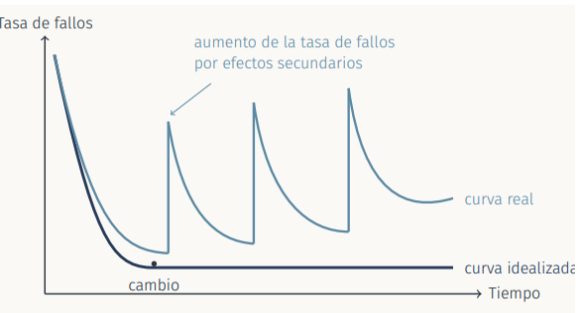
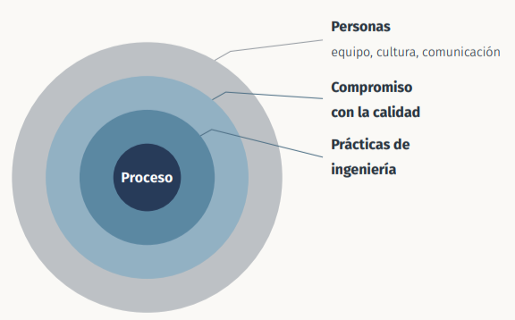

# TEMA 1 **Naturaleza del Software**

### 1. **El papel evolutivo del software**

* Todas las economías de los países desarrollados dependen del software  
* La mayoría de sistemas están controlados por el software  
* El software permite la automatización de procesos desarrollados en negocios, industrias, organismos y gobiernos.  
* Es un medio para transferir tecnología  
* El software puede ser usado como elemento diferenciador

### 2. **Informe CHAOS 2020**  
* En torno al 19% de proyectos fueron cancelados / abandonados  
* El 50% sufrieron retrasos en tiempo, incrementos en costo o pérdidas de requisitos  
* El 31% terminó en tiempo, costo y requisitos

* Los proyectos gestionados con **enfoques ágiles** muestran tasas de éxito mayores que los **gestionados en cascadas** (peores), y los **híbridos** están en posición intermedia  
* Entre los **factores de fracaso** está la deuda técnica acumulada, integración de servicios cloud y de terceros y carencias de seguridad

Los problemas que se presentan en la construcción de grandes sistemas del software NO son simples versiones a gran escala de los problemas de escribir pequeños problemas.

La complejidad de los grandes sistemas requiere trabajar en grupo, utilizar técnicas más rigurosas de análisis y diseño, documentar las decisiones, pruebas exhaustivas y cuidadosa administración

### 3. **Fracaso de los proyectos del software**  
* **Baja calidad de los sistemas construidos**  
- Solución al problema equivocado  
- Falta de consideración influencias más amplias  
- No se analiza bien el problema  
- Se realiza por una razón errónea

* **Baja productividad en desarrollo, tiempo y/o recursos consumidos**  
- Cambio en los requisitos  
- Eventos externos cambian el entorno  
- La implementación no es posible  
- Pobre control del proyecto

**Solución:**

1. **Definir modelos (entregables)** que permitan comprender mejor el sistema y ayuden a incrementar las prob de éxito del sistema software  
2. Definir modelos de desarrollo de software a partir de los cuales se instancian procesos que **subdividen los pasos a realizar para manejar la complejidad**

### 4. **Qué es el software**

**Está formado por:**

1. Instrucciones que cuando se ejecutan proporcionan características, función y desempeños buscados  
2. Estructuras de datos que permiten la manipulación de forma adecuada  
3. Información descriptiva tanto en papel como en formas virtuales que describen la operación y uso de los programas

* **Es un producto**, (que pone a disposición las posibilidades de un ordenador o de una red de ordenadores) **y una herramienta** ( Soporta o facilita la funcionalidad de un sistema, controla el ordenador **(sistema operativo)**, ofrece la comunicación entre ordenadores **( redes)** y ayuda a la elaboración de otro software **( herramientas)** 

### 5. **hardware vs Software**

* Para construir **hardware** el proceso creativo humano se traduce en una forma **física**  
* El **software** tiene carácter **lógico** NO físico  
* El **software se desarrolla, NO se fabrica** en un sentido clásico  
* El **software NO se desgasta**  
* La mayor parte del *software es de uso individualizado*

### 6. **Tipos de Software**

* **Software de sistemas** : conjunto de programas escritos para dar servicios a otros programas ( compiladores, editores…). Presentan gran interacción con el hardware , posibilidad de usuarios múltiples, concurrencia y gestión de recursos e interfaces externas múltiple  
* **Software de aplicación** : programas independientes que resuelven una necesidad de negocio específica  
    
* **Software científico y de ingeniería:** aplicaciones en astronomía , vulcanología, análisis de tensiones en automóviles…  
    
* **Software empotrado:** reside dentro de un producto o sistema y se usa para el control de características específicas de ese producto  
    
* **Software de línea de productos:** puede estar centrado en mercado limitado ( control de inventario) o mercado masivo ( procesadores de texto , hojas de cálculo…)  
    
* **Aplicaciones Web y Móviles:** concentra un amplio abanico de aplicaciones, tanto basadas en el uso de navegador como aquellas para dispositivos móviles  
    
* **Software como servicio (SaaS) y arquitectura cloud-native:** aplicaciones que se ofrecen bajo demanda desde la nube en lugar de instalarse locamente, construidas con contenedores, microservicios y funciones serverless  
    
* **Sistemas de aprendizaje automático e IA generativa**:   
- **Software para IA** (entrenar y desplegar modelos)  
- **Software asistido por IA** (asistentes de código)

* **Software heredado** : caracterizado por su longevidad y por ser crítico en los negocios

> *Muchas veces el software tiene diseños imposibles de entender, código complicado, escasa documentación, casos de prueba no archivados…*

### 7. **Necesidad de evolución**

El software heredado debe evolucionar por varios motivos:

- Debe adaptarse para satisfacer las necesidades de nuevos ambientes o tecnologías  
- Debe mejorarse pa implementar nuevos requisitos  
- Debe extenderse para operar con otros sistemas o bases de datos  
- La arquitectura del software debe rediseñarse para hacerla viable dentro de un sistema de redes

**Deuda técnica:**  
> **Concepto propuesto por Ward Cunnighnam** : cada decisión de diseño o implementación que **prioriza rapidez sobre calidad genera una deuda** ( ej: financiera) que acumula intereses, haciendo sus **mantenimientos más costoso**

### 8. **Mitos**

Los mitos afectan a los gestores y administradores, usuarios y desarrolladores

- Suelen ser aceptados ya q contienen algún elemento de verdad  
- SIempre nos encaminan hacia decisiones erróneas

**Mitos de gestión y Administración**

- Tener computadoras más modernas implica software de mayor calidad  
- Si vamos con retraso siempre se puede añadir más programadores para acabar a tiempo  
- Un libro de estándares y procedimientos es suficiente conocimiento

**Mitos de cliente**

- Una declaración inicial de objetivos es suficiente para escribir programas, los detalles pueden refinarse después  
- Los requisitos son cambiantes pero pueden ser ajustados con éxito gracias a la flexibilidad del software

**Mitos del desarrollador**

- Una vez escrito el programa y funcionando ha terminado el trabajo  
- No puedo probar hasta tener un ejecutable  
- Lo único q se entrega es el programa funcionando  
- La ingeniería del software obligará a crear una voluminosa e innecesaria documentación que hará el proceso de desarrollo más lento

**Mitos Modernos**

- La IA generativa ya escribe software, la ingeniería del software no hace falta  
- Con metodologías ágiles no hace falta documentar ni diseñar  
- SI el código pasa los test es de calidad

contienen un elemento de verdad ( la IA generativa si acelera tareas…) pero llevan a decisiones erróneas , ninguna elimina la necesidad de análisis, diseño ni gestión de calidad

### 9. **Retos del software del siglo XXI**  
* Cada vez aumenta el núm de personas que tienen interés en las características y funciones de una app específica.

	

* Es necesario un esfuerzo concertado para entender el problema antes de desarrollar la aplicación

* Los requisitos de la tecnología de información que demandan individuos, negocios y gobiernos son cada vez más complejos. **El diseño se ha vuelto en una actividad crucial**

* Los individuos , negocios y gobiernos dependen cada vez más del software para tomar decisiones estratégicas y tácticas, por lo que **debe tener calidad alta**

* Conforme aumenta el valor percibido de una app se incrementa la prob de que su **base de usuarios y longevidad tb crezcan**

* La agilidad es hoy el marco dominante en desarrollo **DevOps / DevSecOps** integra desarrollo, operaciones y seguridad en un mismo ciclo continuo  
    
* **La sostenibilidad del software** (eficiencia energética, green software) es una preocupación creciente y transversal  
    
    
### 10. **Definiciones**

> **Fritz Bauer (1969) :** la ingeniería del software es el establecimiento y uso de principios fundamentales de la ingeniería con objetivo de desarrollar de forma económica software que sea fiable y que trabaje eficientemente en máquinasa reales

> **IEEE 2994 :** La ingeniería del Software es: 
> 1. la aplicación de un enfoque matemático , disciplinado y cuantificable al desarrollo , operación y mantenimiento de este  
>2. El estudio de enfoques según el punto anterior

> **SWEBOK (IEEE Computer Society , 2026 )**   
El guide to the software engineering body of knowledge organiza la disciplina en 18 áreas de conocimiento , entre ellas: 

    • Requisitos de Software 

    • Arquitectura de Software 

    •Diseño de Software

    • Construcción de Software 

    • Pruebas de Software 

    • Mantenimiento de Software 

    • Gestión de Configuración 

    • Gestión de Ingeniería del Software 

    • Proceso de Ingeniería del Software 

    • Modelos y Métodos 

    • Calidad del Software 

    • Seguridad 

    • Práctica Profesional

    • Fundamentos de Computación 

    • Fundamentos Matemáticos 

    • Fundamentos de Ingeniería

# HERRAMIENTAS

**DAYPOS**

[Test fis tema 1](https://www.daypo.com/fis-tema-1.html)