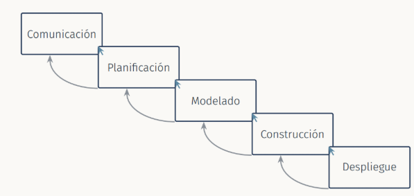
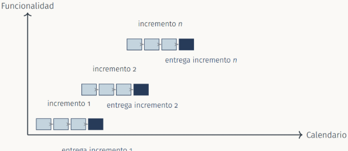
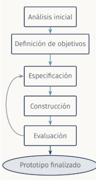
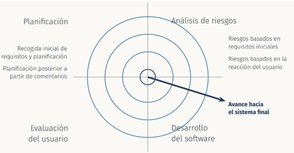
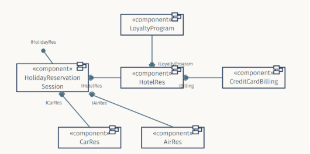
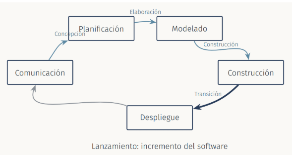
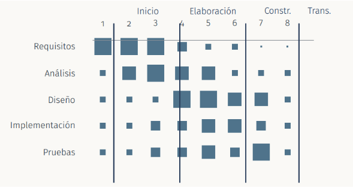
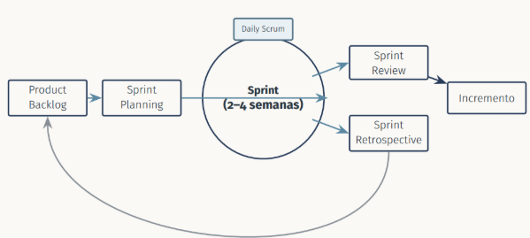
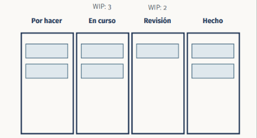

# TEMA 2 **Modelos del proceso**

## 1. **Introducción**

Un proceso de desarrollo de software establece un conjunto de actividades que conducen a la creación de un producto software

La creación de software es difícil de automatizar , aunq existen herramientas como **CASE** es difícil conseguir actualmente mayor automatización. La creación del software es una labor que depende del juicio humano, presentando diversas posibilidades.

No existe un proceso de desarrollo de software ideal. Este proceso depende mucho del tipo de proyecto, tamaño y organización que lo desarrolla

## 2. **Modelos de procesos**  
* **Método cascada:**   
  * Paradigma más antiguo.  
  * Se deriva de: ciclo de vida clásico, modelo de las fases y modelo lineal secuencial  
  * Divide el proceso de software en etapas:  
    * **Comunicación**: inicio del proyecto, recopilación de requisitos  
    * **Planificación**: estimación, itinerario, seguimiento  
    * **Modelado**: análisis y diseño  
    * **Construcción**: código y prueba  
    * **Despliegue**: entrega, soporte y retroalimentación

**Inconvenientes**:

* Los proyectos reales rara vez siguen un modelo secuencial. El proceso de definición y desarrollo de software es altamente no lineal  
* Es difícil que el cliente exponga todos los requisitos al inicio. NO acomoda de manera apropiada la incertidumbre propia del comienzo  
* Pocos proyectos tienen un conjunto estable de requisitos  
* El cliente debe tener paciencia: no dispondrá de ninguna versión hasta etapas muy avanzadas, lo que genera incertidumbre del éxito del mismo  
    
## 3. **Método incremental:**  
  * En lugar de entregarlo en su totalidad **se divide en incrementos** de tal modo que cada entrega es un producto operativo pero incompleto  
  * Los incrementos se estructuran de modo que **los primeros incluyan los requisitos más importantes**  
  * Cada incremento se desarrolla en un periodo breve y determinado  
  * Normalmente, una vez ha comenzado el desarrollo de un incremento, sus requisitos no se modifican hasta q ha terminado , los cambios se pueden incluir en la planificación de un incremento posterior

**Ventajas**:

* Los clientes pueden hacer uso de un software con características primordiales en etapas tempranas  
* Los primeros incrementos sirven de prototipos  
* El riesgo de fracaso disminuye  
* Los incrementos prioritarios son los más probados

**Inconvenientes:**

* Dificultad para acomodar ciertos requisitos en un incremento cerrado  
* Dificultad para determinar la parte común a todos los incrementos

## 4. **Método DRA:**  
  * Los métodos ágiles tienen muchísima importancia e influencia en los últimos años, pero otros métodos como **Desarrollo Rápido de Aplicaciones (DRA)** se utiliza desde hace muchos años  
  * Aplicación de alta velocidad del modelo cascada, basada en componentes ya existentes y creación de componentes reutilizables  
  * Diseñado para aplicaciones de negocio con **uso interno de datos:** ya que otras aplicaciones presentan numerosas partes en común  
  * Tiene sobre todo valor histórico: idea de ir rápido reutilizando lo que ya estaba construido , reaparece en low- code / no- code

**Ventajas:**

* Desarollo muy rápido de aplicaciones sencillas  
* Gran parte de código ya implementado

**Inconvenientes:**

* En sistemas grandes , complejo de organizar todos los equipos  
* Dificultad al implementar interfaces no estándares  
* Problemas de rendimiento al cargar funcionalidad no necesaria  
    
## 5. **Prototipado:**  
  * En el método cascada el usuario solo comprueba cómo funciona la entrega final  
  * A veces los requisitos no están claros: el prototipado evita muchas de las equivocaciones y ambigüedades  
  * Una de sus utilidades es el estudio de la **interfaz hombre-maquina** para decidir que debe mostrarse y que debe introducir el usuario  
  * Un prototipo se diferencia del sistema final en q está inacabado y tiene construcción menos elástica  
  * **Limitada capacidad de procesamiento de datos, pobre rendimiento y una limitada calidad**  
  * Herramientas de prototipado rápido actuales: Figma, Adobe XD o Penpot…  
  * **Etapas del prototipado:**  
    * Realizar análisis inicial  
    * Definir los objetivos  
    * Repetir:  
      * Especificar el prototipo  
      * Construir prototipo  
      * Evaluar el prototipo y recomendar cambios  
    * Hasta que el prototipo esté finalizado 

**Ventajas:**

* Las demostraciones tempranas ayudan a identificar malentendidos entre le diseñador y el cliente  
* Identificar requisitos que se hayan podido olvidar  
* Identificar dificultades en la interfaz  
* Comprobar viabilidad y utilidad del sistema aunq el prototipo no sea un modelo completo por naturaleza

**Desventajas:**

* El cliente puede percibir el prototipo como parte del sistema  
* Puede apartar la atención de los asuntos funcionales a la interfaz  
* Requiere una importante implicación del usuario  
* Gestionar su ciclo de vida requiere decisiones cuidadosas

## 6. **Modelo en espiral:**  
  * El proceso de desarrollo se representa como una espiral en lugar de secuencia de pasos  
  * **No existen fases predeterminadas como análisis o diseño**  
  * El primer circuito genera la especificación del producto, los siguientes se aprovechan para desarrollar un prototipo entregando versiones más elaboradas progresivamente  
  * Lo distingue del resto en la presencia explícita de un **análisis de riesgos en cada ciclo**

* **Desarrollo basado en componentes:**  
  * Su principal características es la reusabilidad  
  * **Etapas del proceso:**  
    * Análisis de componentes  
    * Modificación o adaptación de requisitos  
    * Diseño del sistema con reusabilidad  
    * Desarrollo e integración  
  * Se utiliza cada vez más por el auge de componentes estándares  
  * **Necesidades:**  
    * Una biblioteca de componentes  
    * Estos deben tener una estructura consistente que permita su interacción y adaptación  
  * **Estándares clásicos de componentes** (con vigencia hoy sobre todo histórica pero necesarios para entender la idea de componente):  
    * OMG / CORBA  
    * Microsoft COM  
    * Sun JavaBeans  
  * **Construir agregando piezas reutilizables interoperables:**  
    * Gestores de paquetes: npm, Maven…  
    * Contenedores (Docker) y orquestación (Kubernetes)   
    * Arquitecturas de microservicios y APIs REST/ GraphQl como interfaz estándar  
    * Componentes cloud gestionados: colas de mensajes, bases de datos, autenticación como servicio

      

**Ventajas**:

* Reducción de la cantidad de código a generar  
* Reducción de riesgos y costes

**Inconvenientes**:

* Los desarrolladores no pueden garantizar la calidad de todo el producto: tiene dependencias externas

## 7.  **El modelo de métodos formales:**

Comprende un conjunto de actividades que conducen a la especificación matemática del software de computadora.

### **En la práctica actual:**   
Es minoritario pero activo en dominios críticos: TLA+ ( de amazon), modelos checking con herramientas como SPIN o Alloy y con mucha presencia en sectores aeroespaciales, ferroviarios y de smart contracts

**Ventajas:**

* Software libre de errores

**Desventajas:**

* Caro y consume mucho tiempo  
* Requiere capacitación detallada  
* Difícil comunicación con el cliente

## 8. **El proceso Unificado**

Debido a la fascinación de la nueva forma de entender problemas en 1985 \- 1995 **surgen 50 metodologías orientadas a objetos diferentes** 

* El método unificado nace a partir de una unificación de los métodos **Booch , Jacobson y Rumbaugh.**

* Combina las mejores características de cada uno de ellos y genera un nuevo lenguaje de especificación: **UML ( Unified Modeling Language)**

Este lenguaje propone una serie de diagramas que sirven como herramienta de especificación durante el proceso de desarrollo que propone el proceso unificado

**Características:**

* El proceso de desarrollo está basado en un marco iterativo  
* Modelo incremental con duración de **2 a 6 semanas**  
* Al final se ha de tener un sistema en funcionamiento  
* Cada incremento puede aportar nueva funcionalidad o mejorar lo existente  
    
  **De UP a Scrum:** Esta idea es la misma que trés décadas después seguimos llamando **Sprint de Scrum** , no es una idea exclusivamente ágil ni exclusivamente de los 90

**Fases del proceso:**

* **Concepción**: visión aproximada , análisis de negocio , alcance , estimaciones imprecisas  
    
* **Elaboración**: visión refinada , implementación iterativa del núcleo central de la arquitectura, resolución de riesgos altos , identificación de más requisitos y alcances  
    
* **Construcción**: implementación iterativa del resto de requisitos de menor riesgo y elementos más fáciles  
    
* **Transición**: pruebas finales , pruebas de aceptación y otras para la entrega final

El tamaño de cada cuadrado indica el esfuerzo relativo dedicado a esa disciplina en cada iteración

### **De up a Scrum:**

## 9. **Estrategias ágiles:**  
   
### **Introducción:**

* Problemas de algunas metodologías tradicionales:  
  * Falta de capacidad ante cambios  
  * Generación de un excesivo volumen de documentación  
* A principios de XXI surgen estrategias más ligeras para el desarrollo de sistemas donde pueden producirse cambios importantes  
    
* La necesidad de diseñar sistemas basados en requisitos acordados sugiere q la planificación, análisis y diseño eficaces junto a una documentación apropiada son importantes pa desarrollar software

### **Manifiesto para el desarrollo de Software Ágil:**

Elaborado los días 11-13 de febrero de 2001 en Snowbird (Utah) por un grupo de diseñadores de software y autores de metodologías:

*"Nuestra intención es dar a conocer mejores formas de desarrollar software haciendo y ayudando a otros a hacerlo. En este trabajo vamos a valorar:"*

* Individuos e interacciones sobre procesos y herramientas  
* Software que funcione sobre una extensa documentación  
* Colaboración del cliente sobre negociación del contrato  
* Respuesta a los cambios sobre el seguimiento de un plan

### **3 de los 12 principios son relevantes hoy:**  
	

* Nuestro mayor prioridad es satisfacer al cliente mediante la entrega temprana y continua de software con valor  
* Aceptamos que los requisitos cambien incluso en etapas tardías del desarrollo, dando ventaja competitiva al cliente  
* Los mejores proyectos surgen de equipos autoorganizados

## 10. **Scrum:**

Marco de trabajo ágil de factor mayoritario en la industria, definido por la Scrum Guide

**Roles:**

* Product Owner  
* Scrum Master  
* Equipo de desarrollo

**Eventos**:

* Sprint  
* Sprint Planning   
* Daily Scrum  
* Sprint Review  
* Retrospective

**Artefactos**:

* Product Backlog  
* Sprint backlog  
* Incremento

## 11. **Kanban:**  
* Método ágil de flujo continuo sin sprints: las tareas avanzan por un tablero en cuanto hay capacidad  
* Origen en el sistema de producción Lean de Toyota  
* Limita el trabajo en curso (WIP) por columna para detectar cuellos de botella  
* Tan extendido hoy como Scrum y a menudo combinado con el (Scrumban)  
    
## 12. **Otras metodologías ágiles:**

**Vigentes hoy junto a Scrum y Kanban:**

* **Extreme Programming (XP)**: prácticas de ingeniería que sobreviven integradas en Scrum / DevOps  
* **Agilidad a escala:** SAFe, LeSS, Nexus, Scrum@Scale para coordinar varios equipos en organizaciones grandes

**Con vigencia hoy sobre toda la historia:**

* Crystal Methodologies  
* Dynamic Systems Development Method (DSDM)   
* Adaptive Software Development (ASD)   
* Feature-Driven Development (FDD)   
* Lean Development (LD) — su idea central de eliminar desperdicio sí perdura, integrada hoy en Kanban

8. **DevOps y entrega continua:**  
* **DevOps: no sustituye a Scrum / Kanban** : los complementa en la fase de construcción y despliegue integrando desarrollo (Dev) y operaciones (Ops) en un mismo ciclo  
    
* **Integración Continua (CI):** cada cambio se integra y se prueba varias veces al dia  
    
* **Entrega / despliegue continuo (CD):** cada incremento que supera las pruebas puede desplegarse a producción de forma automatizada  
    
* **Es la evolución de dos valores del manifiesto ágil**: Software que funcione con respuesta a los cambios

La IA generativa empieza a usarse como apoyo en la planificación y estimación ágil , sin sustituir el papel de las personas en las decisiones de proceso

9. **¿Qué método es el más adecuado?**  
* **Ningún método funciona de manera universal**  
* Una de las primeras cuestiones es: Usar metodología ágil o metodología guiada por un plan?  
* Depende fundamentalmente de:  
  * Tipo de proyecto  
  * Cultura existente en la empresa  
  * Conocimiento de herramientas asociadas a la metodologías

# HERRAMIENTAS TEMA 2

**DAYPOS**  
[https://www.daypo.com/fis-tema-2.html](https://www.daypo.com/fis-tema-2.html)
