# Guia Básica para el uso de Visual Paradigm

> **Visual Paradigm** es un programa para **diseñar y modelar software**. Sirve para dibujar diagramas (UML), organizar requisitos y generar documentación a partir de ellos.
 

## Introducción
### **¿Para qué sirve?**
* **Crear diagramas UML**: Permite dibujar diagramas de clase 

* **Diseñar base de datos**: Permite crear diagramas entidad-relación y generar tablas en SQL automáticamente

* **Metodologías Ágiles**: Incluye herramientas para crear mapa de historias de usuario (User Story Maps), tableros Scrum y mapas de empatía

* **Prototipado / Wireframing**: Sirve para esbozar pantallas y bocetos rápidos de interfaces de uso UI

## Como conectar nuestra práctica con nuestros compañeros
### Conceptos a entender

| Palabra | Qué significa  |
|---|---|
| **Checkout** | Descargar el proyecto del servidor a TU ordenador para empezar a trabajar. **Se hace UNA vez por persona** |
| **Commit** | **SUBIR** tus cambios al servidor para que los vean los demás |
| **Update** | **BAJAR** los cambios que han subido los demás a tu copia |
| **Revert** | Deshacer tus cambios locales que aún no has subido (volver a lo que hay en el servidor) |
| **Import project** | Meter por primera vez un proyecto en el servidor (**lo hace solo UNA persona**) |
 
Para evitar conflictos: SIEMPRE TENEMOS QUE SEGUIR ESTE ORDEN:
```
1.  UPDATE   →  antes de empezar a trabajar (bajar lo de los demás)
2.  TRABAJAR →  haces tus cambios
3.  COMMIT   →  al terminar (subir lo tuyo, con un comentario claro)
```
### Pasos:
**Paso 0: Reparto de roles**

**1.** Decidimos quien lo crea y lo sube al servidor (pasos 3 y 4)

**2.** Se descargan el proyecto (paso 5)

**Paso 1: Todos deben tener la app instalada y activada CON LA MISMA VERSIÓN**.

**Paso 2:Iniciar sesión en el servidor del equipo**:
1. Abre Visual Paradigm
2. En la barra superior, pestaña Team.'
3. Pulsa Login
4. Introduce los datos de acceso al servidor (VPository) que os den (la cuenta/equipo de la universidad o del profesor)
5. Si todo va bien, la ventana se cierra sin error y ya estás conectado

```
Team > Login
```
**Paso 3: Una persona crea el proyecto**

Archivo > Nuevo > nombre, autores `UML`

Project > Save (`practica1GXY.vpp` por ejemplo)

**Paso 4: Subir el proyecto al servidor (Import Project)**
```
Team > Open Teamwork Client.. > Project > Import Project to Repository
```

**Paso 5: Las otras personas descargan el proyecto**
1. Haz Login (paso 2)
2. `Team` > `Open Teamwork Client`
3. Aparecerá el proyecto , lo seleccionamos
4. `Checkout`

## Análisis de la primera Práctica
Esta práctica consiste en **analizar un proyecto de sofware y documentarlo**. Lo tenemos que hacer en estos 7 pasos 


| Paso | Qué hacemos | Dónde (en VP) |
|---|---|---|
| 1 | Crear el proyecto y describirlo | Archivo > Nuevo |
| 2 | Escribir los requisitos funcionales (entre 5 y 8) | Modeling > Requirement List |
| 3 | Pasarlos a "historias" (Como un... quiero... para que...) | Diagram > New > Textual Analysis |
| 4 | Dibujar el diagrama de casos de uso del sistema | Diagram > New > Use Case Diagram |
| 5 | Escribir la historia detallada de cada caso de uso | Clic derecho en el caso > Sub Diagrams > New Diagram > Textual Analysis |
| 6 | Dibujar un diagrama individual por cada caso de uso | Clic derecho en el caso > Sub Diagrams > New Diagram > Use Case Diagram |
| 7 | Crear el glosario y generar el informe PDF | Glosario + Tools > Doc. Composer |
 

> **Idea clave para no perderse**: 1 requisito = 1 historia = 1 caso de uso. Si tienes 6 requisitos, tendrás 6 filas en la tabla, 6 casos de uso en el diagrama y 6 historias detalladas

## Uso del software
> **Aclaración:** El uso de visual paradigm en la web es distinto al de la aplicación, por lo cual si queremos usar también la versión de web por ser más claro y fácil para trabajar con compañeros tenemos que distinguir bien sus limitaciones y cuando hay que alternar con la versión de aplicación


| |  Versión Web |  Aplicación de escritorio |
|---|---|---|
| Ventaja | Más sencilla, **trabajo en equipo en tiempo real** | Tiene **todas** las herramientas |
| Limitación | **No permite gestionar requisitos** (ID, tipo, etc.) | Hay que instalarla y activar licencia |
| Úsala para | Hacer diagramas rápido con los compañeros | La práctica completa (requisitos, glosario, informe) |

> 
Para poder emplear esta herramienta junto a nuestros compañeros y ver a tiempo real todas las modificaciones debemos seguir los siguientes pasos:


## Acceso desde la Web
### **1. Ingresar en la página**:  
Iniciamos sesión con la cuenta de la universidad para acceder desde el enlace:
> https://online.visual-paradigm.com/es/


### **2. Crear el proyecto y escribir su descripción**:
 Una vez accedemos nos saldrá una interfaz con enlaces y con funciones para crear diagramas , para crear uno a gusto propio le damos a `Create new` y nos saldrá un menú similar a este

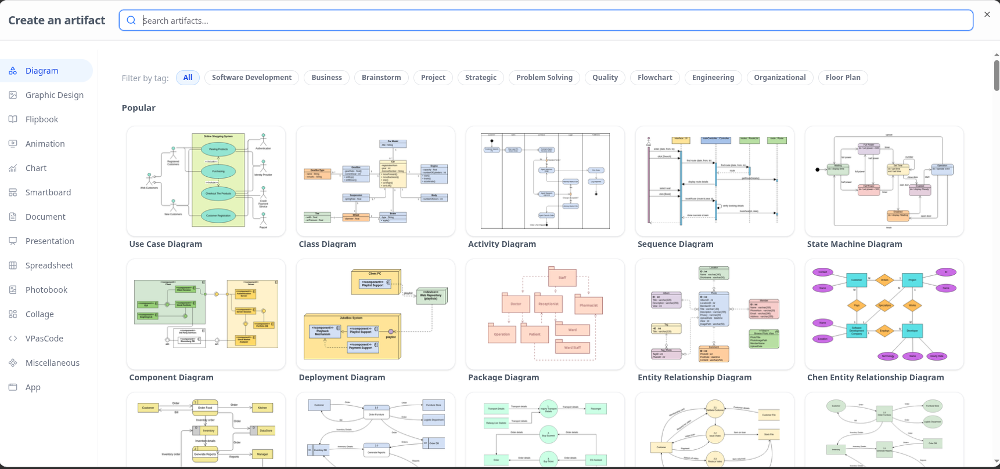


### **3. Acceso al proyecto**: 
Una vez seleccionada la opción que deseemos (en este ejemplo case diagram) podemos empezar a aplicar los diagramas y las funcionalidades que nos ofrece como añadir texto, imagenes, tablas, flechas, dibujos...

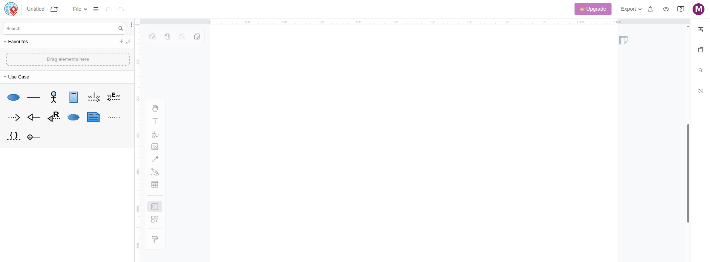

Para cambiar el nombre del proyecto es tan simple como hacer click en `untitled` en el lado derecho al lado de la esquina y renombrarlo como deseemos.

### **4. Invitar a compañeros**:
Para ello hacemos click en nuestro **perfil** (`borde derecho`), `admin pannel` y `members`

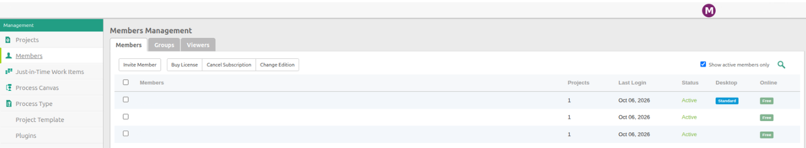


* En este menú también contamos con funcionalidades como ver nuestros proyectos, miembros, estado, añadir plugins...

* Si clicamos en el perfil de alguno de nuestros compañeros podemos gestionar sus permisos de edición, lectura, comentar...

**O también podemos hacerlo desde dentro del propio proyecto** 

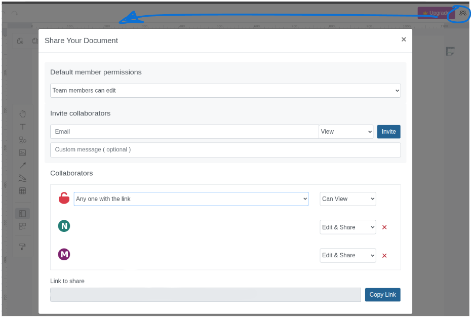


### 5. Exportar el diagrama
Volvemos a nuestro trabajo creado y en la pestaña de `export` podemos elegir como queremos que se guarde el archivo: PDF, PNG ...


## Acceso desde la aplicación
Para descargar la aplicación lo podemos hacer desde la propia página de visual paradigm donde podremos seleccionar si lo queremos instalar en windows, linux o mac

> https://ap.visual-paradigm.com/universidad-de-jaen

**Tenemos que activar la licencia, lo podemos hacer desde el enlace de arriba y seleccionando academic activation**

### 1. Menú Inicial
Una vez iniciemos sesión correctamente lo primero que nos saldrá es el siguiente menú

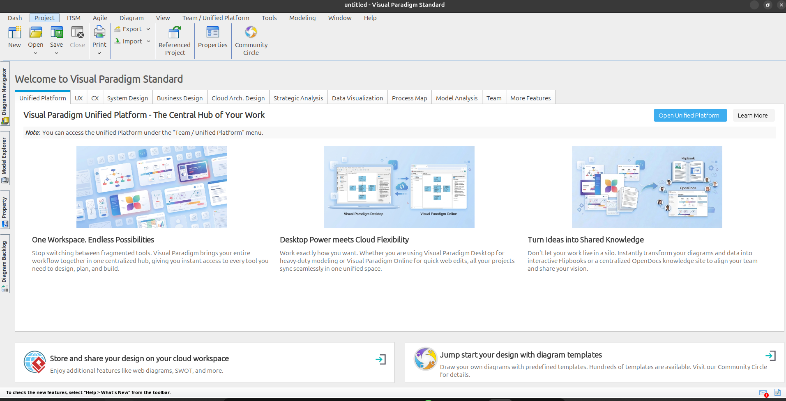

```
Menú Archivo > Nuevo (o New en la pantalla de inicio).
```
Primero creamos el proyecto en VP y escribimos una descripción. Debe responder a tres preguntas: *¿quién lo usa?*, *¿qué problema resuelve?* y *¿qué debe permitir hacer el sistema?*

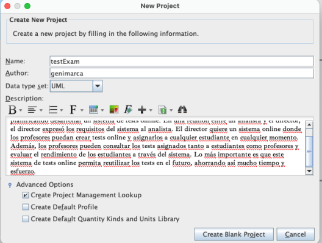

* **Nombre**: nombre del proyecto
* **author**: Los nombres del equipo
* **Data type set**: dejamos `uml`
* **Description**: La descripción que mejor describa el proyecto

Pulsamos `Create Blank Project`

### 2. Definir los requisitos funcionales
"Un **requisito funcional** es algo que el sistema debe poder hacer.
**Reglas:**
* Como mínimo **5** y como máximo **8**.
* Cada uno se escribe con una **frase clara**: 'El sistema debe permitir...'
* Cada uno debe llevar una **justificación** (¿por qué hace falta?)."

**Ejemplo:**

> **RF 01.** El sistema debe permitir a un conductor publicar un trayecto habitual indicando origen, destino, horario y plazas disponibles
> **Justificación:** es la función central; sin trayectos publicados, el resto de funciones no tienen sobre qué actuar

```
Pestaña Modeling > Requirement List
```
(Si queremos crear uno nuevo tenemos que pulsar en el **dibujo verde**)

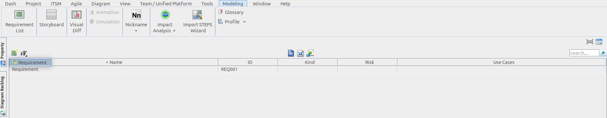

* **Nombre**: Tenemos que escribir que debe permitir
* **Tipo**: No funcional o funcional
* **ID**: se asigna solo
* **Rellenar los detalles:** Clic derecho sobre requisito > `open Specitifaction`
* **text**
```
Como un <actor>, quiero <acción / caso de uso> para que <objetivo de negocio>
```

### 3. Análisis textual (Use Case Statements)
Ahora ponemos todos los requisitos en una tabla con tres columnas. Esta tabla nos ayuda a identificar a los actores (quién usa el sistema) y los casos de uso (qué hace)

```
Diagram > New > Textual Analysis
```
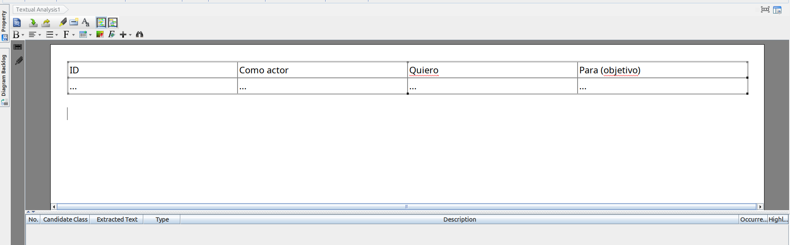

**Ejemplo**

| ID | Como actor | Quiero | Para (objetivo) |
|---|---|---|---|
| 01 | Conductor | publicar un trayecto habitual | que otros puedan solicitar plaza |
| 02 | Pasajero | buscar trayectos compatibles | encontrar uno que me encaje de horario |
| 03 | Pasajero | solicitar una plaza | poder viajar en ese trayecto |
 
* **Cada fila** → será un caso de uso del diagrama
* **Cada valor distinto de la columna "Actor"** → será un actor del sistema (en el ejemplo: Conductor y Pasajero)

### 4. Diagrama de casos de uso del sistema
Es el dibujo general del sistema: muestra todos los actores y todos los casos de uso juntos. Hay un caso de uso por cada requisito

```
Diagram > New > Use Case Diagram > Next
```
En `root` selecciona el proyecto que ya creaste (si te lo pide)

* **En la barra lateral de herramientas:**
    * **Icono del muñeco** → crear un actor
    * **Icono del óvalo** → crear un caso de uso
    * **Líneas** → unir actor con caso de uso

Dibuja la **caja del sistema** (icono del rectángulo en la barra lateral) y mete dentro solo los casos de uso. Los actores quedan fuera de la caja. Ponle el nombre del sistema a la caja

A cada caso le tenemos que poner un esteriotipo > Case story
```
Sterotypes > Case Story
```
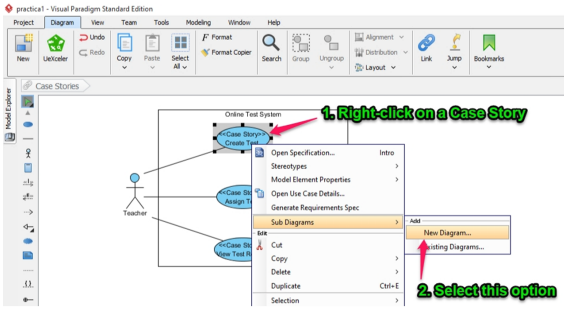
* Si un caso necesita apoyarse en otro usamos **Relaciones**

* `<<include>>`: subfunción obligatoria (siempre ocurre)
* `<<extend>>`: funcionalidad opcional que amplía el caso

> **Muy importante:** la caja del sistema es obligatoria

### 5. Historia detallada de cada caso de uso
Cada caso de uso necesita su descripción textual completa, como una pequeña ficha

```
sub Diagram > New Diagram ...
```

Elegimos Textual Analysis y rellenamos una tabla fijandonos en esta

**Ejemplo**
| Campo | Qué poner |
|---|---|
| **Actor primario** | Quién inicia el caso (ej. Conductor) |
| **Sistema** | Nombre del sistema |
| **Participantes** | Otros actores o interesados |
| **Nivel** | Objetivo de usuario, resumen... |
| **Condiciones previas** | Lo que debe cumplirse antes (ej. el usuario ha iniciado sesión) |
| **Flujo básico (numerado)** | Pasos normales, 1, 2, 3... |
| **Flujos alternativos** | Qué pasa si algo falla o cambia |

### 6. Diagrama individual de cada caso de uso
Además de la historia escrita, cada caso de uso tiene su propio diagrama pequeño, donde se ve el caso con su actor principal y sus relaciones `include`, `extend` o `especialización`

```
clic derecho sobre el caso de uso > Sub Diagrmas > New diagram... > Case diagram
```

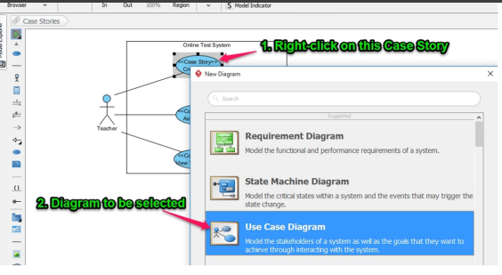

### 7. Glosario

El glosario es un **diccionario del proyecto**: explica los términos importantes (actores, casos de uso, conceptos del dominio...) para que todos entiendan lo mismo. Cada término lleva **descripción** y, si es posible, un **alias**

```
clic derecho > Add '<término>' to Glossary
```

Ponemos:
* **Name**: El término
* **Alias**: Sinónimos
* **Descripción**: que significa

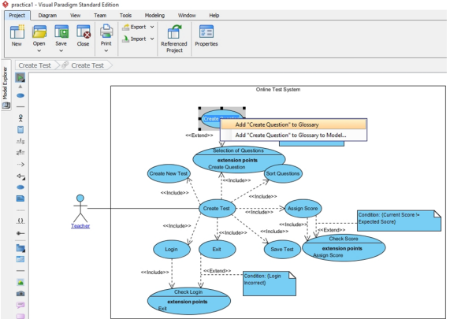

### 8. Generar el informe PDF
VP genera el informe automáticamente a partir de todo lo que hemos hecho. Solo hay que arrastrar los elementos al documento.

```
Tools > Doc. Composer > Build doc from Scratch
```

1. Arrastra y suelta sobre el documento los diagramas, historias y el glosario.
2. Pulsa el botón de propiedades del documento (icono "i") para:
* Cambiar márgenes
* Añadir portada
* Añadir marcas de agua

3. Resivar encabezado y pie de página
4. Explortar a PDF

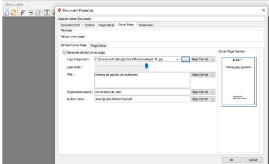

