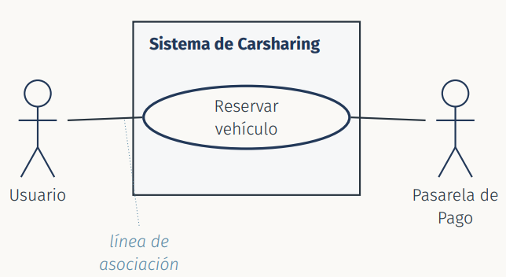
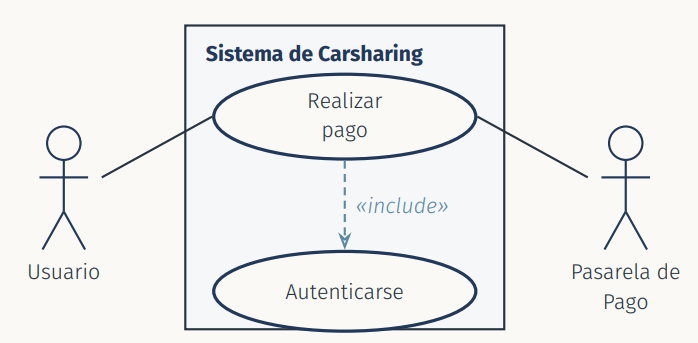
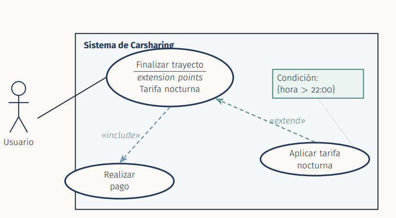
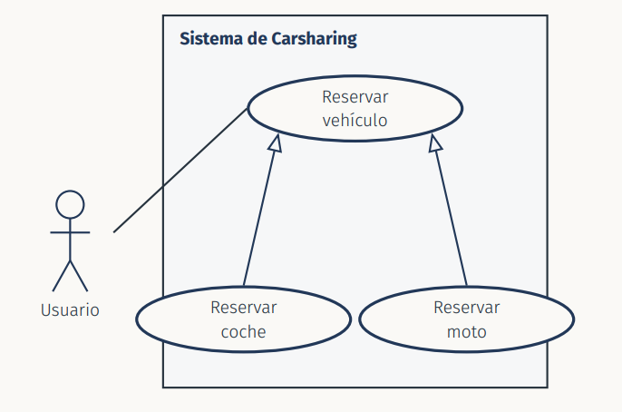
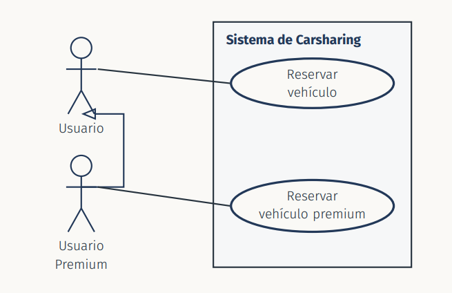
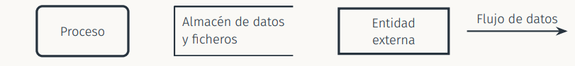

# Tema 4: Representación de Requisitos:

* Un requisito redactado solo en **lenguaje natural libre** es complicado de **verificar, comparar y mantener**

* Para representarlo se le da una **forma estruturada** textual o gráfica que facilite su comunicación


## Técnicas para la representación de requisitos

## Caso de uso:
* Se usan tanto en las técnicas **orientadas a objetos** como en las técnicas de **análisis estructurado**

* **Describen** bajo la forma de acciones y reacciones el comportamiento de un **sistema desde la perspectiva de un usuario**

* Permiten definir los **límites del sistema** y las relaciones entre sistema y su entorno

* Son **descripciones** de la funcionalidad del sistema inddependientes de la implementación

* Están basados en el **lenguaje natural**

### Actores
* Agrupación de **personas, sistemas o máquinas**

* Son **externos** al sistema que vamos a desarrollar 

* Un **usuario** puede acceder al sistema desde **diferentes perfiles**

* **Cada perfil** equivale a un **actor diferente**

### Representación Textual
La representación textual recibe varios nombres: `descripción, historia` o `narrativa`. Representa los distintos **escenarios** que pueden representarse

* **Contenido**
    * **nombre** del caso de uso
    * **actor primario**
    * **sistema al que pertenece**
    * **participantes**
    * **nivel** del caso de uso: objetivo usuario o subfunción
    * **Condiciones previas**
    * **Flujo de operaciones básicas** del escenario principal
    * **Alternativas** (errores o excepciones)

* **Características**
    * Expresadas desde el **punto de vista del actor**
    * Documentadas en **lenguaje natural**:
        * **Lista numerada del flujo de operaciones básicas** que sigue el actor para interactual con el sistema
        * **Lista de alternativas** (errores o excepciones) que aparecen durante la ejecución
    * **Describen** lo que hace el **actor** y el **sistema**
    * Iniciadas por el actor
    * **Acotadas** al uso de una determinada funcionalidad

### Formas de representar el mismo requisito
Un caso de uso desarrollado con su flujo de operaciones y sus alternativas es un **antecesor más formal y detallado** de una historia de usuario con sus criterios de aceptación

> ¿ En qué se diferencian?
* El **caso de uso** es **más tedioso** de escribir y mantener pero **más preciso**

* La **historia de usuario** es **más ligera** y se prioriza mejor en un backlog ágil pero delega en los criterios con el cliente en gran parte del desarrollo

* `Metodología predicativa`: Prefiere el **caso de uso** completo
* `Metodología ágil`: Prefiere la **historia de usuario**

### Representación gráfica
Diagrama que muestra los **casos de uso** en forma de **elipses** y los **actores** en forma de **muñecos de palo**. Representa las diferentes **relaciones** entre actores yc asos de uso

```
* Asociación entre actor y caso de uso
* inclusión (<<include>>) 
* extensión (<<extend>>)
* Generalización entre casos de uso
* Generalización entre actores
```

### Relación de una asociación
> Vincula a un actor con un caso de uso, se representa con una línea continua sin flecha

**Da soporte a diferentes modelos de comunicación**

* **Servicios** que el sistema debe suministrar a cada actor del caso de uso

* **Información** del sistema que un actor puede introducir ,modificar o consultar

* **Cambios** en el entorno , el actor informa al sistema o cambios de sistemas de lso cuales este informa a un actor



---
### Relación de una inclusión

> Enriquece un caso de uso con otro. Se lleva a cabo mediante una **inclusión imperativa**: El caso de uso base siempre ejecuta el caso de uso incluido

* **Características**:
    * El caso de uso incluido **existe únicamente con ese proposito** (es una **subfunción**)
    * Puede **compartir funcionalidad** entre varios casos de uso o **estructura un caso de uso** describiendo sus subfunciones
    * Tiene que usar el esteriotipo `<<include>>`

    

---
### Relación de extensión
> Enriquece un caso de uso mediante el uso de una subfunción. Es una **funcionalidad opcional**

* **Características**:
    * Se produce entre uno o varios **puntos de extensión**
    * La **aplicación** de cada extensión se decide durante la ejecución del escenario. Es **opcional** y puede estar sujeta a una **condición**
    * Se representa de la siguiente forma y con `<<extend>>`

    

---

### Generalización entre casos de usos
> Permite la **especialización** de un caso de uso en otro u otros, obteniendo uno/varios **subcasos de uso** 

* **Características**
    * El **subcaso** hereda el **comportamiento** y las relaciones de asociación, inclusión y extensión del **supercaso**
    * El **supercaso** suele ser **abstracto**
    * Los **subcasos** tienen el **mismo nivel** que el supercaso

    


### Generalización entre actores
> Permite a un actor **heredar** la funcionalidad de otro.

* **Características**
    * El actor que actúa como **general** peude ser abastracto o concreto
    * Cuando el actor general es **abstracto** permite que varios actores concentrados hereden su funcionalidad sin que este participe en un escenario

    

### ¿ Es necesario dibujar siempre todo el sistema?
No. Cuando el caso de uso es **complejo** y queremos mostrar con claridad sus **subcasos de uso y subfuncionalidades** (relacionados con inclusión o extensión) se le dedica su propio diagrama en lugar de saturar el original

**Consejos**:
1. Obtener una **lsita priorizada de casos de uso**
2. Buscar una **comunicación real** entre actores y sistema
3. Los casos de uso aumentan la **trazabilidad del sistema** y permiten desarrollar casos de prueba
4. Los casos de uso deben ser **revisados con el usuario** y deben **evitar ambiguedad**
5. Las relaciones de **inclusión** hacen referencia a subcasos presentes en **todos** los escenarios posibles
6. Las relaciones de **extensión** hacen referencia a subcasos excepcionales, que **no** están presentes en todos los escenarios posibles

**Proceso de obtención**:
1. Definir el **contexto del sistema**
    1) Identificar **actores** y su responsabilidades
    2) Identificar **casos de uso**, comportamiento y características
2. Evaluar los **actores** y los **casos de uso**
3. Evaluar los **casos de uso** para identificar relaciones de `inclusión` y `extensión`
4. Evaluar los **actores** para identificar aquellos casos en los que sea posible crear una `generalización`

## Diagramas de Flujo de Datos (DFD)

* *Los **DFD** son una técnica del **análisis estructurado, anterior y alternativa** al paradigma orientado a objetos.

* Supone un **cambio de paradigma** 

> **Definición**: Representación gráfica de un sistema que ilustra cómo fluyen los datos a través de distintos procesos

> **Estructura**: Se realizan a distintos niveles de abstracción: Un proceso que aparece como un elemtno simple en DFD de nivel superior se detalla a su vez en un nivel inferior

* **Entidades externas**: emiten o reciben la info que fluye a traǘes de las interfaces externas del sistema

* **Flujos de datos**: Indican el flujo de información a través del sistema

* **Procesos**: Transforman la información de entrada en información de salida

* **Almacenes de datos**: Lugar donde se guardan lso datos para su procesamiento posterior



### Normas de Diseño
* Cada elemento tiene asociado un **nombre unívoco** a modo de etiqueta
* Los **flujos de datos** pueden converger o divergir
* **Procesos y ficheros** tienen que representar **flujos de entrada y de salida**
* Los flujos **no** pueden incluir información de control
* **Las entradas y salidas netas** de un DFD deb en **coincidir** con los flujos de entrada y salida del proceso al que corresponde en el **nivel superior**