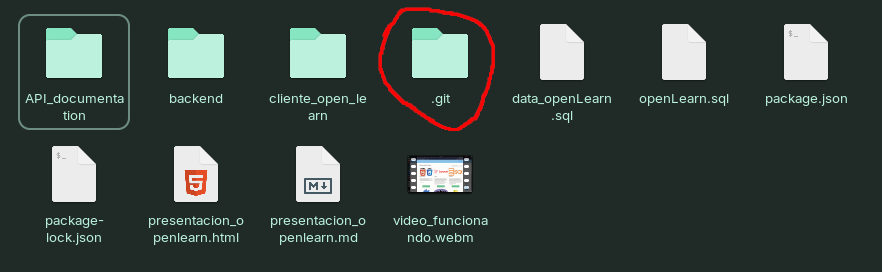
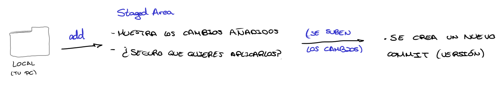
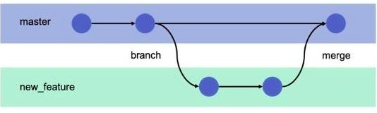
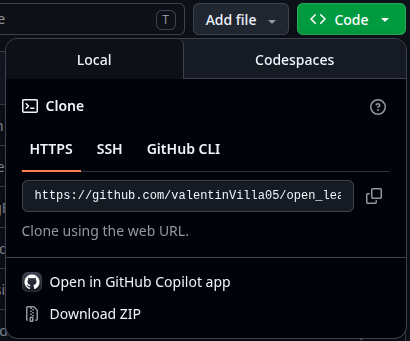

 
 # Apuntes GitHub
 
 ## 1.- Diferencia entre Git, Github y Gitlab
 
 La diferencia que hay es simple:
 > **Git** es el **sistema de control de versiones**. Es decir, es el "motor", lo que hace todo. 
* **Es local:** Se instala y se ejecuta directamente en el ordenador.
* **No necesita internet:** Puedes trabajar y ejecutar comandos directamente sin conexión.

> **Github y Gitlab** son **las plataformas de alojamiento**.

Es decir, son la "nube" donde se guardan los proyectos para no perderlos, compartirlos o colaborar con otra gente.
Estos están creados con "Git" como base.

 ## Comandos básicos
 
 
 > `git init`
 
 Este comando inicializa el repositorio en el directorio que estamos actualmente. 

 #### ¿Qué significa crear el repositorio?

 Un repositorio es básicamente la carpeta de tu proyecto solo que al inicializarlo se crea una carpeta oculta en ella que se llama ".git" que contiene todos los archivos necesarios para que todo git funcione y puedas ejecutar los comandos. (Entre otras cosas contiene el historial de cambios, todos los commits que se hagan y la configuración).
 
 

  
  

 > `git add`

Con este comando añadimos todos los cambios que hemos realizado desde el último commit al "Staging area".

Al hacer un `git add` tenemos la opción de especificar los archivos que queremos añadir en el siguiente commit de la siguiente manera: `git add proyecto/archivos/index.html proyecto/imagenes/imagen.png`, en este caso he añadido solamente 2 archivos especificando su ruta y nombre y esos seran los que se añadan en el siguiente commit. 
Si has modificado varios archivos y queremos añadirlos todos de una vez (sin tener que escribir uno por uno) basta con escribir: `git add .`

A la hora de especificar archivos funciona igual que con comandos de terminal.

En este fragmento muestro (desde la interfaz gráfica de Visual Studio Code) como al realizar un cambio en un archivo del proyecto lo he añadido a el Staging Area manualmente.

### ¿Qué es el "Staging Area"?

El Staging Area es la "fase intermedia" que hay para cada vez que hacemos un **commit**, es decir, guardar los cambios realizados.

Basicamente lo que hace es dejar los cambios en modo de borrador para ver que archivos y lineas se han añadido o cambiado para así decidir cuales son las que quieres implementar en tu próximo commit en vez de añadir todos los cambios de una vez.

 > `git commit -m "nombre_commit"`

Con este comando "confirmamos" los cambios añadidos en el Staging area. Al hacer un commit se crea una nueva versión de nuestro proyecto.

Este comando puede tomar varios valores en su pámetro:
 * **-m**: (De "message"). Con esto indicamos que vamos a escribir el mensaje del commit en la misma terminal.
 * **-am**: Con este parámetro hacemos a la vez el **add y el commit** (es como la unión de los dos). Cuidado en cuanto al "add" que hace: solo añade al Staging area los cambios de los archivos ya existentes, es decir, si queremos añadir al commit un archivo nuevo tendremos que añadirlo mediante "git add" manualmente ya que si hacemos "git commit -am "" " no lo va a reconocer.
 * **--amend -m**: Con este parámetro podemos retroceder al último commit por si hemos añadido algún archivo que no queriamos, nos hemos equivocado en el mensaje o se nos ha olvidado añadir algún archivo.

 * Otras flags que existen pero que por ahora no son necesarias:
    - **--allow-empty**: Nos permite hacer un commit vacío. Sirve para probar si funcionan las automatizaciones en GitHub.
    - **-S**: Nos permite firmar el commit con tu clave criptográfica (GPG). Sirve para que en GitHub aparezca una etiqueta verde ("Verified") de verificado al lado del nombre
    - **-v** o **--verbose**: Nos muestra en el editor de texto que estemos usando todo el código que va a cambiar mientras escribimos el mensaje del commit. Sirve por si no te acuerdas de todos los cambios que has hecho.

 
 

> `git push`

Hasta ahora todos los cambios, guardados y todo lo que hemos hecho ha sido en nuestro repositorio **local**, es decir, en nuestro ordenador. Nada de lo que hemos hecho se ve reflejado aún en github. Para eso usamos este comando, para subir todos estos cambios al servidor/nube Github

 

Aquí de manera más gráfica se muestra las fases 

> `git fetch`

Va al repositorio remoto (GitHub), **revisa si hay cambios nuevos o ramas nuevas creadas por otras personas, y se descarga esa información en tu ordenador, pero SIN tocar ni modificar tus archivos locales.**

> `git pull`

Con este comando bajamos la última versión del repositorio que hay en Github a nuestro repositorio local. Se usa por si subes los cambios desde un ordenador y tienes que bajartelo a otro ordenador o por si estás trabajando con alguien más y necesitas actualizar los cambios que ha hecho otra persona.

En resumen: descarga los cambios de GitHub **y los fusiona inmediatamente** con los archivos locales.

> `git status`

Con este comando vemos los cambios actuales, archivos nuevos y modificados que se encuentran en el Staging area.

> `git reset`

Si usamos este comando sin especificar un archivo descartará **todos** los cambios del staging area pero el código de nuestros archivos se **mantiene intacto**. Para hacer esto también podemos usar `git restore --Staging` 

Hay algunos parámetros del git reset que podemos usar:
* > `git reset [archivo]`

Saca del Staging area el archivo que queramos manteniendo el resto de cambios.

* > `git reset --soft`

**No toca el staging area.** De hecho, se usa para "deshacer" el último commit, dejando esos archivos dentro del Staging Area para que los vuelvas a confirmar rápidamente. | **Mantiene los archivos intactos.**

* > `git reset --hard`

**Vacía el staging area por completo.** Revierte todos tus archivos al estado exacto del último commit, destruyendo cualquier cambio que no hayas guardado en un commit previo.

> `git diff`

Aquí podemos ver exactamente las lineas de código que se han añadido, borrado o modificado. Este diff por defecto compara los cambios del directorio de trabajo actual con el staging area.

* **Líneas en Rojo (empiezan con `-`):** Son líneas de código que han sido **borradas** o modificadas (Git interpreta una modificación como "borrar la línea vieja y crear una nueva").
* **Líneas en Verde (empiezan con `+`):** Son las líneas de código que han sido **añadidas**.
* **Líneas en Blanco/Gris:** Es el código que no ha cambiado, Git te lo muestra alrededor para darte contexto de dónde estás parado en el archivo.

* > `git diff --Staging`

Compara el **staging area** con el **último commit**

* > `git diff HEAD` 

Compara el **directorio de trabajo actual** con el **último commit**

* > `git diff [archivo]`

Compara los cambios del archivo que le especifiquemos

* > `git diff [rama1] [rama2]`

Compara las dos ramas que le especifiquemos.

* > `git diff [commit1] [commit2]` 

Compara las dos versiones usando sus códigos de ID

 
 
 

 ## Comandos para trabajar con ramas

 ### ¿Para que sirven las ramas?

Trabajar con ramas es una buena práctica a la vez de muy útil. Su función principal es poder seguir con el desarrollo de algo mientras la rama principal, la cual es "main" o "master", se mantiene estable y funcionando. 

Ejemplo: Si quieres implementar una nueva funcionalidad, creas una nueva rama y trabajas sobre ella mientras la principal sigue funcionando estable, cuando esa nueva funcionalidad esté lista, fusionas la rama como la rama principal. Así el proyecto no ha dejado de funcionar en ningún momento y hemos podido implementar la nueva funcionalidad sin problemas. 

> `git branch`

Con este comando conseguimos la lista de todas las ramas que haya. (La rama en la que estemos en ese momento aparecerá con un *)

> `git branch nombre_rama`

Con este comando creamos una rama nueva con el nombre que le pongamos.

> `git checkout nombre_rama`

Con este comando cambiamos de la rama en la que estemos a la rama que digamos

> `git merge`

Una vez hemos terminado de de trabajar en una rama, nos movemos a la rama principal con "git checkout main" y fusionamos nuestra nueva rama a la princial con "git merge new_feature" (o el nombre de esa rama).

> `git rebase`

El rebase hace lo mismo que el merge pero de manera distinta. Mientras que con el merge se crea un "commit de fusion", por así decirlo, donde quedan muestras de que ha habido una rama y se ha fusionado con la principal, el rebase no deja ninguna evidencia de eso. Rebase "reescribe" el historial de commits dejando un historial lineal y limpio. 

> `git branch -d nueva_rama`

Con este comando eliminamos la rama en la que estbamos trabajando una vez ya la hayamos implementado en nuestra rama principal.

En caso de que intentemos borrar la rama sin haberla implementado antes Github nos dará un error. Si queremos borrarla sin implementarla tenemos que forzarlo con:

> `git branch -D nueva_rama`

 
 
 

 ## Stash

Un stash podemos decir que es como una "captura de pantalla" de nuestro proyecto. Si estamos trabajando en algo y de repente necesitamos volver a trabajar en la main pero no podemos fusionar nuestra rama (ya sea por que no esté completa, no funcione o cualquier otra razon) haremos un stash para guardar en memoria el estado del proyecto (guardará los cambios tanto del directorio de trabajo como del staging area).

> `git stash`

Crea un stash y lo guarda en memoria

Para guardarlo con un nombre propio en vez de un genérico:

> `git stash push -m [nombre]`
 
¡Atención con los archivos nuevos! Al igual que git commit -am, el comando git stash básico no guarda los archivos nuevos que acabas de crear (los untracked). Para guardarlo absolutamente todo (incluyendo archivos nuevos), añade el flag -u: `git stash -u`

> `git stash list`

Nos muestra una lista de los stash que hemos creado

> `git stash pop`

Aplica los cambios que guardamos en el stash más reciente y lo elimina de la lista temporal. el código vuelve a aparecer en el editor tal y como lo teniamos.

> `git stash apply`

Hace lo mismo que pop (aplica los cambios guardados de vuelta a el editor), pero mantiene la copia guardada en la lista de stash por seguridad. Es muy útil si queremos aplicar esos mismos cambios en varias ramas diferentes.

> `git stash drop`

Elimina el stash mas reciente

* > `git stash drop [id]` 

Elimina el stash con el id especificado

> `git stash clear`

Vacía por completo la lista de stashes.

 
 
 

 ## Otros comandos

 > `git log`

 Muestra el historial de commits en la rama actual.

 > `git log ramaB..ramaA`

 Muestra los commits de la rama A que no estan en la rama B.

 > `git clone [url]`

 Con esto podemos clonar un repositorio de github a nuestro ordenador. El enlace lo obtenemos desde aquí:

 