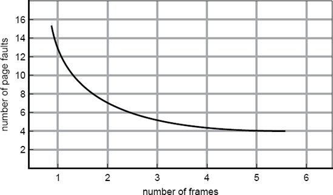
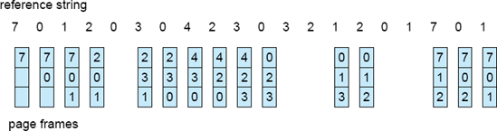
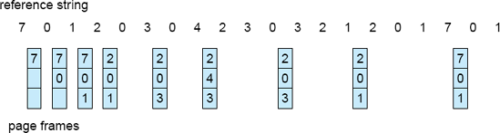
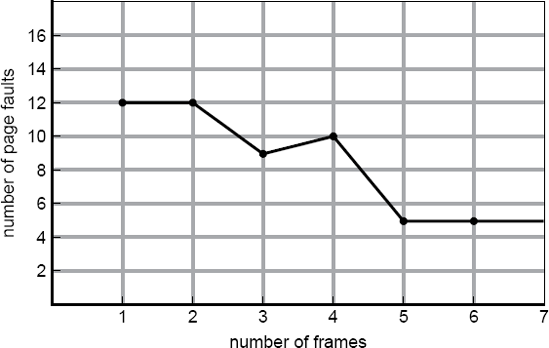

# 4.2.2 Algoritmos de Reemplazo De Páginas

El objetivo de estos algoritmos es **minimizar la tasa de fallos de página** cuando la memoria física (RAM) está llena y se debe cargar una nueva página traída desde el disco

## 1. Cadenas de Referencia y Simplificación
Para probar y evaluar la eficiencia de un algoritmo, se analiza una  **cadena de referencias** a memoria. Dado que la velocidad de ejecución es altísima (los procesadores modernos ejecutan decenas de miles de MIPS), el voluemn de referencais es gigantesco

Para simplificar las pruebas se aplican dos reglas de reducción:

**1. Ignorar el desplazamiento**: Solo interesa el **número de páginas** al que se accede, no la dirección exacta de memoria

**2. Eliminar referencias consecutivas repetidas**: Si se accede sucesivamente a la misma página $p$, solo los accesos iniciales o cambios de página pueden generar un fallo. Las lecturas/escrituras consecutivas sobre $p$ están garantizadas en la RAM

> **Ejemplo de reducción (para un tamaño de página** de 100 bytes):
Direcciones originales: `0100`, `0432`, `0101`, `0612`, `0102`, `0103`, `0104`, `0101`

Cadena de páginas reducida: 1,4,1,6,1

## 2. Comportamiento según el número de marcos
En las condiciones normales, **cuanto mayor es el número de marcos de RAM asignados a un proceso, menor es el número de fallos de páginas**, ya que caben más páginas en la memoria física

Para comparar los algoritmos de remplazo se suele usar la siguiente **cadena de referencia estándar (20 accesos)**:
> $$7, 0, 1, 2, 0, 3, 0, 4, 2, 3, 0, 3, 2, 1, 2, 0, 1, 7, 0, 1$$

## 3. Algoritmos FIFO (First-In, FIrst-Out)
Asocia a cada página el instante exacto en el que fue cargada en la RAM. Cuando la memoria está llena y hay un fallo, **se remplaza la página que lleva más tiempo en memoria**

* **Resultado para la cadena estándar (3 marcos asignados)**: Produce un total de **15 fallos de página**

### Problemas principales del algoritmo FIFO
* **1. Incapacidad para medir el uso real**: Una página que lleva mucho tiempo en RAM puede ser un módulo inicial que ya no se usa, o una variable global a la que se accede constantemente. FIFO la expulsará en ambos casos por el simple hecho de ser la más antigua

* **2. Anomalía de Belady**: Es la contradicción en la que **al aumentar el número de marcos de memoria asignados a un proceso, la cantidad de fallos de una página AUMENTA en lugar de disminuir.

> Ejemplo:
Dada la cadena de referencia: $1, 2, 3, 4, 1, 2, 5, 1, 2, 3, 4, 5$
* Con 3 marcos disponibles $\rightarrow$ **9 fallos de página**.
* Con 4 marcos disponibles $\rightarrow$ **10 fallos de página** (peor rendimiento con más memoria)

## 4. LRU (Least Recently Used)
A diferencia de FIFO (que mira cuando **entró** una página) y del Algoritmo óptimo (que mira cuando se **usará**), el algoritmo **LRU** utiliza el **pasado reciente** para predecir el futuro

* **Principio**: Basado en el principio de localidad, si una página no se ha utilizado en mucho tiempo, es probable que no se vuelva a usar pronto.

* **Mecanismo**: Al ocurrir un fallo de página, se reemplaza la página que lleva más tiempo sin ser utilizada.

* **Resultado**: Aplicado a la cadena de referencias estándar (con 3 marcos), produce 12 fallos de página (mejor rendimiento que FIFO)

### Algoritmos de Pila y la Anomalía de Belray
Ni el algoritmo Óptimo ni el LRU sufren la Anomalía de Belady. Esto se debe a que pertenecen a los denominados algoritmos de pila:

> Un algoritmo es de pila si el conjunto de páginas cargadas en memoria con $n$ marcos es siempre un subconjunto de las que estarían cargadas si tuviéramos $n + 1$ marcos. Si el número de marcos aumenta, las $n$ páginas más recientemente usadas siguen estando en la lista, por lo que nunca aumentarán los fallos

### Implementaciones Hardware de LRU
Mantener una lista enlazada de páginas por software e ir actualizándola en cada acceso a memoria es prohibitivamente lento. Por ello, se requieren soluciones en hardware:

**1. Contador de 64 bits (Reloj lógico):**

El procesador incrementa un contador automático $C$ con cada instrucción. En cada acceso a memoria, se copia el valor de $C$ en la entrada correspondiente de la tabla de páginas. Al haber un fallo de página, el SO busca el valor mínimo (la página accedida hace más tiempo)

**2. Matriz de $n \times n$ bits (para $n$ marcos):**
Al acceder al marco $k$, el hardware pone a `1` todos los bits de la fila $k$ y a `0` todos los bits de la columna $k$. En cualquier momento, la fila con el menor valor numérico en binario corresponde al marco menos recientemente usado

## 5. Aproximaciones a LRU
Como el hardware necesario para un LRU puro es costoso y poco común, los sistemas emplean un bit de referencia ($R$) básico (puesto a $1$ por el hardware al acceder a la página) para implementar aproximaciones:

**1. Bits Adicionales de Referencia (Registro de desplazamiento)**:
Como el hardware necesario para un LRU puro es costoso y poco común, los sistemas emplean un **bit de referencia (R)** básico (puesto a 1 por el hardware al acceder a la página) para implementar aproximaciones:

* Un valor de `00000000` indica que no se usó en los últimos 8 periodos.

* Un valor de `11000100` es más reciente que `01110111`.

* Se reemplaza la página con el menor valor entero sin signo

**2. Algoritmo de la Segunda Oportunidad**
Modificación de FIFO basada en examinar el bit $R$ de la página más antigua:

* Si $R = 0$, la página es antigua y no se ha usado recientemente: se reemplaza inmediatamente.

* Si $R = 1$, se le da una «segunda oportunidad»: el bit $R$ se pone a $0$, la página se reubica al final de la lista (como si acabase de llegar) y la búsqueda continúa

* Si todas las páginas tienen $R = 1$, el algoritmo limpia todos los bits y acaba actuando como un FIFO estándar

**3. Algoritmo del Reloj**
Misma lógica que la Segunda Oportunidad, pero más eficiente. En lugar de mover físicamente las páginas en una lista, utiliza una **lista circular con un puntero** (manecilla) que apunta a la página más antigua:

* Si $R = 0$: Se saca la página, se carga la nueva y la manecilla avanza

* Si $R = 1$: Se pone $R = 0$ y la manecilla avanza a la siguiente posición hasta encontrar una con $R = 0$

## 6. Algoritmos basados en Conteo: LFU y MFU
Mantienen un contador con la cantidad de veces que ha sido referenciada cada página. SOn pocos comunes debido a su alto coste y pcoa precisión respecto al algoritmo óptimo

* **LFU (Least Frequently Used):** Reemplaza la página con el menor número de referencias, asumiendo que las más usadas son las que tienen recuentos más altos
    * **Problema**: Una página muy usada al principio queda en memoria para siempre aunque ya no se necesite. Se soluciona dividiendo o desplazando los contadores periódicamente a la derecha

* **MFU (Most Frequently Used):** Reemplaza la página con el mayor número de referencias, bajo la premisa de que las páginas con contadores bajos acaban de llegar a memoria y aún deben ejecutarse

## 7. Algoritmo de Uso No Reciente: NRU (Not Recently Used)

El algoritmo **NRU** aprovecha dos bits de estado presentes en la tabla de páginas, los cuales son actualizados directamente por el hardware (o simulados por el sistema operativo mediante fallos de página y control de permisos):

* **Bit $R$ (Referencia):** Se pone a $1$ cada vez que la página es leída o escrita

* **Bit $M$ (Modificación / Dirty bit):** Se pone a $1$ únicamente cuando se realiza una operación de escritura en la página

### Mecanismo de Funcionamiento
**1. Reinicio periódico del bit R**: A intervalos regulares (en cada interrupción del reloj por ejemplo cada 20ms), el sistema operativo pone a 0 el bit $R$ de todas las páginas para distinguir cuáles se están usando en el intervalo actual y cuales no

**2. Manteniemiento del bit $M$**: El bit $M$ ^no se pone a cero con el reloj**, ya que el SO necesita conservar esta información para saber si la página debe guardarse en el disco antes de ser expuesta en la RAM

### Clasificación de las Páginas
Cuando ocurre un fallo de página el sistema operativo examina las páginas presentes en memoria y las clasificas en **4 categorías prioritarias**

| Clase | Bit $R$ | Bit $M$ | Estado de la Página |
| -- | -- | -- | -- | 
| **Clase 0** | 0 | 0 | **No referenciada, No modificada** | 
| **Clase 1** | 0 | 1 | **No referenciada, pero Modificada** , ocurre cuadn oe lreloj borró el bit $R$ de una página de Clase 3 |
| **Clase 2** | 1 | 0 | **referencida y modificada** expulsar requirer guardarlea en disco | 

### Criterio de Reemplazo
El algoritmo **elimina una página de forma aleatoria elegida dentro de la primera clase no vacía con la menor numeración** (empezando por la clase 0)