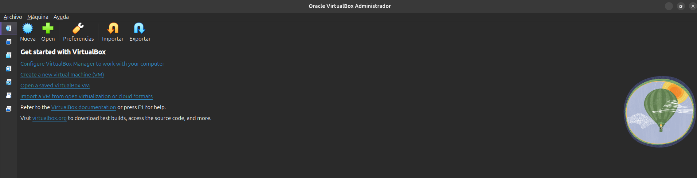
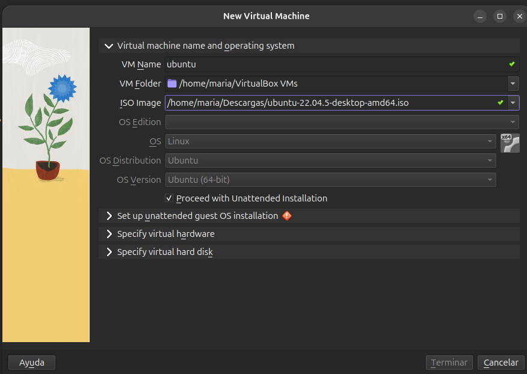
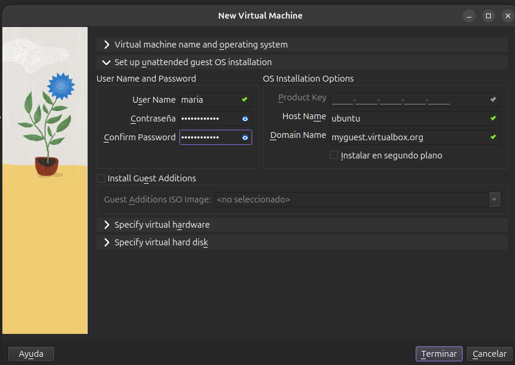
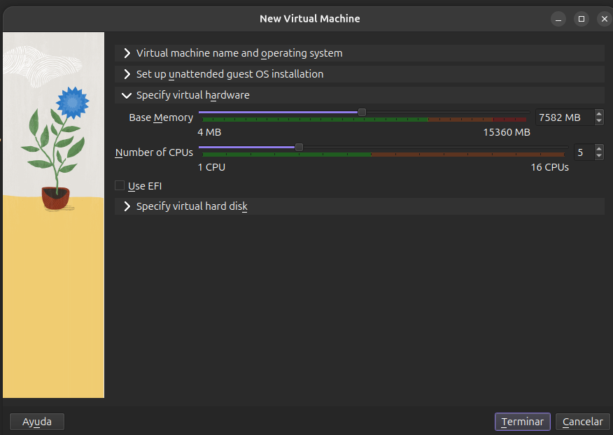
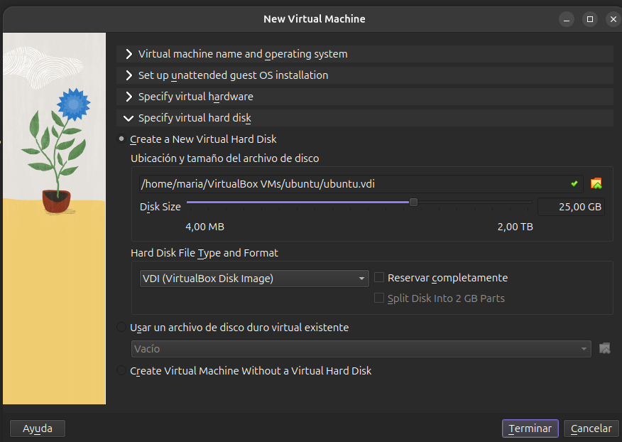
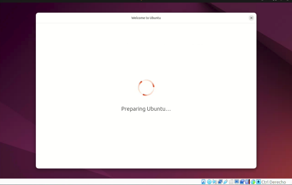

# Practica 1: Configuración e Instalación de una máquina virtual

**Una máquina virutal (MV)** es un ordenador simulado por sofware que funciona en una ventana dentro de un PC real, compartiendo sus recursos (CPU, RAM y disco)

**Ventajas**:

- **Seguridad total**: Lo que pasa dentro (virus, errores) no afecta a tu ordenador real
- **Sistemas a la vez**: Podemos usar linux dentro de windows
- **Puntos de control (Snapshots)**: Si algo sale mal, restauramos el programa a su estado anterior
- **Entorno de prueba**: es un espacio ideal para experimentar, programar y romper cosas sin riesgo

## Instalación de Una máquina virtual

En nuestro caso vamos a usar **Oracle VirtualBox** que es un **programa hipervisor** gratuito que nos permitirá usar la máquina virtual

(Enlace de instalación: https://www.virtualbox.org/)

Y como Sistema Operativo usaremos **Ubuntu 22.04.5 LTS**

### Primeros Pasos

Opciones:

1. **Nueva**: Donde crearemos una máquina virtual
2. **Open**: Para abrir las máquinas que tenemos
3. **Preferencias**: Sirve para configurar las opciones
4. **Importar**: Para importar otra máquina
5. **Exportar**: Para compartir otra máquina que tengamos

### Paso 1: Le daremos a Nueva

- En VM Name podemos poner como queremos que se llame la máquina virtual

- En ISO Image tenemos que poner la ruta de la descarga donde hemos descargado la ISO del sistema operativo que deseemos

- Es recomendable seleccionar **proceed with unattended installation** que sirve para omnitir la instalación desatendida

### Paso 2: Configuraciones de usuario

En este paso configuramos el usuario y la contraseña que queremos ponerle para acceder a la máquina virtual

### Paso 3: Configuración de Hardware

Este paso es Importante ya que debemos seleccionar la memoria y los núcleos de CPUS, en este caso usamos una versión antigua de ubuntu (_que no es tan demandante como la 26.04 que requiere una memoria mínima de 6 GB de RAM_), siempre es recomendable para la máquina virtual darle una memoria y numeros de CPU decente para que no tengamos problemas al ejecutarla pero no debemos pasar la zona verde ya que tenemos que compartir recursos con nuestro **sistema principal**

### Paso 4: Especificación de Memoria

En esta sección lo más relevante es asegurarnos de que nuestra máquina virtual tenga un mínimo de 25GB para poder ejecutarse correctamente

**Terminados estos pasos podemos darle a terminar y nos saldrá pronto nuestra máquina**

**El proceso de la instalación tardará un poco así en función de la RAM y los núcleos**

Una vez Instalado nos saldrá en pantalla una serie de opciones como configurar el lugar para establecer la zona horaria, la preferencia para instalación de aplicaciones y demás, configurado eso ya tendremos nuestra propia máquina
