# Practica 2

> Recordatorio : En esta práctica sobre todo hay que aprender como funciona el ejecutor de ordenes **Nano** y otra serie de comandos necesarios para obtener información sobre procesos y demás

## Formas para programar en la terminal

Para programar necesitamos un editor de texto, lo bueno es que cualquier editor nos vale para ello. Podemos destacar **tres opciones principales**. Cada uno tiene funciones distintas como editar archivos (cualquier editor), probar código linea a linea o generar código mediante IA (IDE), como en la práctica lo más relevante y lo único que usaremos de momento es **Nano** solo profundizaremos en este.

## Ordenes Útiles

Antes de pasar a la práctica estaría bien conocer un poco los comandos más basicos/utilizados de cualquier sistema linux (y también como funciona y se estructura nuestro sistema). [Aquí podemos ver un poco más desarrollado lo básico de linux](https://github.com/valentinVilla05/Guias-Basicas/blob/master/sistemas_operativos/manual_linux/basico_linux.md) para no estar tan perdidos en un sistema que para la mayoria es nuevo.

Aun así esta tabla es un resumen de los comandos que usaremos por ahora:

| Orden                  | Uso                                                                                                                           |
| ---------------------- | ----------------------------------------------------------------------------------------------------------------------------- |
| **`pwd`**              | Muestra el directorio actual de trabajo                                                                                       |
| **`cd <dir>`**         | Sirve para desplazarse al directorio que queramos                                                                             |
| **`more <fichero>`**   | Muestra el contenido de un fichero de texto pantalla por pantalla (paginado)                                                  |
| **`cat <fichero>`**    | Muestra todo el contenido de un fichero de golpe en la terminal                                                               |
| **`ls`**               | Muestra una lista del contenido del directorio en el que nos encontremos                                                      |
| **`cp `**              | Sirve para copiar ficheros                                                                                                    |
| **`mv`**               | Sirve para desplazar o renombrar ficheros                                                                                     |
| **`rm`**               | Sirve para borrar ficheros                                                                                                    |
| **`man orden`**        | Es un manual que nos premite consultar que hacen las órdenes **Es muy importante saber usarlo**                               |
| **`touch`**            | Sirve para crear un fichero vacío                                                                                             |
| **`whatis orden/es`**  | Se puede obtener una descripción breve sobre lo que hace cualquier orden                                                      |
| **`whereis orden/es`** | Se usa para localizar los archivos binarios de código fuente y de manual de un comando                                        |
| **`whoami`**           | Muestra la identidad del usuario                                                                                              |
| **`hostname`**         | Muestra el nombre de la computadora a la que nos hemos conectado                                                              |
| **`uname`**            | Nuestra información relacionada al SO                                                                                         |
| **`wc`**               | Sirve para contar, si ponemos `wc -c` cuenta bytes, `wc -m`cuenta caracteres, `wc -w` cuenta palabras y `wc -l` cuenta lineas |
| **`echo`**             | Mostrar una línea de texto / cadena de una salida estandar (su equivalente en C++ es `cout`)                                  |

Cabe resaltar que todos estos comandos cuantan con sus parámetros correspondientes que varian su comportamiento.

Por ejemplo: mientras que `ls` lista el contenido del directorio sin más, si le añadimos el parámetro `-a` (`ls -a`) nos listará todo el contenido incluyendo los arhivos/carpetas ocultas. Por eso es muy importante saber usar el comando `man` ya que es dificil saberse todos los parámetros de cada comando.

Mientras estamos aprendiendo también nos puede venir la pagina [cheat.sh](https://cheat.sh/) que nos da información sobre cualquier comando que busquemos.

## Nano (Editor de texto para la terminal)

Es un programa editor de texto que se ejecuta directamente desde la consola, sin necesitar el ratón ya que todo es por combinación de teclas.

Es diferente a cualquier editor que estamos acostumbrados a utilizar ya que aquí no es necesario usar el ratón, nos movemos por el documento usando las flechas, las teclas Inicio y Fin... y debido al cursos que tenemos para escribir no podemos movernos a lineas que no existen.

> Esta es de las más importantes y las que más usaremos

**1. Crear o abrir un archivo**:
`nano programa.cpp` (al hacer esto si el archivo 'programa.cpp' no existe, se crea)

**2. Escribir Código**: Escribimos como lo haríamos normalmente en CLion, VisualStudio o cualquier otro editor.

**3. Menú de funciones en Nano**:
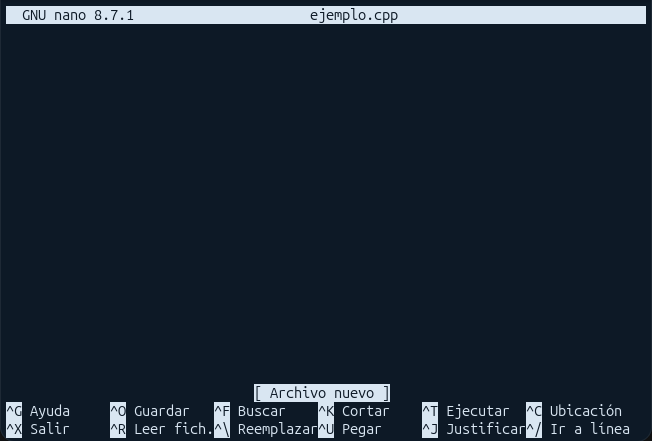

Las funciones que más usaremos son la de Guardar: `Control  O`y Salir: `Control  X` (también es posible guardar los cambios con `Control  S`)

### Ejemplo de Programa en nano

Voy a crear un ejemplo en Nano para poder ver como podemos guardarlo y cargarlo desde la terminal hasta que compile correctamente.

**Paso 1**: Creamos/Abrimos el archivo `nano ejemplo.cpp`
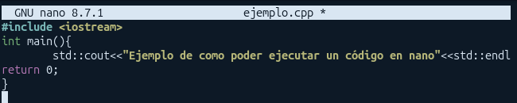
**Paso 2**: Como ya he escrito mi código hago `Control  O`, esto nos preguntará si queremos guardar los cambios y nos preguntará el nombre con el que queremos guardarlo, le damos a `Enter` para confirmar y finalmente `Control  X` para salir.

**Paso 3**: Hemos vuelto a la terminal y hemos guardado nuestro código

**Paso 4: COMPILAR**: Como en este caso vamos a usar C++ para programar tenemos que poner el siguiente comando:

> `g++ ejemplo.cpp -o ejemplo`

(En caso de que nos de error debemos asegurarnos que nuestro sistema tiene el compilador de C++ instalado)

**¿Qué es -o?**: Es un parámetro que significa _output_ o _salida_ para indicarle el nombre del ejecutable que queremos crear

**Paso 5: Ejecutar como programa final**: Para ejecutar el programa tenemos que poner `./` (en caso de que el ejecutable esté en el mismo directorio que nos encontramos, sino debemos especificar el directorio en el que se encuentra) y el nombre del ejecutable

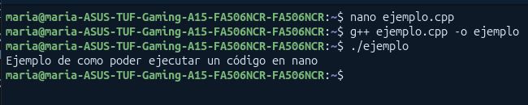

Como podemos ver, en tan solo **3 comandos** hemos creado, compilado y ejecutado nuestro código

## Operadores de redirección

| Operador | Tipo                       | Qué hace                                            | Ejemplo                        |
| :------: | :------------------------- | :-------------------------------------------------- | :----------------------------- |
|   `>`    | Salida (`stdout`)          | **Sobrescribe** el archivo con la salida normal     | `ls -l > lista.txt`            |
|   `>>`   | Salida (`stdout`)          | **Añade/Concatena** la salida del comando al final  | `ps -ef >> procesos.txt`       |
|   `2>`   | Errores (`stderr`)         | **Sobrescribe** el archivo solo con errores         | `g++ main.cpp 2> errores.log`  |
|  `2>>`   | Errores (`stderr`)         | **Añade/Concatena** los errores al final            | `g++ main.cpp 2>> errores.log` |
|   `&>`   | Todo (`stdout` + `stderr`) | **Sobrescribe** con salida normal y errores         | `g++ main.cpp &> todo.log`     |
|   `<`    | Entrada (`stdin`)          | Usa un archivo como entrada del comando             | `sort < lista.txt`             |
|   `<<`   | Entrada (`stdin`)          | Lee texto introducido hasta llegar a un delimitador | `cat << FIN`                   |
|   `<>`   | Entrada y Salida           | Usa un archivo como entrada y salida a la vez       | `cmd <> archivo.txt`           |

## Interconexiones (Pipes)

Un **pipe** o **tubería** (`|`) permite **conectar comandos en cadena**: La salida de un comando se convierte en la entrada de otro.

Para concatenar comandos en linux tambien podemos usar `&&` o `;` pero tiene un comportamiento diferente que la **pipe** `|`.

- `&&`: Ejecuta el segundo comando **SOLO SI** el primero tuvo éxito
- `|`: Como hemos dicho **conecta la salida** de un comando con la entrada del siguiente.
- `;`: Ejecuta el siguiente comando sin importarle si el primero ha tenido éxito o ha fallado

### Flujo de datos Continuo

Sin tuberías, si quieres procesar datos en varios pasos, tienes que guardar archivos intermedios en el disco. Con tuberías, la información fluye por la memoria de un comando a otro sin guardar nada en medio

**Sin tubería**

```text
Comando 1  --->  Guarda en archivo.txt  --->  Comando 2 lee archivo.txt
```

**Con Tubería**

```text
Comando 1  ===[ tubería | ]===>  Comando 2  ===[ tubería | ]===>  Comando 3
```

Con esto tenemos los conocimientos necesarios para realizar esta práctica.

## Resolución de los Ejercicios y Explicación

### EJERCICIO 1

Si ejecutamos los códigos que nos pone haciendo lo que hemos comentado previamente de nano quedaría algo así

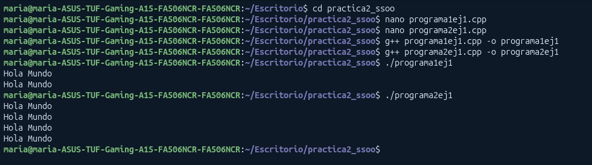

> `fork()` lo que hace es duplicar el proceso actual para crear un **proceso hijo** idéntico en TODO pero en una nueva zona de memoria que se ejecuta en paralelo al proceso padre, es decir es un proceso NUEVO identico.

Para hacer el ejercicio que nos piden tenemos que crear un código similar a este:

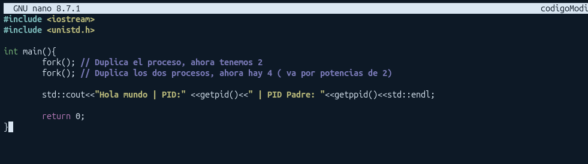

Nos dará un resultado similar a este:

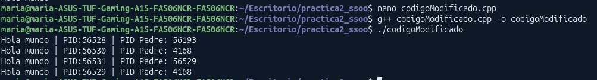

### EJERCICIO 2

Nos pide hacer un programa que actue como el comando `echo` que lo que hace es mostrar una línea de texto por consola.

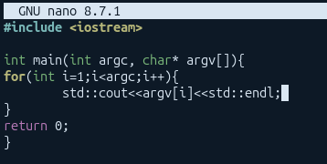

**Explicación**

Aquí tenemos que pasarle parámetros a la función `main()` (cosa que no habiamos hecho hasta ahora) para que al ejecutar el programa desde linea de comandos tenemos que pasar los parámetros ahí mismo.

Estos parámetros son:

- `argc` que indica el número de parámetros pasados a la función (incluyendo el propio nombre de la función).
- char\* `argv[]` que será un vector (de punteros) de carácteres (cada argv[i] representa una cadena de texto completa).

- Empezamos por i=1 ya que i=0 siempre será el nombre de nuestro programa

El flujo de esta función es recorrer el vector de carácteres (que este será el parámetro que le pasamos a la función ("Hola Mundo" o cualquier otra cadena))

**Resultado**
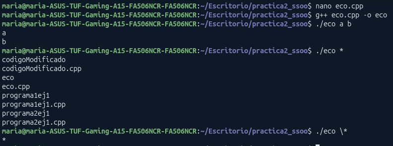

- Como podemos ver en el primer caso si le pasamos `./eco a b` hace un simple cout con a y b

- Si hacemos un `./eco *` muestra todos los archivos dentro de ese directorio

- Por otro lado si hacemos `./eco \*` si se muestra el `*` ya que la barra invertida sirve como un **carácer de escape** que le dice a la terminal que no haga caso al significado especial del caracter que pongamos y lo trate como un texto normal

### EJERCICIO 3

Nos pregunta por los valores de ejecutar cat a b>x

- argc=3 ya que es el número total de elementos
- argv contiene:
  - argv[0]="cat"
  - argv[1]="a"
  - argv[2]="b"

**¿Por qué no se incluyen ni `>` ni `x`?**

El operador `>` es una redirección de la terminal, no un argumento

1. Si escribimos cat a b>x la terminal capta el `>` antes de lanzar el programa
2. La terminal abre o crea el archivo con nombre "`x`"
3. La terminal ejecuta cat solo pasandole los nombres a y b

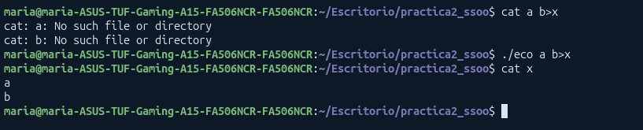

Como no tenemos nada como a o b pues simplemente nos dice que no existe, pero si nos metemos con **`cat x`** si nos muestra que están dentro de este

### EJERCICIO 4

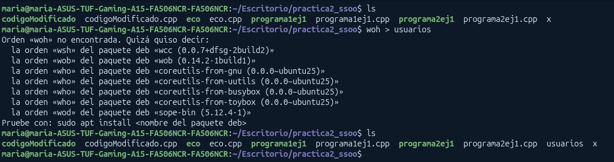

**Explicación**:
La shell procesa la redirección `>` antes de ejecutar la orden, woh no es un comando que exista pero crea el fichero "`usuarios`" en disco y luego ejecuta la orden

**Demostración de los 0 bytes**

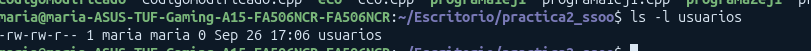

Podemos ver que el fichero existe y también podemos ver los permisos que tiene este, pero el tamaño es `0`

### EJERCICIO 5

En este ejercicio nos piden que conectemos el comando `head` y `tail` para ello tenemos que utilizar `|` (una pipe explicada antes)

Como nos piden mostrar las 3 primeras líneas tenemos que ejecutar `head -n 3` ya que por defecto mostraría las 10 primeras

```bash
head -n 3 /etc/passwd | tail -n 1
```

**Explicación**

- `head -n 3 /etc/passwd`: lee el archivo `/etc/passwd` y extrae las 3 primeras lineas
- `|` en lugar de imprimir las 3 las envia directamente como entrada
- `tail -n 1`: recibe las 3 primeras lineas y se queda con la última.
