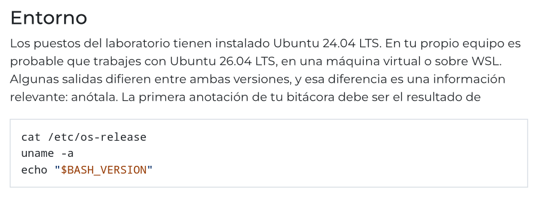
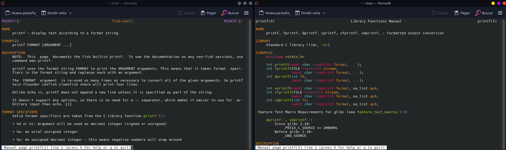
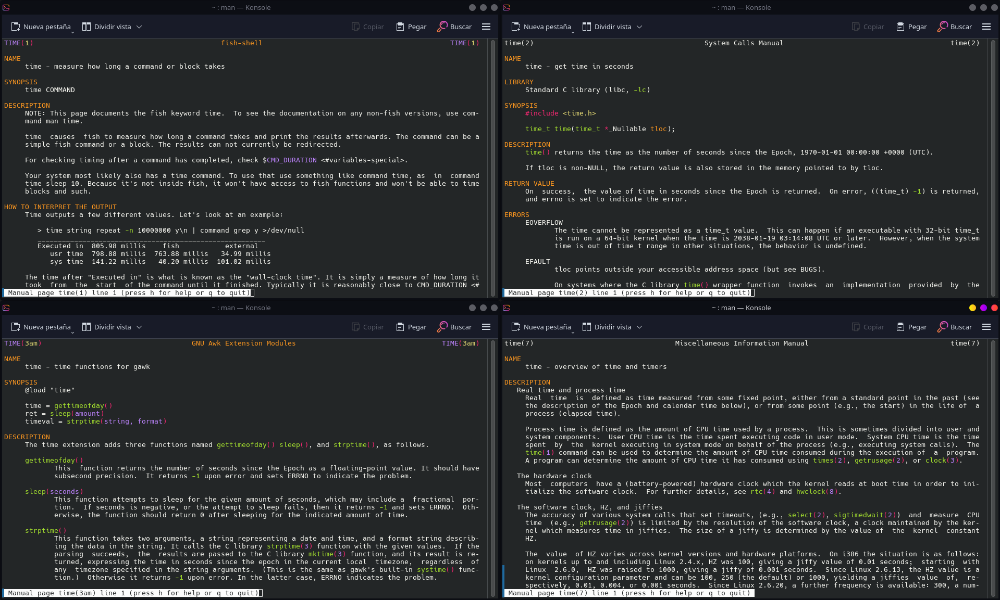

# Ejercicios extras de la Practica 2

Vamos a ir realizando el guión paso a paso, lo primero que nos dice es lo siguiente:



La información que nos va a devolver esto va a depender de la versión y distribución de linux que tengamos. En mi caso obtengo esto:

```bash
❯ cat /etc/os-release
  uname -a
  echo "$BASH_VERSION"
NAME="CachyOS Linux"
PRETTY_NAME="CachyOS"
ID=cachyos
ID_LIKE=arch
BUILD_ID=rolling
ANSI_COLOR="38;2;23;147;209"
HOME_URL="https://cachyos.org/"
DOCUMENTATION_URL="https://wiki.cachyos.org/"
SUPPORT_URL="https://discuss.cachyos.org/"
BUG_REPORT_URL="https://github.com/cachyos"
PRIVACY_POLICY_URL="https://terms.archlinux.org/docs/privacy-policy/"
LOGO=cachyos
Linux valentinvilla05 7.2.8-1-cachyos #1 SMP PREEMPT_DYNAMIC Sat, 26 Sep 2026 19:43:45 +0000 x86_64 GNU/Linux

```

En caso de estar usando VirtualBox con la versión de Ubuntu sugerida en clase el resultado debe ser algo parecido a esto:

```bash
ubuntuvbox@Ubuntu:~$ cat /etc/os-release
  uname -a
  echo "$BASH_VERSION"
PRETTY_NAME="Ubuntu 24.04.5 LTS"
NAME="Ubuntu"
VERSION_ID="24.04"
VERSION="24.04.5 LTS (Noble Numbat)"
VERSION_CODENAME=noble
ID=ubuntu
ID_LIKE=debian
HOME_URL="https://www.ubuntu.com/"
SUPPORT_URL="https://help.ubuntu.com/"
BUG_REPORT_URL="https://bugs.launchpad.net/ubuntu/"
PRIVACY_POLICY_URL="https://www.ubuntu.com/legal/terms-and-policies/privacy-policy"
UBUNTU_CODENAME=noble
LOGO=ubuntu-logo
Linux Ubuntu 7.0.0-34-generic #34~24.04.1-Ubuntu SMP PREEMPT_DYNAMIC Fri Sep  4 15:38:29 UTC 2 x86_64 x86_64 x86_64 GNU/Linux
5.2.21(1)-release

```

Vamos a ver que hace cada una de esas 3 lineas:

> `cat /etc/os-release`

Muestra el contenido del archivo 'os-release' dentro de la carpeta '/etc' el cual es un archivo de texto que describe la **distribución de linux** instalada.

> `uname -a`

Viene de (_unix name_) imprime la información del kernel y el hardware. Al poner la opción '-a' muestra TODA la información en una sola linea

> `echo "$BASH_VERSION"`

Imprime la variable especial de bash '$BASH_VERSION' que tiene la versión del intérprete.

---

A partir de aquí comienza la 'bitacora' de la sesión. Como vamos a tener que registrar lo que vamos haciendo vamos a usar el comando `script`. Este comando registrar en el fichero que especifiquemos todo lo que pongamos en consola desde que lo ejecutamos hasta que ejecutemos `exit`. Este comando es bastante útil para registrar como intentamos hacer algo y verlo más tarde.

En el caso del guión, nos pregunta que hace la opción `-q`, Si nos vamos a ver le manual (`man script`):

> -q, --quiet
>
> Be quiet (do not write start and done messages to standard output).

Es decir, no nos registra en el fichero los mensajes de 'Script started on 2026-10-01 10:15:32+02:00...' que aparecen al inicio y al final.

Si empezamos a hacer un script y tenemos que irnos. Para luego seguir registrando en ese mismo archivo sin sobreescribir lo que ya tenemos usamos la opción '-a' (_append_) e iremos añadiendo al final del documento lo que sigamos haciendo.

Según el guión habría que usar la plantilla:

```text
Ejercicio L3
Predicción: ...
Consulta al manual: man 1 ls, apartado de la opción -F
Orden ejecutada:
$ ...
Salida obtenida:
...
Contraste: la predicción era correcta / no lo era porque ...
```

en la que antes de ejecutar algo deberiamos de hacer una predicción del comando que creemos que se utilizará. En esta guía NO voy a usar esa plantilla.

Se insiste mucho en saber usar adecuadamente el comando `man` (_manual_) ya que es esencial porque tiene todas las respuestas que podemos necesitar.

Hay que saber que este comando está dividido en **secciones**:

| Sección | Contenido                             | Ejemplo      |
| ------- | ------------------------------------- | ------------ |
| 1       | Órdenes de usuario                    | man 1 printf |
| 2       | Llamadas al sistema                   | man 2 fork   |
| 3       | Funciones de biblioteca               | man 3 printf |
| 5       | Formatos de fichero                   | man 5 passwd |
| 7       | Convenios y temas diversos            | man 7 glob   |
| 8       | Órdenes de administración del sistema | man 8 mount  |

La diferencia de especificar la sección o no es que si NO la especificamos el manual nos devolverá la primera coincidencia que haya con el comando que buscamos (la primera sección por lo general).

Ejemplo: a la izquierda se usa `man printf` y a la derecha `man 3 printf`



Al especificar la versión nos devuelve la función de la biblioteca estándar de C con su información.

---

### Ejercicio L1

1. Determina en qué secciones del manual existe una página llamada time . Indica, para cada una, de qué objeto se trata (orden, llamada al sistema, función de biblioteca).

El comando time existe en:

| Sección | Objeto                                       | Qué hace                                                                                  |
| ------- | -------------------------------------------- | ----------------------------------------------------------------------------------------- |
| 1       | Òrdenes de usuario                           | Mide el tiempo que tarda un comando                                                       |
| 2       | Llamada al sistema                           | Función de C que nos devuelve el tiempo en segundos desde 1970-01-01 00:00:00 +0000 (UTC) |
| 3am     | Extensión de gawk no de la librería estándar | Añade métodos a la función time (gettimeofday() sleep(), y strptime())                    |
| 7       | Tema/convenio                                | visión general del tiempo y los temporizadores en Linux                                   |



2. Consulta la página de la sección 1 y la de la sección 2. Anota una diferencia
   sustantiva entre lo que documenta cada una.

Una diferencia sustantiva que podemos ver entre la sección 1 y la sección 2 es que en la sección 1 `time` es un propio comando del sistema y nos explica como funciona el comando y como lo interpreta el interpretador mientras que la sección 2 nos muestra el código de C, el valor de devuelve...

3. La orden time presenta una particularidad adicional que se estudiará en el
   apartado 3.2. Anótala si la detectas ahora; si no, vuelve a este ejercicio al terminar el capítulo 3.

`time` tiene la particularidad de que no es solo un programa sino que también es una **palabra reservada**. Es decir, según como lo invoquemos, ejecutamos **cosas distintas**.
