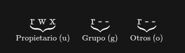
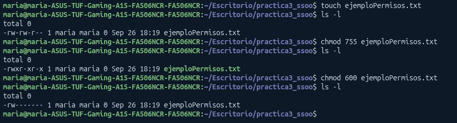
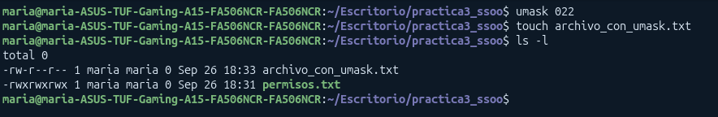
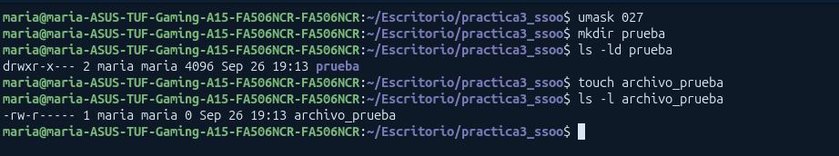

# Aprendiendo Sistemas de Ficheros

## Consideraciones de ficheros

* Son **Case-sensitive** : Distinguen entre mayúsculas y minúsculas (datos!=Datos!=DATOS)

* **Ficheros ocultos**: Empiezan por un punto (ej: `.bashrc`). No se muestran con `ls` normal y estos guardan configuraciones o ejecutan scripts de inicio

* **Buenas prácticas:**
    * Usar solo minúsculas
    * Usar guíon bajo `_` en vez de espacios 
    * Mantener nombres cortos y con extensión explícita
    * Evitar caracteres especiales como `$`,`-`,``%`

* **Trayectorias de ficheros**
    * Secuencia de nombres separados por `/ para localizar un elemento en un árbol de directorios

    * Tipos de Rutas:
        * **Absoluta:** empiezan con `/` (directorio raíz) y se especifica el camino desde el origen (ej: `/usr/bin/python`)
        * **Relativa:** no empiezan con `/`. Partendel directorio de trabajo actual 
    
    * Navegación especial:
        * `.` -> Directtorio actual
        * `..`-> Directorio padre
    
    * Cuando usar cada una:
        * **Relativa** para moverse pocos niveles dentro del sistema cercano
        * **Absoluta** para rutas lejanas

* **Otras consideraciones**
    * `~`indica que estamos en la base del usuario actual (`/home/usuario`)
    * Variable `$HOME``guarda la ruta directorio base

## Listado de Ficheros (`ls`)
Sintaxis general:

> **ls [opciones] [nombre_o_ruta...]**

( si no lleva nombre es que actua en el directorio actual)

* **Opciones clave:**
    * `-a`: Muestra **todos** los archivos, incluido los ocultos
    * `-l`: Muestra info sobre permisos, propietarios ...
    * `-F`: Añade un indicador visual al final del nombre (`/` si es directorio, `*` si es un ejecutable)
    * `-C`: Muestra el listado organizado en columnas

## Permisos
**Hay 3 tipos de permisos y 3 niveles de usuarios**

Los permisos se dividen en **tres bloques de 3**



* **Propietario / User (`u`):** El usuario dueño del archivo
* **Gurpo / Group (`g`):** Usuarios que pertenencen al grupo del archivo
* **Otros / Others (`o`):** Cualquier otro usuario en el sistema

### **Significado de permisos**
| Permiso | Letra | En archivos | En directorios | 
| -- | -- | -- | -- |
| **Lectura** | `r`| Ver el contenido del archivo | Listar los archivos que contiene | 
| **Escritura** | `w` | Modificar el contenido | Crear, borrar o renombrar | 
| **Ejecución** | `x` | Ejecutar el archivo como un script o programa | Entrar al directorio y acceder a sus arcvhios |

### **Permisos en notación octal**

Si están activos se muestran como `r,w,x` (**1**) y si no están como `-` (**0**)

El valor va en función de la posición

| Permiso | Binario | Valor decimal | 
| -- | -- | -- | 
| `r` | `100` | 4 | 
| `w` | `010` | 2 | 
| `x` | `001` | 1 |
| `-` | `000` | 0 |

Como podemos ver va por potencias de 2 

### Ejemplos
| Cadena de texto | Cálculo sumatorio | Número Octal | Significado |
|---|---|---:|---|
| `rwx------` | `(4+2+1) 0 0` | `700` | Solo el dueño tiene todos los accesos. |
| `rw-r--r--` | `(4+2+0) 4 4` | `644` | Dueño lee/escribe; grupo y otros solo leen. (Típico de archivos) |
| `rwxr-xr-x` | `(4+2+1) (4+0+1) (4+0+1)` | `755` | Dueño todo; grupo y otros leen y ejecutan. (Típico de carpetas/scripts) |
| `rwxrwxrwx` | `(4+2+1) (4+2+1) (4+2+1)` | `777` | Control total para todo el mundo. (Inseguro) |

### Cambio de Permisos (`chmod`)
Hay dos métodos para cambiar permisos

#### Método 1: Notación Absoluta (OCTAL)


**Hay que especificar los 3 dígitos**

#### Método 2: Notación Simbólica
Usa operadores para añadir (`+`), quitar (`-`) o fijar (`=`) permisos:

* **Usuarios:** `u` (user), `g` (group), `o` (others), `a`  (all / todos)

* **Operadores:** `+` (añadir), `-` (quitar), `=` (asignar exacto)

```bash
# Dar permiso de ejecución al dueño:
chmod u+x mi_script.sh

# Quitar permisos de escritura al grupo y a otros:
chmod go-w archivo.txt

# Dar acceso de lectura a todo el mundo:
chmod a+r documento.txt
```

## Uso de `umask`
`umask` funciona como una máscara de resta , define que permisos se le **quitan** a los permisos máximos del sistema

> $$\text{Permisos finales} = \text{Permisos Máximos} - \text{Valor de umask}$$

### Ejemplo con `umask` 022:



Para usar **umask** tenemos que configurarla primero, ya que los archivos creados antes de esta no se modificarán, si creamos otro en vez de crearse con los permisos de defecto (666) se le aplica **666-022 = 644**


## Ejercicios
### Ejercicio 1

**1. Muestra el contenido del directorio actual con información extendida o larga de permisos**

```bash 
ls -l // muestra permisos
```

**2. Muestra los permisos del directorio actual, no de su contenido**

Para que no nos muestre lo que hay dentro usamos `-d`, como también queremos mirar lospermisos lo tenemos que combinar con `-l`

```bash
ls -ld
```

**3. Crea los directorios público, privado y compartido en tu directorio personal**

Como nos dice que debe ser en el directorio personal tenemos que usar `~`

```bash
mkdir ~/público ~/privado ~/compartido
```

**4. Muestra los permisos de los tres directorios creados en tu directorio personal, no de su contenido. Solo esos tres directorios**

(tenemos que volver a usar `-d`)

```bash
ls -ld ~/público ~/privado ~/compartido
```

**5. Configura los permisos del directorio público: Propietario (rwx), Grupo (r-x), Otros (---)**

* **Propietario:** Lectura, escritura y acceso $\rightarrow$ rwx = $4+2+1 = 7$
* **Grupo:** Solo acceder para leer $\rightarrow$ Lectura y acceso (r-x) = $4+0+1 = 5$
* **Otros:** Ninguna acción $\rightarrow$ --- = $0$

```bash
chmod 750 ~/público
```

**6. Configura los permisos del directorio privado: Propietario (rwx), Grupo (---), Otros (---)**

* **Propietario:** Lectura, escritura y acceso $\rightarrow$ rwx = $7$
* **Grupo:** Ninguna acción $\rightarrow$ --- = $0$

* **Otros:** Ninguna acción $\rightarrow$ --- = $0$

```bash
chmod 700 ~/privado
```

**7. Configura los permisos del directorio compartido: Propietario (rwx), Grupo (rwx), Otros (r-x)**

* **Propietario:** Lectura, escritura y acceso $\rightarrow$ rwx = $7$

* **Grupo:** Lectura, escritura y acceso $\rightarrow$ rwx = $7$

* **Otros:** Solo acceder para leer $\rightarrow$ r-x = $5$

```bash
chmod 775 ~/compartido
```

**8. Muestra información extendida de estos directorios**

Volvemos a listar la información detallada de los tres directorios para verificar los cambios de permisos:

```bash
ls -ld ~/público ~/privado ~/compartido
```

### Ejercicio 2

**Pasos previos:**


como nos dicen que tiene que tener texto hacemos un echo con la palabra y lo metemos en ficheros distintos que serán creados en ese instante

***
**Apartado 1**

*Usted pueda consultar el contenido de d, pero no pueda utilizar (no tenga
acceso a) los ficheros que cuelgan de d*

básicamente nos está diciendo que no podemos ejecutar: `x` en el directorio `d` pero que si podemos mantener la lectura `r`

```bash
chmod 400 d
```

***
**Apartado 2**

Ver qué hay en `d`, usar sus archivos, pero solo poder leer `f` (**no f2**)

```bash
chmod 500 d
chmod 400 d/f
chmod 000 d/f2
```

***
**Apartado 3**

Le das solo Acceso/Ejecución (1) al directorio:

```bash
chmod 100 d
chmod 400 d/f
```
***
**Apartado 4**

Poder BORRAR los archivos de d, pero no poder leerlos ni editarlos

Para borrar necesitas Escritura + Acceso (2+1=3) en el directorio. A los archivos les quitas todo (0):
```bash
chmod 300 d
chmod 000 d/f d/f2
```
***
**Apartado 5**

Poder LEER y EDITAR los archivos, pero NO poder borrarlos

Le quitas la escritura al directorio dejándolo en Lectura + Acceso (4+1=5). A los archivos les das Lectura + Escritura (4+2=6):

```bash
chmod 500 d
chmod 600 d/f d/f2
```

---
### Ejercicio 3

**No, el propietario no puede leer el fichero**

A pesar de que el grypo y el resto de usuarios si tiene permisos de lectura (`r`) se rechaza el acceso al propietario

**¿Qué hace UNIX en estos casos?**
1. **¿Eres el propietario?**
    * **SI**: Si no tienes `r``no puedes leer
    * Unix **no** pasa a mirar los permisos del grupo ni otros usuarios

2. **¿Eres del grupo?**
    * **SI** aplica solo los permisos de `g`
3. **¿Eres de "Otros"?**
    * **SI**: Slo mira a `o`

---
### Ejercicio 4
Queremos que tenga permisos **rwxr-x---**
    
* **Propietario**: `rwx` 4 + 2 + 1 =7
* **Grupo**: `r-x` 4+0 +1 = 5
* **Otros**: `---` 0+0+0 = 0

Nos queda -> **750**

umask = 777 - 750 = 027

> Recordatorio : umask = permisos máximos (777) - Permisos Denegados (750)


