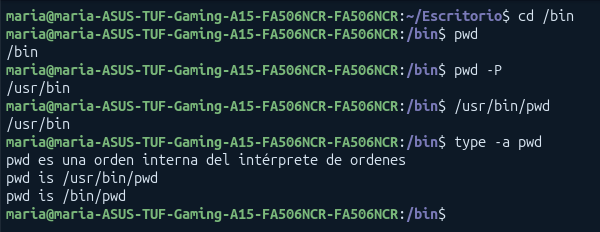
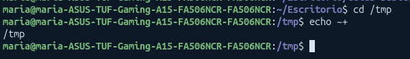
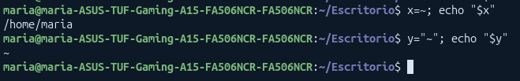
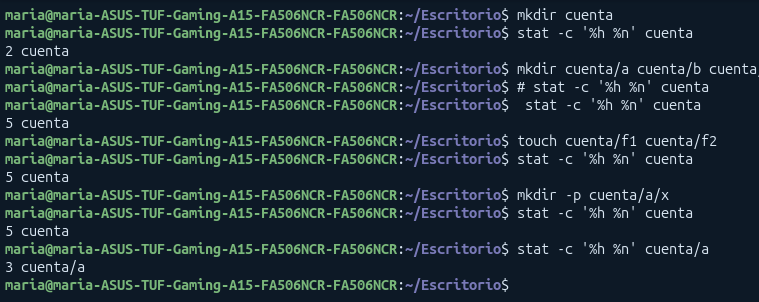
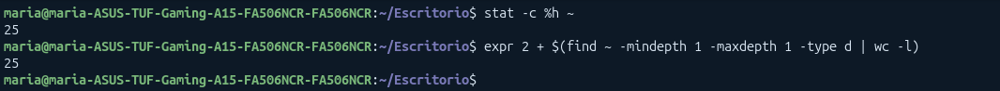

# Ejercicios extras de la práctica 3

## 1. Conceptos Previos y Entorno
### Entorno y herramientas útiles
* **Ubuntu 24.04 vs 26.04** (`uutils` vs `coreutils`): En ubuntu 26.04 varios comandos básicos utilizan `uutils` (Rust) en vez de GNU, provocando que ciertos mensajes aparezcan en inglés o cambie su comportamiento

* **Comandos de diagnóstico básico**
```bash
cat /etc/os-release   # Información de la distribución
uname -a              # Versión del kernel
id                    # UID, GID y grupos del usuario
umask                 # Máscara de permisos por omisión
```
* **Guardar salidas automáticamente**: Usa `tee -a salidas.txt` tras una orden o graba la sesión con `script -q bitacora-bruta.txt`

> Precaución: Trabaja siempre en `~/so/p03`. Nunca uses `chmod -R` en el directorio personal. Si perdemos acceso a un directorio de prueba hay que restaurar permisos con `chmod 700` nombre

## 2. Rutas y Directorio de Trabajo
### 1.Rutas absolutas y relativas:
* **Absoluta:** Empieza por `/` (directorio raíz)
* **Relativa:** Se evalúa a partir del directorio actual (`pwd`)
* Quien interpreta las rutas es el **núcleo** (`kernel`), **no el shell**. Consulta man 7 path_resolution
* `.` (directorio actual) y `..` (directorio padre) son entradas reales dentro de los directorios

### 2. `realpath`: Muestra la ruta absoluta limpia, resolviendo  `.`,`..` y enlaces simbólicos

### 3. Directorio Lógico vs Físico
* El shell guarda el **camino lógico** por el que entraste (incluso atravesando enlaces)
* El **camino físico** refleja la ubicación rela en el sistema de ficheros
* `pwd` (shell) usa el camino lógico: `/usr/bin/pwd` o `pwd -P` que muestran el camino físico

### 4. La Virgulilla (`~`): Es una expansión del intérprete que indica que estamos en el home del usuario

## Ejercicios

### Ej 1: Rutas absolutas y Relativas
**Crea esta estructura de directorios en ~/so/p03 :**
```bash
mkdir -p ~/so/p03/proyecto/src/cabeceras ~/so/p03/proyecto/bin ~/so/p03/proyecto/doc
```

**1. Suponiendo que tu directorio de trabajo es proyecto/src/cabeceras , escribe, antes de ejecutar nada, la ruta relativa y la ruta absoluta de proyecto/bin y de proyecto/doc . Compruébalas situándote en proyecto/src/cabeceras y ejecutando cd ruta seguido de pwd para cada una**

* Rutas desde `proyecto/src/cabeceras`
    * Para `proyecto/bin`
        * Ruta relativa: `../../bin`
        * Ruta absoluta: `/home/alumno/so/p03/proyecto/bin` *(en alumno ponemos el nombre de nuestro usuario)*
    * Para `proyecto/doc`
        * Ruta relativa: `../../doc`
        * Ruta absoluta: `/home/alumno/so/p03/proyecto/doc`

**2. Predice qué devuelve realpath -m proyecto/../proyecto/./doc/.. (ejecutado desde ~/so/p03 ). Escribe cómo se resuelve componente a componente. Consulta en man 1 realpath qué hace la opción -m .**

Devuelve `/home/alumno/so/p03/proyecto`
* Resolución:
    * `proyecto/..` -> regrea a `~/so/03`
    * `/proyecto` -> entra a `~/so/03/proyecto`
    * `/./doc` -> entra a `proyecto/doc`
    * `/..` -> sube al padre (`proyecto`)

    * La opción `-m`(`--must-exist`) permiteresolver la ruta sin requerrir que los componentes finales existan fisicamente en el disco

**3. El guion afirma que el directorio raíz es su propio padre. Predice el resultado de cd /; cd ..; pwd y de cd /..; pwd**

* `cd/; cd ..; pwd` -> la salida es `/`
* `cd /..; pwd`: La salida es `/`
* Explicación: El directorio raíz es su propio padre : la entrada `..` dentro de `/` apunta a `/`

**4. Desde proyecto/src/cabeceras , calcula cuántos .. necesitas para llegar a /usr/bin con una ruta relativa. Predice qué ocurre si escribes uno de más, y si escribes diez de más. Compruébalo con ls y explícalo con la respuesta al apartado 3.**

* Desde `proyecto/src/cabeceras` hay 4 niveles hasta `$HOME` por ejemplo: `/home/alumno`. Para llegar a `/` necesitamos 5 niveles de `..`. Luego añadimos `usr/bin`
    * Ruta relativa: `../../../../../usr/bin`

* Escribir un `..` de más o diez de más: El sistema no falla, al llegar a `/` los `..` sobrantes se quedan en el directorio raiz, entoncess si ponemos:

`ls ../../../../../../../usr/bin` devuelve `/usr/bin`

----
### Ej 2: Directorio de trabajo lógico y físico
**1. Ejecuta ls -ld /bin /sbin /lib y explica qué indica el primer carácter de cada línea y qué aparece a la derecha de ->**

El primer carácter es `l`lo que indica que indica que son enlaces simbólicos. A la derecha de `->` apaece la ruta real a la que apuntan 

**2. Predice la salida de cada una de estas órdenes y compruébala:**

```bash
alumno@so-lab01:~/so/p03$ cd /bin 
alumno@so-lab01:/bin$ pwd 
alumno@so-lab01:/bin$ pwd -P alumno@so-lab01:/bin$ /usr/bin/pwd 
alumno@so-lab01:/bin$ type -a pwd
```



Explicación más detallada:
* `pwd`: Muestra `/bin` (ruta lógica)
* `pwd -P`: Muestra `/usr/bin` (ruta física real)
* `/usr/bin/pwd` (ejecutable externo): Muestra /usr/bin (opera directamente con llamadas al sistema físicas)
* `type -a pwd`: Muestra que pwd es una función/orden interna del shell y que existe un ejecutable en `/usr/bin/pwd`

**3. Vuelve a ~/so/p03 y crea un enlace simbólico a un directorio:**
```bash
alumno@so-lab01:~/so/p03$ ln -s proyecto/src atajo 
alumno@so-lab01:~/so/p03$ cd atajo 
alumno@so-lab01:~/so/p03/atajo$ cd .. 
```
**Predice en qué directorio te encuentras después de cd .. y compruébalo. Repite la secuencia sustituyendo cd .. por cd -P .. . Explica la diferencia con help cd.**

Sustituyendo los directorios correctos sdeberíamos ejecutar lo siguiente: 
```bash
cd ~/so/p03
ln -s proyecto/src atajo
cd atajo
cd ..
```
* `cd ..` nos lleva a `~/so/p03` (ruta lógica)
* Diferencia con `cd -P ..` : Nos lleva a `~/so/p03/proyecto` 

* Explicación de `help cd` -> Por defecto `cd` usa `-L` (vía lógica) recordando el enlace simbólico. `-P` obliga a usar la estructura física de los directorios

* Los `..` son interpretados y ajustados por el **shell (bash)** en función de su historial de navegación. En `cd -P ..`, los `..` los resuelve directamente el **núcleo**

---
### Ej 3: Uso de la virgulilla (`~`) 
**1. Predice qué escribe cada palabra de la orden siguiente y compruébalo:**

```bash
alumno@so-lab01:~/so/p03$ echo ~ ~root ~noexiste "~" a~ ~/x
```

* `~` indica la ruta personal -> `/home/alumno`
* `~root` -> Ruta personal de root (`/root`)
* `~noexiste` -> se imprime `~noexiste` porque ese usuario no existe
* `"~"` -> Se imprime `~` porque las comillas deshabilitan el uso de `~`
* `a~` -> Se imprime `a~` porque la `~` debe estar al inicio
* `~x` -> Se expande a `/home/alumno/x`

**2. Predice la salida de estas dos órdenes, ejecutadas en ese orden:
```bash
alumno@so-lab01:~/so/p03$ cd /tmp 
alumno@so-lab01:/tmp$ echo ~+ ~-
```



Muestra `/tmp` (que corresponde a la variable `$PWD`, el directorio de trabajo actual)

**3. Compara x=~; echo "$x" con y="~"; echo "$y" . Explica la diferencia citando el párrafo del manual que la justifica.**



* `$x` muestra la ruta extendida: `/home/alumno` (dependiendo del usuario) como `~` no está entrecomillada se expande 
* `~y` al estar entrecomilada solo muestra `~`

**4. La expansión de ~alumno2 funciona aunque no tengas permiso para entrar en el directorio de alumno2 . ¿Por qué? ¿Qué consulta el intérprete para realizarla?**

Funciona sin permisos de acceso porque el shell no intenta abrir el directorio personal. Consulta la base de datos de usuarios del sistema en `/etc/passwd` para leer la ruta del directorio home asociada a ese nombre

## 3. El listado largo
1. **Tipos de fichero (columna 1 de `ls -l` y sufijos de `ls -F`)**

* `-` Regular (`regular file`)
* `d` Directorio (`/`)
* `l` Enlace simbólico (`@`)
* `p` Tubería con nombre / FIFO (`|`)
* `c` Dispositivo de caracteres
* `b` Dispositivo de bloques

2 **Enlaces duros (columna 2 de `ls -l`):**
* Representa el número de entradas en directorios que apuntan al mismo nodo-i (inode)

* Un directorio nuevo siempre tiene al menos **2 enlaces duros**: su entrada en directorio padre y su propia entrada `.`. Cada directorio añadido suma 1 enlace más por la entrada `..`

3 **Representa el número de entradas en directorios que apuntan al mismo nodo-i (inode)**
* **Acceso (`%x` / `-u`)**: Última vez que se leyó el contenido
* **Modificación** (`%y`): Última vez que se modificó el contenido del fichero
* **Cambio (`%z` / `-c`)**: Última vez que se modificó el nodo-i (permisos, propietario, enlaces, etc.). No es la fecha de creación


## Ejercicios 
### Ej 4: Tipos de fichero
**Crea un directorio tipos con un ejemplar de cada tipo de fichero que puedes crear sin privilegios:**

```bash
alumno@so-lab01:~/so/p03$ mkdir tipos && cd tipos 
alumno@so-lab01:~/so/p03/tipos$ touch ordinario 
alumno@so-lab01:~/so/p03/tipos$ mkdir dir 
alumno@so-lab01:~/so/p03/tipos$ ln -s ordinario enlace 
alumno@so-lab01:~/so/p03/tipos$ ln -s nada roto 
alumno@so-lab01:~/so/p03/tipos$ mkfifo tubo 
alumno@so-lab01:~/so/p03/tipos$ printf '#!/bin/sh\n' > ejec 
alumno@so-lab01:~/so/p03/tipos$ chmod +x ejec
````

**1. Predice, para cada uno de los seis ficheros, el primer carácter de ls -l , el sufijo que añade ls -F y el color con que lo muestra el terminal. Compruébalo y explica en qué se distinguen en pantalla enlace y roto**

| Fichero | Primer carácter (`ls -l`) | Sufijo (`ls -F`) | Color Habitual | 
| -- | -- | -- | -- | 
| `ordinario` | `-` | ninguno | Blanco / Normal | 
| `dir` | `d` | `/` | Azul | 
| `enlace` | `l` | `@` | Clan / Turquesa | 
| `roto` | `l` | `@` | Rojo parpadeante / Fondo rojo | 
| `tubo` | `p` | ` | ` | 
| `ejec` | `-` | `*` | verde


**2. Ejecuta stat -c '%n: %F' * y file * . Señala un caso en que las dos órdenes describan el mismo fichero de forma distinta y explica por qué.** 

En `ejec`,`stat` indica `fichero regular` (o regular file) ya que solo analiza los datos del inodo

`fije ejec` inspecciona el contenido del fichero y determina que es un `PSOXI shell script, ASCII text executable` por la cabecera `#!/bin/sh`

**3. Predice qué ocurre con ls -lL enlace roto . Consulta en man 1 ls qué hace -L** 
Con `-L` (`--dereference`), `ls` sigue el enlace simbólico y muestra los datos del fichero destino. Para ppenlace` mostrará los datos de `ordinario`. Para `roto` dará error porque el archivo no existe


**4. Ejecuta ls -l /dev/null /dev/tty /dev/zero . En estos ficheros, la columna del tamaño muestra dos números separados por una coma. Averigua qué son: consulta en man 1 stat las secuencias %t y %T y compruébalo con stat -c '%n %t %T' /dev/null .**

* Ejecuta: `stat -c '%n %t %T' /dev/null`

* Significado: Los números separados por coma sustituyen al tamñao y representan los números **Major** (`%` en hexadecimal) y **Minor** (`%T` en hexadecimal) del dispositivo

* **Major:** Identifica el controlador (driver) asignado por el kernel
* **Minor:** Identifica el dispositivo específico o subfunción que gestiona ese controlador


### Ej 5: Número de enlaces de un directorio

**1. Predice el número de enlaces de un directorio recién creado y vacío. Justifica cada uno de ellos: ¿qué entradas, y en qué directorios, lo nombran?**

* Tiene **2 enlaces duros**
* *Justificación*
    * a. La entrada dcon su nombre dentro del directorio padre
    * b. La entrada `.` **dentro de si mismo**

**2. Predice cómo cambia ese número tras las órdenes siguientes y compruébalo después de cada una con stat -c '%h %n' cuenta cuenta/a:**

```bash
alumno@so-lab01:~/so/p03$ mkdir cuenta 
alumno@so-lab01:~/so/p03$ mkdir cuenta/a cuenta/b cuenta/c 
alumno@so-lab01:~/so/p03$ touch cuenta/f1 cuenta/f2 
alumno@so-lab01:~/so/p03$ mkdir -p cuenta/a/x
```



> Consideraciones:

* **En mkdir cuenta/a cuenta/b cuenta/c**

Muestra 5 enlaces (2 iniciales + 3 entradas por las entradas '..' de a,b y c)

* **En touch cuenta/f1 cuenta/f2**
Muestra 5 enlaces (crear ficheros regulares no altera los enlaces del directorio)

**En mkdir -p cuenta/a/x**
Muestra 3 enlaces (2 iniciales + 1 por el '..' de 'x')

**3. Formula una regla que dé el número de enlaces de un directorio en función de su contenido. Compruébala con tu directorio personal: compara stat -c %h ~ con el número de subdirectorios, incluidos los ocultos, que obtienes con find ~ -mindepth 1 -maxdepth 1 -type d | wc -l.**

> **REGLA**: Número de enlaces de un directorio: 

$D = 2 + \text{número de subdirectorios directos de } D$

* **Comprobación en el home:**



### Ej 6: Las tres marcas de tiempo
**1. Ejecuta esta secuencia. Antes de cada stat, predice cuáles de las tres marcas habrán cambiado respecto del stat anterior. La pausa de sleep sirve para que los cambios sean visibles.**

```bash
alumno@so-lab01:~/so/p03$ echo hola > tiempos
alumno@so-lab01:~/so/p03$ stat -c '%x | %y | %z' tiempos 
alumno@so-lab01:~/so/p03$ sleep 2; cat tiempos 
alumno@so-lab01:~/so/p03$ stat -c '%x | %y | %z' tiempos 
alumno@so-lab01:~/so/p03$ sleep 2; cat tiempos alumno@so-lab01:~/so/p03$ stat -c '%x | %y | %z' tiempos
alumno@so-lab01:~/so/p03$ sleep 2; chmod g-w tiempos 
alumno@so-lab01:~/so/p03$ stat -c '%x | %y | %z' tiempos 
alumno@so-lab01:~/so/p03$ sleep 2; cat tiempos 
alumno@so-lab01:~/so/p03$ stat -c '%x | %y | %z' tiempos
```

**Explicación paso a paso por instrucción**
* `echo hola > tiempos` $\rightarrow$ Inicializa las 3 marcas (Acceso, Modificación, Cambio) al momento actual
* `sleep 2; cat tiempos` $\rightarrow$ Lee el fichero. Cambia Acceso (`%x`)
* `sleep 2; cat tiempos` $\rightarrow$ Lee el fichero. Cambia Acceso (`%x`)
* `sleep 2; chmod g-w tiempos` $\rightarrow$ Modifica atributos del nodo-i. Cambia Cambio (`%z`)
* `sleep 2; cat tiempos` $\rightarrow$ Lee el fichero. Cambia Acceso (`%x`)

**2. Es muy probable que alguna de tus predicciones sobre la marca de acceso haya fallado. Ejecuta findmnt -T . y localiza, en la columna de opciones, la palabra relatime. Busca su descripción en man 8 mount y explica con ella cada uno de los resultados de la marca de acceso. ¿Por qué crees que los sistemas actuales no actualizan esa marca en cada lectura?**

* Al ejecutar `findmnt -T .`, se observa la opción `relatime`

* Explicación (`man 8 mount`): Por eficiencia de E/S, Linux no actualiza la marca de acceso en cada lectura física salvo que la marca de acceso anterior sea más antigua que la de modificación/cambio actual, o haya transcurrido más de 24 horas. Esto evita que cada operación de lectura genere una operación de escritura en disco

**3. Ejecuta touch -d '2020-01-01 10:00' viejo y después ls -l viejo y stat viejo. Explica por qué la marca de cambio no es la del 1 de enero de 2020 aunque la de modificación sí lo sea. Localiza en la salida de stat la fecha de creación: ¿qué columna de ls -l la muestra?**

```bash
touch -d '2020-01-01 10:00' viejo
ls -l viejo
stat viejo
```
* `touch -d` altera explicitamente las marcas de modificación (`%y`) u accesp (`%x`). El acto de modificar estos datos altera el inodo en el instante presente por lo que la marca de **cambio (`%z`) aquiere la fecha y horas actuales**

* Fecha de creación: Se lista en `stat` como `Nacimiento` / `Birth` (`%w`). **Ninguna columna estándar de `ls -l` muestra su fecha de creaión**


## 3. Tamaño y Bloques
Hay 3 métricas distintas para medir el tamaño y espacio de un fichero

**1. tamaño del contenido (Bytes)**: Número real de bytes que componen los dtaos. Obtenido con `ls -l` o `stat -c %s`

**2. Espacio Ocupado (bloques de 1024 bytes / 1KiB)**: Bloques contados por utilidades de usuario como `ls -s`,`du` o el `total` mostrado por `ls -l`

Un **fichero disperso** contiene "huecos" con bytes nulos (`\0`) para los cuales el sistema de archivos no asigna bloques físicos en el disco hasta que no se escriben datos reales en ellos . Su tamaño lógico es grande pero su espacio ocupado es casi nulo

## Ejercicios
### Ej 7: Fichero de un solo byte
**1. Crea un fichero de un solo byte y predice cuántos bloques ocupará según ls-s y según stat -c %b. Compruébalo y explica el resultado con el tamañode bloque del sistema de ficheros ( stat -f -c %S . ).**

```bash
printf a > unbyte
ls -ls unbyte
stat -c '%s bytes, %b bloques de %B' unbyte
stat -f -c %S .
```

* `ls -ls`: Mostrará un tamaño de 1 byte y un espacio ocupado de 4 bloques (de 1 KiB)

* `stat -c '%s bytes, %b bloques de %B'`: Mostrará 1 bytes, 8 bloques de 512

### 2. Fichero de 1 GB disperso (sparse file)
**Crea ahora un fichero de un gigabyte con truncate -s 1G disperso . Predice su tamaño y el espacio que ocupa. Compruébalo con ls -ls , du -h y du -h --apparent-size . Consulta man 1 truncate y explica cómo es posible que un fichero ocupe menos de lo que mide**

```bash
truncate -s 1G disperso
ls -ls disperso
du -h disperso
du -h --apparent-size disperso
```
* **Tamaño Lógico**:  1 GB ($1073741824 \text{ bytes}$)
* **Espacio ocupado**: 0 bloques (0 bytes en disco)
* **ls -ls disperso**: Muestra `0` en la primera columna (bloques ocupados) y el tamaño aparente `1073741824 o 1.0G`
* `du -h disperso`: Muestra 0 (mide el bloque real reservado en disco)
* `du -h --apparent-size disperso`: Muestra `1.0G` (mide la longitud lógica de los datos)

`truncate` cambia la longitud lógica del fichero. SI este se amplia las posiciones no escritas no resrevan espacio físico en el disco, solo se marcan como bloques dispersos que devuelven 0 al leerse

### 3. Borrado de prueba
**Borra disperso cuando termines: aunque no ocupe espacio, algunas herramientas de copia de seguridad lo copiarían entero**

```bash
rm disperso
```

## 4. La Jerarquía de Directorios
* **/proc**: Es un sistema de ficheros virtual (`procfs`) generado dinámicamente en memoria RAM por el kernel. No ocupa espacio en disco

* **/proc/self**: Es un enlace simbólico que apunta al directorio del proceso que efectúa la lectura en ese instante puntual

* **FHS (Filesystem Hierarchy Standard / man 7 hier)**: Define la ubicación de los archivos según su uso:

* `/tmp` vs `/var/tmp`: `/tmp` es para datos temporales volátiles (a menudo borrados en reinicios o montados sobre RAM con tmpfs). `/var/tmp` preserva su contenido entre reinicios del sistema

* `/opt` vs `/usr/local`: `/opt` es para paquetes de software independientes/comerciales monolíticos; `/usr/local` es para software compilado e instalado manualmente por el administrador que sigue la estructura tradicional (bin/, lib/, etc.)

* `/media` vs `/mnt`: `/media` se usa para montaje automático de medios removibles (USB, CD-ROM); `/mnt` es para montajes manuales y temporales del administrador

## Ejercicios 
### Ejercicio 8: Múltiples ejecuciones de ls -l /proc/self
**1. Ejecuta dos veces seguidas ls -l /proc/self . Predice si el destino del enlace coincidirá en ambas ejecuciones y explica el resultado. Relaciónalo con lo que estudiaste en la práctica 2 sobre la creación de procesos.**

```bash
ls -l /proc/self
ls -l /proc/self
```

* **Explicación**: Cada vez que ejecutas `ls` el shell crea un nuevo proceso hijo con `fork()` y le asigna un **Pid** diferente, por lo que no coincidirá

**2. Compara stat -c %s /proc/cpuinfo con wc -c < /proc/cpuinfo . Explica la discrepancia.**

```bash
stat -c %s /proc/cpuinfo
wc -c < /proc/cpuinfo
```
* `stat` devyekve `0` ya que como `/proc` no reside en un disco físico los archivos no tienen un tamaño registrado en el inodo

* `wc -l` lee secuencialemnte el contenido mientras el kernel lo generae n tiempo real, contando los bits hasta llegar al fin del fichero

**3. Ejecuta findmnt -T sobre / , /proc , /tmp y tu directorio personal, y anota el tipo de sistema de ficheros (columna FSTYPE ) de cada uno. El guion indica, en la descripción de /tmp , que en Ubuntu 26.04 ese directorio es un sistema de ficheros en memoria (tmpfs ). Si trabajas en ambas versiones, comprueba si es así y explica la consecuencia.**

```bash
findmnt -T /
findmnt -T /proc
findmnt -T /tmp
findmnt -T ~
```

* **Tipos de sistemas de ficheros (`FSTYPE`):**
* `/`: ext4 (o overlay en WSL).
* `/proc`: proc
* `~`: `ext4` (mismo que / si está en la misma partición).
* `/tmp`: En Ubuntu 26.04 es tmpfs (sistema de archivos residente en la memoria RAM)

**4. Ejecuta file /usr/bin/ls . En 24.04 obtendrás la descripción de un ejecutable; en 26.04, un enlace simbólico. Si trabajas en 26.04, averigua con realpath a qué fichero conducen /usr/bin/ls , /usr/bin/chmod y /usr/bin/cp . ¿Pertenecen todas las órdenes básicas a la misma implementación? Relaciónalo con el apartado 1.1**

```bash
file /usr/bin/ls
realpath /usr/bin/ls /usr/bin/chmod /usr/bin/cp
```

* `/usr/bin/ls` y `/usr/bin/chmod` apuntan a la implementación de uutils (ej. `/usr/bin/uutils-coreutils` o binarios en Rust)

* `/usr/bin/cp` sigue apuntando a la versión de GNU coreutils

## Ej 9
**1. Localiza en man 7 hier la descripción de /tmp y la de /var/tmp . Explica la diferencia entre ambos y cuál usarías para un fichero temporal que deba sobrevivir a un reinicio**

* `/tmp`: Archivos temporales de corta duración

* `/var/tmp`: Archivos temporales que deben conservarse entre reinicios del sistema

* **Elección para sobrevivir a un reinicio:** Se debe utilizar `/var/tmp`

**2. Explica la diferencia entre /opt y /usr/local , y entre /media y /mnt , según hier**
* `/opt` vs `/usr/local`: `/opt` aloja paquetes de aplicaciones independientes de terceros organizados en subdirectorios propios (`/opt/app/bin`). `/usr/local` aloja binarios y código fuente instalado localmente por el administrador respetando la jerarquía estándar de Unix (`/usr/local/bin`, `/usr/local/lib`)

* `/media` vs `/mnt`: `/media` se destina a puntos de montaje automáticos gestionados por el sistema operativo para dispositivos extraíbles (pendrives, tarjetas SD). `/mnt` es la ubicación reservada para que el administrador monte manualmente sistemas de archivos temporales

**3. El guion describe varios directorios que no existen en Ubuntu. Compruébalo con ls -ld para /usr/adm , /usr/spool , /usr/tmp y /usr/ucb , e indica, según el guion y según hier, qué directorio cumple hoy la función de cada uno**
`ls -ld /usr/adm /usr/spool /usr/tmp /usr/ucb`  no funciona actualmente

| Directorio antiguo | Equivalente actual |
| -- | -- | 
| `/usr/adm` | `/var/log` (o `/var/adm`) | 
| `/usr/spool` | `/var/spool` |
| `/usr/tmp` | `/var/tmp` (o `/tmp`)
| `/usr/ucb` | está dentro de `/usr/bin` |

## 5. Usuarios, Grupos y Permisos
* **Identidad:** Un proceso está asociado a un UID (User ID) y uno o varios GID (Group IDs)

* `/etc/passwd` vs `getent`: `/etc/passwd` es un archivo de texto plano local. getent consulta las bases de datos del sistema definidas en `/etc/nsswitch.conf` (que puede incluir LDAP, Active Directory, NIS, etc.)

* `/etc/shadow`: Almacena los hashes de las contraseñas y parámetros de caducidad. Solo es legible por el usuario root (o grupo shadow) por motivos de seguridad

* El kernel evalúa la terna de permisos en orden estricto de precedencia:
    * **Propietario:** Si el UID del proceso coincide con el UID del archivo, solo se aplican los permisos del usuario (owner)
    * **Grupo**: Si no es el propietario, pero el GID del archivo coincide con alguno de los grupos del proceso, solo se aplican los permisos del grupo
    * **Otros**: Si no se cumple ninguna de las dos anteriores, se aplican los permisos de otros (others)

## Ejercicios 
## EJ:10
**1. Anota tu uid, tu gid y los grupos a los que perteneces. Identifica cada campo de tu línea de getent passwd con la descripción del guion.**

```bash
id
getent passwd "$USER"
getent group "$USER"
```

**2. Compara el resultado de getent passwd "$USER" con el de grep "^$USER:" /etc/passwd . Si en tu puesto del laboratorio el segundo no devuelve nada, tu cuenta no está definida en ese fichero: averigua de dónde la obtiene el sistema consultando /etc/nsswitch.conf y man 5 nsswitch.conf . Si ambas órdenes coinciden, explica en qué caso podrían no hacerlo**

`grep "^$USER:" /etc/passwd` no devuelve nada pero `getent` sí

**3. Predice el resultado de cat /etc/shadow y justifícalo con ls -l /etc/shadow . ¿Qué contiene ese fichero y por qué no puede leerlo cualquier usuario, a diferencia de /etc/passwd ? ( man 5 shadow )**

```bash
cat /etc/shadow
ls -l /etc/shadow
```

`cat /etc/shadow` devuelve Permiso denegado

`ls -l /etc/shadow` muestra permisos `rw-r-----` (o `r--------`) con propietario `root` y grupo `shadow` que contiene contraseña cifradas

## EJ 11:
**1. Predice, para cada fichero, si podrás leerlo con cat . Compruébalo:**
```bash
alumno@so-lab01:~/so/p03$ echo secreto > p070 
alumno@so-lab01:~/so/p03$ chmod 070 p070 alumno@so-lab01:~/so/p03$ echo secreto > p007 
alumno@so-lab01:~/so/p03$ chmod 007 p007 
alumno@so-lab01:~/so/p03$ cat p070 p007
```

* cat `p070`: Fallará con Permiso denegado

* cat `p007`: Fallará con Permiso denegado

En ambos casos el propietario no tiene ningún permiso

**2. Con p070, eres el propietario y además perteneces al grupo del fichero. Cita la frase de man 7 path_resolution que explica el resultado.**

*"If the process user ID matches the owner ID of the file, the owner permissions are used... otherwise, if the process group ID matches... group permissions are used... otherwise others permissions are used."*

**3. Crea p377 con permisos -wxrwxrwx . Predice si podrás leerlo y si podrás añadirle una línea con echo otra >> p377 . Comprueba ambas cosas y explica por qué el resultado no es contradictorio.**
```bash
chmod 377 p377
cat p377
echo otra >> p377
```
* `cat p377`: Fallará (falta el permiso de lectura `r`)
* `echo otra >> p377`: Se ejecutará correctamente (tiene permiso de escritura w)

**4. ¿Puedes recuperar la lectura de p070 sin ayuda de nadie? Justifícalo con el apartado de restricciones de chmod del guion.**

Si , se puede recuperar permisos con:
```bash
chmod u+r p070
```

El propietario de un archivo siempre tiene derecho explícito a modificar sus metadatos y permisos mediante la llamada al sistema chmod, independientemente de cuáles sean los permisos actuales del archivo

## Ejercicio 12
**Tabla de predicción y resultados para `chmod` y `umask`**

| N.º | Tipo        | Permisos Iniciales | Orden ejecutada             | Predicción Octal / Simbólica | Resultado (`stat -c '%A %a'`) |
|-----|-------------|--------------------|-----------------------------|-------------------------------|--------------------------------|
| 1   | Fichero     | 644 (-rw-r--r--)   | `chmod u=rwx,g=rx,o= f`     | 750 / -rwxr-x---              | 750 / -rwxr-x---               |
| 2   | Fichero     | 750 (-rwxr-x---)   | `chmod a-w f`               | 750 / -rwxr-x---              | 750 / -rwxr-x---               |
| 3   | Fichero     | 644 (-rw-r--r--)   | `chmod 7 f`                 | 007 / ------rwx                | 007 / ------rwx                |
| 4   | Fichero     | 644 (-rw-r--r--)   | `chmod =r f`                | 444 / -r--r--r--              | 444 / -r--r--r--               |
| 5   | Fichero     | 600 (-rw-------)   | `umask 027; chmod +x f`     | 750 / -rwxr-x---              | 750 / -rwxr-x---               |
| 6   | Fichero     | 666 (-rw-rw-rw-)   | `umask 022; chmod -w f`     | 444 / -r--r--r--              | 444 / -r--r--r--               |
| 7   | Fichero     | 644 (-rw-r--r--)   | `chmod u+s,g+s f`           | 6644 / -rwSr-sr--             | 6644 / -rwSr-sr--              |
| 8   | Directorio  | 2755 (drwxr-sr-x) | `chmod 755 d`               | 0755 / drwxr-xr-x             | 0755 / drwxr-xr-x              |
| 9   | Directorio  | 2755 (drwxr-sr-x) | `chmod 00755 d`             | 2755 / drwxr-sr-x             | 2755 / drwxr-sr-x              |

**1. En la línea 5, explica por qué los otros no reciben el permiso de ejecución y el grupo sí. Compáralo con lo que afirma el guion en el ejemplo de chmod +x camus .**

Como no especificamos grupo al que aplicar `+x` se acaba aplicando a `u`,`g`,`o`
* Propietario (`0`): No filtra nada $\rightarrow$ recibe `x`
* Grupo (2 = w): Tampoco filtra x $\rightarrow$ recibe `x`
* Otros (7 = rwx): Filtra los tres bits $\rightarrow$ **se bloquea x**

**2. En la línea 6, chmod escribe un aviso. Transcríbelo y explica qué significa.**
En utilidades de GNU o `uutils`, retirar un permiso sin especificar la clase (ej. `chmod -w`) aplica la operación teniendo en cuenta la máscara del sistema. Si la herramienta genera un aviso o advertencia, este indica que la máscara ha filtrado u omitido la modificación en ciertas clases

**3. Explica la diferencia entre las líneas 8 y 9 con el apartado SETUID AND SETGID BITS de man 1 chmod**
Línea 8 (`chmod 755 d`): Al usar un número de 3 dígitos octales, los bits especiales (SetUID, SetGID y Sticky bit) se ponen a cero (`0`), eliminando el bit SGID previo (`2`)

Línea 9 (`chmod 00755 d`): Al especificar un número de **4 o 5 dígitos octales iniciando en cero** (`00755` o `0755` según la implementación en `coreutils`), las reglas de la utilidad preservan los bits SetUID/SetGID previamente configurados en los directorios por seguridad

## 6. Permisos de Directorios
Un directorio es una tabla de nombres asociada a números de nodo-i (inodes).

* `r` **(Lectura)**: Permite leer la tabla de nombres (saber qué ficheros hay dentro con ls)

* `w` **(Escritura)**: Permite modificar la tabla (crear, borrar o renombrar entradas dentro del directorio)

* `x` **(Ejecución/Atravesar)**: Permite entrar al directorio (cd) y acceder a los metadatos/nodos-i de sus contenidos (ls -l, cat, etc.).

* **Bit adhesivo (sticky bit - `t`/`T`)**: En directorios compartidos (`/tmp++), impide que un usuario borre o renombre ficheros de otros, aunque tenga permiso `w` sobre el directorio. Solo pueden borrar el propietario del fichero, el propietario del directorio o `root`

## Ej 13:Lo que permite cada bit en un directorio
**Prepara un directorio con un fichero y ve cambiando los permisos del directorio. Para cada modo, predice primero si cada operación funcionará y compruébalo después. Devuelve siempre el permiso 700 antes de pasar al modo siguiente.**

```bash
alumno@so-lab01:~/so/p03$ mkdir d alumno@so-lab01:~/so/p03$ echo hola > d/f alumno@so-lab01:~/so/p03$ chmod 600 d  # el modo que toque en cada fila 
alumno@so-lab01:~/so/p03$ ls d 
alumno@so-lab01:~/so/p03$ chmod 700 d  # antes de la fila siguiente
```

| Modo | `ls d` | `ls -l d` | `cat d/f` | `cd d` | `touch d/nuevo` | `rm d/f` |
|---|---|---|---|---|---|---|
| **700 (`rwx`)** | Sí | Sí | Sí | Sí | Sí | Sí |
| **600 (`rw-`)** | Sí | Incompleto (`?`) | Denegado | Denegado | Denegado | Denegado |
| **500 (`r-x`)** | Sí | Sí | Sí | Sí | Denegado | Denegado |
| **400 (`r--`)** | Sí | Incompleto (`?`) | Denegado | Denegado | Denegado | Denegado |
| **300 (`-wx`)** | Denegado | Denegado | Sí | Sí | Sí | Sí |
| **100 (`--x`)** | Denegado | Denegado | Sí | Sí | Denegado | Denegado |
| **000 (`---`)** | Denegado | Denegado | Denegado | Denegado | Denegado | Denegado |

* **600 (rw-)**
    * `r`: puedes leer los nombres de los ficheros
    * `w`: puedes modificar el contenido del directorio
    * Sin `x`: no puedes atravesarlo ni acceder a los nodos-i

> Por eso no puedes consultar propiedades ni modificar ficheros (cat, touch, rm, ls -l

* **300 (-wx)**
    * `w + x`: puedes modificar y atravesar el directorio
    * Sin `r`: no puedes listar su contenido con ls
    * Si conoces el nombre exacto de un fichero, si puedes:
        * Leerlo (cat), si el fichero tiene r
        * Modificarlo
        * Crear nuevos ficheros (touch)
        * Borrarlos (rm)

**¿Por qué aparecen ? en ls -l?**
* Con **r pero sin x**, ls puede conocer los nombres
* Pero para obtener tamaño, permisos, propietario, fecha, etc., necesita acceder al nodo-i mediante `stat()`
* Como falta x, no puede obtener esos datos → aparecen `?`

## EJ 14: Borrar no es escribir
**1. Crea un directorio con permisos normales y, dentro, un fichero sin permiso de escritura para nadie**

```bash
alumno@so-lab01:~/so/p03$ mkdir sololect 
alumno@so-lab01:~/so/p03$ echo a > sololect/f 
alumno@so-lab01:~/so/p03$ chmod 444 sololect/f 
alumno@so-lab01:~/so/p03$ rm sololect/f
```

**Fichero de solo lectura (chmod 444)**
* rm puede borrar el fichero, aunque no tenga permiso de escritura

* En modo interactivo, rm pide confirmación porque el fichero está protegido contra escritura.

* rm -f evita la confirmación.
**2. Haz ahora lo contrario: un fichero en el que todos pueden escribir, dentro de un directorio sin permiso de escritura:**
```bash
alumno@so-lab01:~/so/p03$ mkdir cerrado 
alumno@so-lab01:~/so/p03$ echo a > cerrado/f 
alumno@so-lab01:~/so/p03$ chmod 666 cerrado/f 
alumno@so-lab01:~/so/p03$ chmod 555 cerrado
```
**Predice cuáles de estas operaciones funcionarán y compruébalo: echo b >> cerrado/f , cat cerrado/f , : > cerrado/f (deja el fichero vacío), rm cerrado/f y mv cerrado/f cerrado/g**

Aunque el directorio no tenga w, si el fichero tiene permisos adecuados:
* `echo b >> cerrado/f` → Funciona
* `cat cerrado/f` → Funciona
* `: > cerrado/f` → Funciona (vacía el contenido)
* `rm cerrado/f` → Falla → borrar requiere w en el directorio
* `mv cerrado/f cerrado/g` → Falla → renombrar requiere w en el directorio

**3. Con la tercera operación del apartado 2 has dejado vacío un fichero que no podías borrar. ¿Qué diferencia hay, para el sistema, entre vaciar un fichero y borrarlo? Devuelve después el permiso con chmod 755 cerrado**

* **Vaciar:** se mantiene el fichero y su entrada en el directorio; solo se eliminan sus datos

* **Borrar:** se elimina la entrada del directorio y se reduce el contador de enlaces del nodo-i

## EJ 15: 
**1. Localiza todos los directorios del sistema de ficheros raíz que tienen el bit adhesivo:** 
```bash
alumno@so-lab01:~/so/p03$ find / -xdev -type d -perm -1000 2>/dev/null 
```
**Consulta en man 1 find el significado de -xdev y de -perm -1000 , y explica por qué la orden redirige el error estándar.**

**2. Compara el resultado con la lista del apartado 6.1 del guion**
* El bit adhesivo impide que un usuario borre o renombre ficheros propiedad de otros usuarios dentro de un directorio con permisos de escritura globales (`rwxrwxrwx`)

* `/tmp` requiere `rwx` para que cualquier programa pueda crear archivos temporales, pero exige el bit adhesivo (t) para evitar que un usuario malintencionado borre los ficheros de otros procesos

## 7. Permisos Especiales y Máscara de Creación
* **Set-UID (`4000` octal / `s` en usuario)**: Un ejecutable con Set-UID activo se ejecuta con la identidad (UID) y privilegios del propietario del archivo, no con los de la persona que lo lanza

* **Máscara de creación (`umask`)**: Define qué bits de permiso se le quitan a las peticiones por defecto que hacen las aplicaciones (`666` en ficheros, `777` en directorios)
$$\text{Permisos finales} = \text{Permisos solicitados} \quad \text{AND NOT} \quad \text{Mágcara}$$

## Ejercicio L16: El bit Set-UID en acción
**1. Ejecuta ls -l /usr/bin/passwd /etc/shadow . Explica, con los permisos de ambos ficheros, por qué passwd puede modificar /etc/shadow y tú no. (El guion menciona /etc/passwd; en los sistemas actuales la contraseña cifrada está en /etc/shadow .)**

```bash
ls -l /usr/bin/passwd /etc/shadow
```
* `/usr/bin/passwd` tiene permisos `-rwsr-xr-x` (propietario `root`, bit Set-UID `s` activo)

* `/etc/shadow` tiene permisos `-rw-r-----` (propietario root)

* Un usuario no puede modificar directamente `/etc/shadow`. Al ejecutar `passwd`, el proceso adopta la identidad efectiva de `root` gracias al bit Set-UID, lo que le otorga el privilegio de actualizar la contraseña en `/etc/shadow`

**2. Observa el proceso mientras se ejecuta. Abre dos terminales. En el primero ejecuta passwd y no respondas a la pregunta de la contraseña. En el segundo ejecuta**

```bash
alumno@so-lab01:~$ ps -o user,ruser,pid,comm -C passwd
```

**Consulta en man 1 ps qué muestran las columnas USER y RUSER y explica los valores obtenidos. Vuelve al primer terminal y cancela passwd con Ctrl+C : no cambies tu contraseña.**

* `RUSER` **(Real User)**: Tu nombre de usuario (quien ejecutó el comando)

* `USER` **(Effective User)**: `root` (la identidad con la que actúa el proceso)

**3. Obtén la lista de programas con el bit set-uid de /usr/bin con find /usr/bin -perm -4000 . Elige dos, además de passwd , y explica por qué necesitan ese bit**

* `/usr/bin/su` o `/usr/bin/sudo`: Requieren Set-UID para validar la identidad y cambiar de contexto de usuario

* `/usr/bin/chfn` o `/usr/bin/gpasswd`: Necesitan modificar ficheros restringidos del sistema (`/etc/passwd` o `/etc/group`)

## EJ 17
**Predice lo que mostrará ls -l (o ls -ld ) después de cada orden y compruébalo:**

```bash
alumno@so-lab01:~/so/p03$ touch sin 
alumno@so-lab01:~/so/p03$ chmod 4644 sin
alumno@so-lab01:~/so/p03$ chmod u+x sin 
alumno@so-lab01:~/so/p03$ mkdir compartido 
alumno@so-lab01:~/so/p03$ chmod 1770 compartido 
alumno@so-lab01:~/so/p03$ chmod o+x compartido
```

**1. Explica por qué la cadena de permisos necesita letras mayúsculas: ¿qué información se perdería si solo existieran s y t?** 
* `touch sin; chmod 4644 sin` $\rightarrow$ `-rwSr--r--` (muestra S mayúscula porque el bit Set-UID está activo pero no tiene permiso de ejecución `x` para el propietario)
* `chmod u+x sin` $\rightarrow$ `-rwsr--r--` (pasa a s minúscula porque ya tiene `x`)
* `mkdir compartido; chmod 1770 compartido` $\rightarrow$ `drwxrwx--T` (muestra T mayúscula en la terna de otros porque el bit adhesivo está activo pero no hay permiso `x` para otros)
* `chmod o+x compartido` $\rightarrow$ `drwxrwxr-t` (pasa a t minúscula al añadir la ejecución `x`)

Para indicar dos bits de información en un solo carácter. La versión en **minúscula** (`s`,`t`) indica que el bit especial y el bit `x` están activos. En **mayusculas** (`S`,`T`) avisa que el bit especial está activo pero falta el bit de ejecución `x`

**2. ¿Tiene sentido un directorio en modo 1770? Razona qué efecto práctico tiene el bit adhesivo cuando los otros no pueden ni atravesar el directorio**

No tiene sentido sobre la clase *otros*, como tiene `---` ni siquiera pueden atravesar el directorio, pero si preparael directorio si en el futuro se añade (`o+x`)

## Ej 18
**1. Completa la tabla con los permisos que predices para cada fichero creado y compruébalos con stat -c '%A %a %n'. Fija la máscara al principio de cada columna con umask 022, umask 077 o umask 111, y crea cada fichero con un nombre distinto.**
| Creado con | `umask 022` | `umask 077` | `umask 111` |
|---|---|---|---|
| `touch f` | `-rw-r--r-- (644)` | `-rw------- (600)` | `-rw-r--r-- (644)` |
| `mkdir d` | `drwxr-xr-x (755)` | `drwx------ (700)` | `drw-r--r-- (664)` |
| `echo x > f` | `-rw-r--r-- (644)` | `-rw------- (600)` | `-rw-r--r-- (644)` |
| `cp /usr/bin/ls f` | `-rwxr-xr-x (755)` | `-rwx------ (700)` | `-rw-r--r-- (644)` |
| `gcc -o f programa.c` | `-rwxr-xr-x (755)` | `-rwx------ (700)` | `-rw-r--r-- (644)` |

**Para la última fila, basta con un programa mínimo: printf 'int main(void) {return 0;}\n' > programa.c**

* `touch` y `eco` solicitan permisos de fichero estándar sin ejecución `666`
* `mkdir`: solicita permisos completos `777`
* `gcc`: solicita permisos de ejecutable: `777`
* `cp`: Copia y solicita permisos originales del archivo fuente (`/usr/bin/ls`) (`755`)

**2.Con umask 111 , mkdir crea un directorio que no puedes usar. Explica por qué con el capítulo 6 y comprueba que no puedes crear nada dentro.**

`mkdir` con `umask 111` : genera un directorio con permisos `644`. Como falta el de ejecución `x`, ek creador jon puede entrad (`cd`) ni crear contenido dentro del directorio

**3. Crea un fichero con umask 000; echo x > g , cambia la máscara a 077 y ejecuta echo y > g . Predice los permisos finales de g y explica el resultado: ¿cuándo actúa la máscara?**
`umask` actúa solo en el momento exacto en el que se crea un fichero /directorio . Al ejecutar `echo y > g` sobre un archivo existente **NO** cambiará sus permsisos


## EJ 19: La máscara como atributo de proceso
**1. Predice qué escribirá cada umask de esta secuencia y compruébalo:**
```bash
alumno@so-lab01:~/so/p03$ umask 0002 
alumno@so-lab01:~/so/p03$ bash -c 'umask 077; umask'  # Muestra 0077 (subshell hijo)
alumno@so-lab01:~/so/p03$ umask                       # Muestra 0002 (shell padre sin cambios)
alumno@so-lab01:~/so/p03$ (umask 027; umask)          # Muestra 0027 (subshell ejecutado entre paréntesis)
alumno@so-lab01:~/so/p03$ umask                       # Muestra 0002 (shell padre intacto) 
```
**2. Ejecuta type umask . Razona por qué umask , igual que cd , no puede ser un programa externo. Utiliza el mismo argumento que en el ejercicio L4 de la práctica 2**

* `umask` debe ser una **orden interna del shell**
* `type umask` retransmite umask es una función/orden interna del shell

Si fuera un ejecutable externo, se ejecutaría en un proceso hijo y cualquier modificación sobre la máscara desaparecería al terminar el programa sin afectar al proceso padre

**3. Si cambias la máscara con umask 077 y abres un terminal nuevo, ¿quémáscara tendrá? Compruébalo. ¿Dónde tendrías que escribir la orden para que el cambio fuera permanente?**

* Si abres un terminal nuevo tras un `umask 077`, la máscara vuelve a su valor predeterminado (`0002` o `0022`)

* Para hacer la configuración permanente, la orden `umask 077` debe escribirse en el fichero de configuración de inicio del shell de tu usuario (generalmente `~/.bashrc` o `~/.profile`)