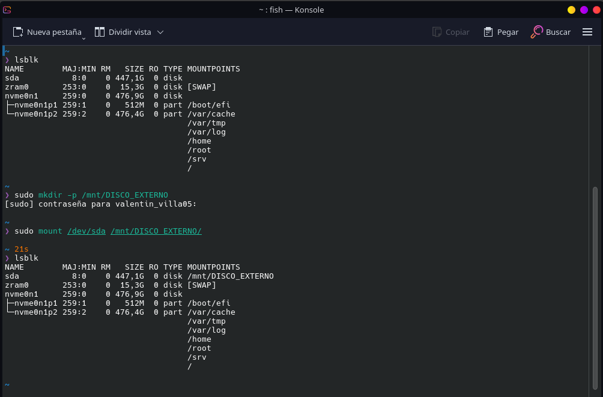
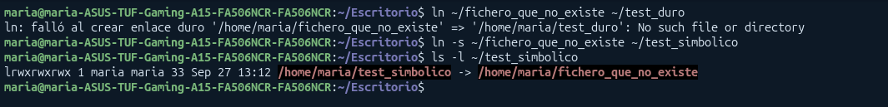

# Gestión de Ficheros

UNIX permite dividir la jerarquía de directorios en varias partes (particiones o discos).

- **¿Por qué se hace?**: Por 2 razones:
  - Tamaño insuficiente en el disco para almacenar toda la jerarquia (falta de espacio).
  - Los dispositivos de almacenamiento puede que NO siempre estén conectados (discos duros externos, pen drives...)

- **¿Cómo se gestiona?**: Mediante **puntos de montaje**:
  - Estos son un **directorio del sistema principal que sirve de "puerta de entrada" (raíz) al nuevo dispositivo**
  - Hay 2 sistemas de ficheros:
    - **Sistema de ficheros primario** (el que surge del directorio raíz `/`)
    - **Sistema de ficheros secundario** que se enlazan con el sistema primario a través de `mount` a la que se le da la trayectoria del **punto de montaje** y la ubicación del sistema de ficheros secundarios.

- **Comandos Clave**
  - `mount` : Conecta el sistema secundario al arbol principal
  - `umount`: Lo desconecta
  - `df -h`: muestra discos físicos montados y su espacio ocupado
  - `df -i`: Muestra el estado de los inodos (puedes quedarte por llenar el espacio)

**Tipos de Sistemas de Ficheros**:
**1. Reales (físicos)** : Guardan datos permanentemente en el disco (`ext4` en Linux , `NTFS` en Windows y `FAT32` en USBs)
**2. Virtuales**: Existe solo en la memoria RAM (al apagar se borran) para dar información del sistema/kernel (`/proc`, `/sys`,`/tmp`)

Por ejemplo:


Aquí he montado mi disco externo manualmente, para ello he ejecutado:

1. `lsblk` para ver el nombre que el kernel le ha asignado a mi disco, enn este caso ha sido `sda`
2. `sudo mkdir -p /mnt/DISCO_EXTERNO`: He creado el punto de montaje (se usa `/mnt/...` por convencion.
3. `sudo mount /dev/sda /mnt/DISCO_EXTERNO/` Monto el disco en el punto que hemos creado.

Para desmontarlo sería tan simple como usar `sudo umount /dev/sda`

## Los nodos i (Inodos)

Cada archivo o directorio tiene una estructura de datos en disco llamada **inodo**. Al crearse un fichero este se le asigna un nombre y un **_InodeNumber_** (su identificador) para que el sistema pueda identificar el archivo.

- **¿Qué guarda un inodo?**: Toda la información importante del fichero: permisos, tamaños, fechas, punteros a los datos y el **número de enlaces duros**

- **Comando**: `ls -i` (muestra el número de inodo de cada archivo)

- **Direcorio raíz (`/`):** Por convenio en sistemas Linux (`ext4`), la raíz siempre es el **inodo 2**

Cada sistema de ficheros tiene un **número limitado** de identificadores disponibles (Inode Numbers) que impone el numero máximo de archivos que podemos crear independientemente del espacio.

## Directorios y apertura de archivos

- **¿Que es un directorio?**: Un fichero especial que contiene una lista de **enlaces a ficheros** y estos enlaces están compuestos por el par: `[nombre del archivo] <---> [Número de inodo]`

- **Entradas especiales**: Todo directorio tiene `.` (el mismo) y `..` (su padre)

## ¿Cómo abre el SO un archivo? (Ejemplo: `/d2/f2`)

1. Busca el inodo de `/` (inodo 2), lee su contenido en disco y busca la carpeta `d2`
2. Lee el inodo de `d2` para ver dónde está en disco y busca el archivo `f2`
3. Encuentra la entrada de `f2` asociada al inodo 5
4. Comprueba permisos. Si todo es correcto, **carga el inodo 5 en RAM** para trabajar más rápido

## Enlaces Duros vs Enlaces Simbólicos

Sirven para acceder a un mismo archivo desde diferentes rutas

| Característica               | Enlace Duro (Hard link)                                                                   | Enlace Simbólico (Soft Link)                                                             |
| ---------------------------- | ----------------------------------------------------------------------------------------- | ---------------------------------------------------------------------------------------- |
| **¿Qué es?**                 | Un nombre adicional apuntando al **mismo inodo**                                          | Un archivo nuevo que guarda la **ruta en texto** de otro archivo                         |
| **Inodo**                    | Comparte el mismo número de inodo que el original                                         | Tiene su propio número de inodo independiente                                            |
| **Velocidad**                | **Muy rápido**: Accede directamente al inodo final                                        | **Más lento**: requiere leer primero la ruta guardada y luego buscar el archivo original |
| **Si borras el original**    | El archivo **SI** se conserva (el inodo se borra solo cuando los enlaces duros bajan a 0) | El enlace se **rompe** (acceso directo roto)                                             |
| **Entre particiones/discos** | **NO permitido**: Un inodo solo es válido dentro de su propio sistema de ficheros         | **Sí permitido**: Al guardar una ruta de texto, puede pasar por puntos de montaje        |

## 1. La orden `ln` (crear enlaces)

Permite crear enlaces duros y simbólicos hacia ficheros existentes

```bash
Para crear enlaces duros
ln [opciones] origen destino
ln [opciones] archivo1 archivo2 ... directorio

Para crear enlaces simbolicos
ln [-s] [opciones] origen destino
ln [-s] [opciones] archivo1 archivo2 ... directorio
```

**Opciones clave**:

- **Sin opciones**: Crea un **enlace duro** por defecto
- `-s`: Crea un **enlace simbólico** (soft link / Acceso directo)
- `-f`: Forzar: No pide confirmación si debe remplazar un archivo existente

### Diferencias prácticas entre Enlace Duro vs. Simbólico

| Característica            | Enlace Duro (`ln origen destino`)         | Enlace Simbólico (`ln -s origen destino`)      |
| ------------------------- | ----------------------------------------- | ---------------------------------------------- |
| **Inodo**                 | Mismo inodo que el archivo original       | Inodo diferente                                |
| **Directorio**            | No se pueden hacer a directorios          | **Si** se pueden hacer a directorios           |
| **Sistema de ficheros**   | Solo dentro del **mismo** disco/partición | Puede apuntar a **otros** discos/particiones   |
| **Al borrar el original** | El contenido se conserva                  | El enlace se **rompe**                         |
| **En `ls -l`**            | Incrementa el contador de enlaces duros   | Aparece la letra `l`al inicio y la flecha `->` |

## 2. Traslado y Renombrado: La orden `mv`

Mueve o renombra archivos y directorios

```bash
mv origen destino
mv archivo1 archivo2 ... directorio_destino/
```

Si cambiamos ponemos de destino cualquier directorio este fichero se moverá, sin embargo, si lo que queremos es renombrarlo tendriamos que poner algo como:

```bash
mv archivo.txt nuevoNombre.txt
```

#### Funcionamiento interno:

- **Mismo sistema de archivos**: Solo cambia el nombre/ruta en la entrada del directorio. **No mueve datos en disco** (es instantaneo)
- **Entre distintos sistemas de archivos**: Copia los datos al nuevo disco, crea los enlaces y borra el original
- **Opciones**:
  - `-i`: Pide confimación antes de sobreescribir
  - `-f`: Sobreescribe sin preguntar

## 3. Copia de archivos y directorios : La orden

Copia el contenido real de los archivos de una ubicación a otra

```bash
cp [opciones] archivo_origen archivo_destino
cp -r directorio_origen/ directorio_destino/
```

**Opciones princiaples de control**

- `-r` / `-R`: Copia recursiva (imprescindible para copiar directorios enteros).

- `-p`: Preserva atributos (mantiene los permisos, propietario y fecha original). Crucial en administración de sistemas.

- `-i`: Pregunta antes de sobrescribir

- `-n`: No sobrescribe si el destino ya existe

- `-b`: Hace una copia de seguridad (~) del archivo original antes de sobrescribir

- `-u`: Actualiza (solo copia si el origen es más reciente que el destino)

#### Detalle de sintaxis en directorios:

```bash
cp -r carpeta/ destino/   # Copia la carpeta ENTERA dentro de destino/
cp -r carpeta/. destino/  # Copia SOLO EL CONTENIDO de carpeta dentro de destino/
```

## 4. Creación de Directorios: La orden `mkdir`

Crea uno o varios directorios. Todo nuevo directorio nace de **2 enlaces duros minimo** (`.` y `..`)

```bash
mkdir [opciones] nombre_directorio
```

**Opciones avanzadas**:

- `-p` (Parents): Crea directorios anidados y las carpetas intermedias si no existen
- `-m` (Mode): Asigna permisos específicos en el momento de creación, ignorando la `umask`

```bash
mkdir -m 700 carpeta
```

## 5. Eliminación: Las órdenes rm y rmdir

`rm` (remove)
Elimina enlaces de archivos y/o directorios. Los datos reales se borran del disco cuando el **último enlace duro desaparece**

```bash
rm [opciones] archivo1 archivo2
```

- `-r`: Elimina de forma recursiva (directorios y todo su contenido)

- `-f`: Fuerza el borrado sin pedir confirmación y omite errores de archivos inexistentes

- `-i`: Pide confirmación para cada borrado

`rmdir` (Remove Directory)
Está diseñado para borrar **directorios VACIOS**. Si tiene algo dentro no va a funcionar

- `-p`: Elimina el directorio y sube borrando a los padres si también quedan vacíos

```bash
rmdir -p dir1/dir2/dir3  # Borra dir3 y, si dir2 y dir1 se quedan vacíos, también los borra.
```

## 5. Localización de Ficheros con la orden `find`

El comando `find` busca ficheros y directorios en tiempo real dentro del árbol de directorios aplicando diversos criterios de búsqueda

```bash
find [ruta1 ruta2 ...] [criterios]
```

**Importante**: Si vamos a utilizar caracteres como (`*`, `?`..) es importante ponerlo entre comillas para evitar que la shell los interprete antes de tiempo (ej: `"*.txt"`)

### Criterios de búsqueda

#### 1. Por nombre

- `-name "patrón"`: Busca por nombre exacto (sensible a mayúsculas/minúsculas)

```bash
find /usr -name "v*.h"
```

- `-iname "patrón"`: Búsqueda no sensible a mayúsculas/minúsculas (case-insensitive)

```bash
find /etc -iname "httpd.conf"
```

#### 2. Por Tipo de Fichero (-type)

- `-type f`: Filtra únicamente ficheros ordinarios

- `-type d`: Filtra únicamente directorios

- `-type l`: Filtra enlaces simbólicos

```bash
find . -type f   # Muestra solo archivos del directorio actual
```

#### 3. Por Tamaño (-size)

Soporta unidades como `k`(klobytes), `M` (Megabytes), `G` (Gigabytes)

Usa símbolos como: `+` (Mayor que), `-` (Menor que) o sin signo q sería exacto

```bash
find /var/log -size +10M   # Archivos mayores a 10 MB
find . -size 10            # Archivos de exactamente 10 bloques
```

#### 4. Por Fecha de Acceso / Modificación

Soporta modificadores `+` (hace más de X días) y `-` (hace menos de X días)

- `-atime N`: Acceso (Access time)
  - `-atime 7`: Accedido hace exactamente 7 días

  - `-atime -2`: Accedido en los últimos 2 días (hace menos de 48 horas)

  - `-atime +5`: Accedido hace más de 5 días

- `-mtime N`: Modificación de contenido (Modification time)

```bash
find /home/usuario -mtime -1   # Modificados en las últimas 24 horas
```

#### 5. Por Propietario y Permisos

- `-user usuario`: Archivos que pertenecen a un usuario específico

```bash
find /home -user usuario
```

- `-perm permisos`: Filtra por permisos exactos o máscaras especiales

```bash
find / -type f -perm -4000     # Busca archivos con bit SUID activo
find /var/www -perm /g+w,o+w   # Permiso de escritura para grupo u otros
```

### Operadores Lógicos (Combinar Criterios)

- `-o` (OR / Ó lógico): Cumple una condición u otra

```bash
find . -size 10 -o -atime +2   # Tamaño de 10 bloques O accedido hace más de 2 días
```

- **(Sin operador / espacio) (AND / Y lógico)**: Debe cumplir ambas condiciones a la vez (es la opción por defecto)

```bash
find /tmp -type f -name "*.tmp"   # Es un fichero Y además termina en .tmp
```

## Ejercicios

### Ejercicio 1

#### 1. Cambie el directorio de trabajo a su directorio base

```bash
cd ~ //También podemos usar cd
```

#### 2. Muestre en la pantalla el contenido del fichero `/etc/passwd` empleando una trayectoria relativa para hacer referencia al fichero

```bash
cat ../../etc/passwd
```

(como estramos en el directorio base(HOME), basta con retroceder 2 niveles)

#### 3. Cree un directorio de nombre temp que cuelgue directamente de su directorio base

```bash
mkdir ~/temp // o mkdir /temp si estaos en el directorio base
```

#### 4.Muestre en la pantalla el contenido del directorio creado empleando una trayectoria absoluta para hacer referencia al directorio

```bash
ls "$HOME/temp"
```

#### 5. Crea en tu directorio base el directorio `dir`

```bash
mkdir ~/dir
```

#### 6. Crea con solo una orden la estructura de directorios de la imagen que aparece en `1.3`. Directorios y enlaces en el directorio `dir`

```bash
mkdir -p ~/dir/d  (`-p` permite crear directorios anidados)
```

#### 7.Crea con solo una orden todos los ficheros que aparecen en esa estructura

```bash
touch ~/dir/d/f
```

#### 8. Muestre en la pantalla el contenido del fichero `f`. Éste cuelga del directorio `d`, que a su vez cuelga del directorio dir que acaba de crear en la pregunta previa.

```bash
find ~ -type f -name "f*"
```

#### 9. Muestre en la pantalla las trayectorias de los ficheros de nombre que comienzan por `f` que existen en el árbol de directorios que comienza en su directorio base

```bash
find ~ -type f -name "f*"
```

#### 10. Muestre en la pantalla el número de ficheros de nombre que comienzan por f que existen en el árbol de directorios que comienza en su directorio base. Sugerencia: interconecte la salida de la orden que utilizó en 9) con wc

```cpp
find ~ -type f -name "f*" | wc -l
```

#### 11.Cree un enlace simbólico en su directorio base con al directorio `dir`

```bash
ln -s ~/dir ~/enlace_dir
```

#### 12. Borre el directorio `dir` de su directorio base (con todo su contenido)

```bash
rm -rf ~/dir
```

#### 13. Cree el directorio ~/d2/d3/d4 con permisos rwx------

recordatorio -> rwx----: 700

```bash
mkdir -pm 700 ~/d2/d3/d4
```

#### 14.Copie el fichero `/etc/passwd` a su directorio base

```bash
cp /etc/passwd ~
```

#### 15. Desplace (mueva) el fichero de su directorio base copiado en 14) al directorio creado en 13)

```bash
mv ~/passwd ~/d2/d3/d4/
```

#### 16. Muestre en la pantalla el contenido del directorio dir utilizando el enlace que creó en su directorio en 11)

```bash
ls ~/enlace_dir
```

#### 17. Cree un enlace duro en su directorio base con el fichero que desplazó en 15)

```bash
ln ~/d2/d3/d4/passwd ~/passwd_duro
```

#### 18.Muestre el contenido del fichero asociado al enlace duro que creó en 17)

```bash
cat ~/passwd_duro
```

#### 19. Ejecute el programa creacap (lo puedes descargar desde “preguntas frecuentes” de la carpeta “Materiales de prácticas” o de Github)

```bash
./creacap
```

(TIENE QUE TENER PERMISOS DE EJECUCIÓN CON `chmod +x creacap`)

#### 20. Desplace (o mueva) todos los ficheros (realmente son enlaces) de su directorio base cuyo nombre comience por `cap` al directorio `temp` (que creó en 3)

```bash
mv ~/cap* ~/temp/
```

#### 21. Muestre en la pantalla el contenido de los ficheros del directorio `temp` cuyo nombre tiene exactamente cuatro caracteres

```bash
cat ~/temp/????
```

#### 22.Muestre en la pantalla el contenido de los ficheros del directorio `temp` cuyo nombre empiece por `cap` seguido de un número entre el 1 y el 7, y que terminan en la cadena .2

```bash
cat ~/temp/cap[1-7]*.2
```

---

### Ejercicio 2

#### ¿cuántos enlaces duros existen al directorio dir de su directorio base?

Existen 3 enlaces

#### ¿Por qué existen ese número de enlaces duros?

En Linux, cada archivo contiene automáticamente referencias relativas que permiten la navegación

- **1. La entrada del propio directorio en su directorio padre (`~/dir`)**: Cuando creas el directorio dentro de tu directorio base, se asigna su primer enlace

- **2. La entrada especial `.` dentro de `dir`** (`~/dir/.`): Todo directorio de entrada hace referencia a el mismo

- **3. La entrada especial `..` dentro del subdirectorio `d`** (`~/dir/d/..`): El subdirectorio `d` creado dentro de `dir` contiene una entrada `..` que apunta a su padre

---

### Ejercicio 3



### Explicación:

- **Comando 1**: Falla porque necesita un inodo real
- **Comando 2**: Funciona pero porque guarda la ruta como texto
- **Comnado 3**: Muestra que el enlace existe pero apunta a una ruta rota

---

### Ejercicio 4

- **¿Qué ocurre con los permisos al copiar un fichero?**
  Por defecto, la orden `cp` crea un fichero nuevo propiedad del usuario que ejecuta el comando. Como se crea de 0 **no conserva los permisos del fichero original** entonces dependen de la máscara (`umask`)

- **¿Cómo se aplican?**
  Por defecto el sistema base es `rw-rw-rw-` (666) y se les aplica la máscara activa mediante la operación bit a bit `permisos_base AND NOT umask`

- **¿Como preservar los permisos originales al copiar?**
  Tenemos que poner `-p` (p `-a` para preservar atributos de forma más completa)

```bash
cp -p origen destino
```
