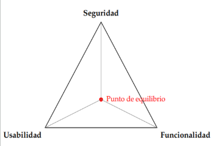
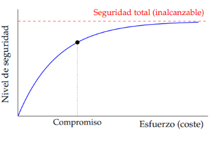
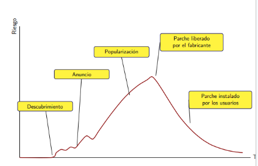

## 1.  **Conceptos básicos**

### **1.1.1. Concepto de seguridad**

* **Seguridad de un sistema:** Un sistema es seguro cuando actúa como debe, es decir cuando su comportamiento se ajusta a las especificaciones y características para las que fue diseñado

Cuando aumenta la complejidad lo hace más probable a tener fallos. Todos los sistemas presentan fallos en mayor o menor medida, algunos pueden manifestarse como: 

* Fallos que **no afectan a la información** ( no compromete los datos ni el funcionamiento )  
* Fallos que **dañan la información por sí mismo**s ( corrompen o destruyen datos de forma directa)  
* Fallos que **pasan desapercibidos** ( pueden ser aprovechados por terceros para provocar daños en el sistema)

### **1.1.2. Sistema de información seguro**

Un sistema de información es seguro si:

1. Cuando se produce algún funcionamiento anómalo, no afecta a la información o puede ser **recuperada en un tiempo razonable**  
2. La probabilidad de robo, manipulación o interrupción del servicio es nula o casi **debajo de un límite tolerable**

La seguridad no se plantea en términos absolutos, sino en términos de riesgo aceptable

### **1.1.3. El triángulo seguridad, usabilidad y funcionalidad**

Cuando se desarrolla un software se busca: **seguridad, usabilidad y funcionalidad**. Estas se encuentran en tensión permanente , mejorar una implica degradar las otras dos.

*Un sistema muy seguro puede requerir muchas contraseñas, lo que dificulta su uso diario ( usabilidad) y añadir nuevas funcionalidades aumenta la probabilidad de ataque.*

La tensión se representa mediante un triángulo en cuyos vértices se sitúan sus propiedades. **El punto de equilibrio dependerá del contexto y necesidades del usuario**, (Cuanto más se aleja a una esquina más se sacrifican las otras)   
**No existe una solución universal que maximice la seguridad, usabilidad y funcionalidad de un sistema**. El diseñador debe encontrar el equilibrio adecuado para cada caso

### **1.1.4. Esfuerzo dedicado a la seguridad**

Existe una relación `no lineal` entre el **esfuerzo / coste invertido en seguridad y el nivel de protección que se obtiene**. Cuando se incrementa la inversión se alcanzan niveles de seguridad cada vez más altos pero con rendimientos decrecientes. **Las primeras medidas suelen ser más baratas y efectivas, a niveles cercanos al máximo teórico aumenta desproporcionadamente el coste**. La curva crece rápidamente al principio y se aplana sin tocar la asíntota ( `seguridad total`).

Es  fundamental **encontrar un compromiso entre el coste del sistema de seguridad y el nivel de protección deseado**. 

> **CLAVE**: identificar el punto en el que el coste marginal de una mejora en seguridad iguala al beneficio marginal que aporta

| Propiedad | Ataques típicos | Contramedidas típicas |
| :---- | :---- | :---- |
| Confidencialidad | Interceptación de comunicaciones, robo de credenciales, fuga de datos | Cifrado, control de acceso, clasificación de información |
| Integridad | Modificación de mensajes, manipulación de registros, malware | Funciones, resumen, firmas digitales, control de versiones |
| Disponibilidad | Denegación de servicio (DoS/DDoS) ransomware, sabotaje | Redundancia, copias de seguridad, planes de contingencia |

**Propiedades adicionales:**

* **Autenticación:** verificar la identidad de los agentes que interactúan con el sistema , (requisito previo de cualquier política de acceso)  
* **No repudio:** impedir que un agente niegue haber hecho una acción, se implementa 

### **1.1.5. Propiedades de un sistema de información seguro**

Las tres propiedades que debe garantizar un sistema de información seguro se conoce como la **tríada CIA ( Confidentiality, Integrity, Availability)**

* **Confidencialidad:** Solo pueden acceder a la info agentes (personas, procesos o sistemas) que están autorizados. La confidencialidad protege el acceso no autorizado de datos  
* **Integridad:** La información no sufre alteraciones no autorizadas cuando se almacena, recupera o transmite . La integridad garantiza que se mantienen completos y correctos  
* **Disponibilidad**: La información puede ser utilizada siempre que se necesite por parte de los usuarios autorizados sin interrupciones del servicio

Estas propiedades son complementarias entre sí y un sistema solo puede ser seguro si las garantiza simultáneamente. Si falla una no cumple los requisitos de seguridad.

Cada propiedad tiene sus propios ataques y contramedidas

* mediante firmas digitales  
* **Trazabilidad( Accountability)**: poder reconstruir el historial de accesos y operaciones sobre la información toda acción puede atribuirse a un agente concreto. Se apoya en logs

## **1.2. Daño, ataque y riesgo**

* **Daños:** Perjuicio que se produce a raíz de un fallo en un sistema. Pueden ser:  
  * Económicos  
  * Físicos (daños de infraestructura/ persona/sistemas críticos)  
  * Morales (reputación / imagen)  
  * Legales (sanciones por incumplimiento)  
  * Fortuito (causado por un accidente)  
  * Provocado (por una acción)

* **Ataque:** Provocar un daño a un sistema de forma intencionada. Un ataque presupone la existencia de un agente (atacante) que explota una o varias vulnerabilidades para causar perjuicio  
    
* **Riesgo**: Producto entre la magnitud del daño (d) y probabilidad de que ocurra (pd)  
  >	R \= d \* pd  
  
  *un daño de baja magnitud pero con prob de ocurrencia alta puede suponer un daño mayor q uno potencial pero improbable* 

### **1.2.1. Estrategias de gestión del riesgo**

Identificado y cuantificado un riesgo las estrategias son:

* **Evitar el riesgo:** eliminar actividad o el componente que lo origina, (no almacenar datos de tarjetas de crédito si no es imprescindible)  
* **Mitigar el riesgo:** aplicar controles que reduzcan la probabilidad de daño (pd), su magnitud (d) o ambas.  

* **Transferir el riesgo:** trasladar total o parcialmente sus consecuencias a un tercero usualmente por la contratación de un seguro contra ciberriesgos o la externalización del servicio  
* **Aceptar el riesgo:** Asumirlo conscientemente cuando su magnitud es inferior al umbral tolerable definido por la organización o el coste de contramedidas supere al propio daño.

> *Aceptar un riesgo es una decisión legítima de gestión; Ignorarlo NO\! . La diferencia esq en la aceptación está informado, documentado y revisable y la segunda deja a la organización expuesta sin ser inconsciente* 

### **1.2.2. El factor humano: los agentes de la amenaza**

Detrás de todo ataque hay un agente con motivaciones y capacidades concretas . Conocer el perfil del posible atacante es esencial para construir un modelo de amenazas.

* **Aficionados y script kiddies:** Individuos con conocimientos limitados q usan herramientas y exploits desarrollados por terceros. Peligrosidad baja, número enorme  
    
* **Personal Interno:** empleados o colaboradores (antiguos/actuales) con acceso al sistema. Una de las amenazas más difíciles de contrarrestar ya q viene de dentro. Sus acciones pueden ser tanto malintencionadas como fruto de negligencia  
    
* **Cibercriminales:** Grupos organizados con ánimo de lucro, responsables de la mayor parte del ransomware, el fraude en línea y robo de credenciales. Operan como empresas con estructuras jerárquicas y modelos de negocio propios  
    
* **Hacktivistas:** Agentes con motivaciones ideológicas o políticas cuyos ataques buscan notoriedad pública

* **Actores estatales y APT (Advanced Persistent Threats):** grupos con abundantes recursos frecuentemente vinculados a gobiernos, capaces de desarrollar ataques muy sofisticados y de mantenerse ocultos mucho tiempo. Suelen perseguir espionaje o sabotaje

## **1.3. Amenaza, vulnerabilidad y exploit**

* **Amenaza:** Situación de daño cuyo riesgo de producirse es significativo. Una amenaza existe cuando hay una combinación de vulnerabilidades en el sistema y agentes capaces de explotarlas, la prob de que se produzca daño NO es despreciable  
    
* **Vulnerabilidades:** Deficiencia de un sistema susceptible de producir (accidental o intencionalmente) un fallo en el mismo. Pueden residir en el diseño, implementación o forma de uso  
    
* **Exploit:** Técnica que permite aprovechar una vulnerabilidad y producir daño , rompiendo la seguridad de un sistema. Es una materialización práctica de una amenaza; transforma una debilidad teórica con un ataque real

La relación entre estos es secuencial: una **vulnerabilidad** constituye una debilidad , cuando existe un agente capaz de explotarla es una **amenaza** y cuando dicho agente emplea un **exploit** se produce el daño 

### **1.3.1. Clasificación clásica de las amenazas**  
Un modelo clásico, debido a Pfleeger , clasifica las amenazas sobre un flujo de info en 4 categorías según el efecto en dicho flujo:

* **Interrupción:** un activo del sistema se destruye o queda inutilizable. Es un ataque contra la **disponibilidad**  
* **Interceptación**: un agente no autorizado consigue acceso a un activo. Ataca contra la **confidencialidad**  
* **Modificación:** un agente no autorizado no solo accede a un activo sino q lo altera. Ataca contra la **integridad**  
* **Fabricación:** un agente no autorizado introduce objetos falsificados en el sistema. Ataca contra la **autenticidad**

Estas clasificaciones están conectadas con las propiedades de un sistema seguro.

### **1.3.2. Identificación unívoca de vulnerabilidades: CVE**  
Para facilitar la comunicación y gestión de vulnerabilidades se creó el sistema CVE (Common Vulnerabilities and Exposures), mantenido por la corporación MITRE con el apoyo del Departamento de Seguridad de EU. Antes, cada fabricante usaba su propia nomenclatura , lo que hacía difícil saber si esos avisos se referían al mismo problema. El sistema CVE proporciona un identificador universal para cada vulnerabilidad. Cuenta con:

* **Identificador:** formato `CVE-AAAA-NNNN` (`AAAA` → año de asignación y `NNNN` → número único de 4 o más dígitos)  
* **Estado:** candidato (pendiente a confirmación) o entry (confirmado)  
* **Descripción:** de la vulnerabilidad  
* **Referencia:** a fuentes externas con info adicional (avisos de seguridad, parches, análisis técnicos)

los identificadores son asignados por llamadas `CNA` (`CVE Numbering Authorities`), organizaciones autorizadas para reservar y publicar identificadores. Sobre `CVE` se construyen bases de datos ricas como `NVD` (national vulnerability database) del `NIST` que añade a cada entrada su puntuación de severidad y metadatos adicionales.

### **1.3.3. Valoración del impacto: CVSS**  
El sistema `CVSS` (`Common Vulnerability Scoring System`) permite medir de forma estandarizada la peligrosidad de una vulnerabilidad. Combina estas métricas:

* **Métricas base:** propiedades intrínsecas que no cambian con el tiempo, incluyen aspectos como acceso (local, adyacente, red) , complejidad del ataque, privilegios requeridos y el impacto sobre la confidencialidad, integridad y disponibilidad.  
* **Métricas temporales:** reflejan evolución de vulnerabilidad como existencia de exploits funcionales, disponibilidad de parches oficiales o nivel de confianza de info reportada  
* **Métricas del entorno:** relativas a una implementación como la importancia del activo afectado

> El resultado va del 0 al 10:

| Puntuación | Severidad |
| :---- | :---- |
| 0 | Ninguna |
| 0,1 \- 3,9 | Baja |
| 4.0 \- 6,9 | Media |
| 7.0 \- 8,9 | Alta |
| 9.0 \- 10.0 | Crítica |

El vector `CVSS` codifica **métricas de vulnerabilidades** (como red, complejidad o impacto) en un formato compacto para facilitar su comparación y cálculo automático.

> La versión CVSS 4.0 (2023) aporta:
* **Mayor precisión:** Aumenta la granularidad, reduce la ambigüedad y se adapta a entornos como OT/ICS, salud y seguridad física.  
* **Nomenclatura explícita:** Clasifica las evaluaciones según las métricas usadas (*CVSS-B* para base, *CVSS-BT* con amenaza, *CVSS-BE* con entorno y *CVSS-BTE* para todas).  
* **Evaluación de riesgo real:** Enfatiza que la puntuación base no basta por sí sola para medir el riesgo real.

### **1.3.4. Causas y detección de vulnerabilidades**

Las vulnerabilidades se originan principalmente en tres causas:

* **Mal diseño:** La arquitectura no incluye seguridad desde el inicio (falla al aplicar el principio de mínimo privilegio o defensa en profundidad)  
* **Implementación deficiente:** Errores al desarrollar el software (*bugs* como inyección SQL o desbordamientos) o el hardware (fallos en chips).  
* **Uso inadecuado:** El sistema se utiliza para algo distinto a su diseño original, por falta de formación de los usuarios o por cambiar su entorno de despliegue

## **1.4. La ventana de exposición**

La **ventana de exposición** es el tiempo entre que surge una vulnerabilidad y se corrige completamente, periodo en el que el sistema es vulnerable.

* **El problema:** Se sabe cuándo se detecta la vulnerabilidad, pero no cuándo se abrió la ventana, permitiendo que otros la exploten en secreto  
* **Ataques de día cero (*zero-day*):** Ocurren cuando se explota la falla antes de que exista un parche o solución conocida.  
* **Mercado e incentivos:** Existen mercados que pagan sumas elevadas por *exploits* no publicados; como alternativa legal y responsable, las organizaciones usan programas de recompensas (*bug bounty*)

### **1.4.1. Ciclo de vida de la ventana de exposición**

El ciclo de vida comprende las siguientes fases:  

**1\. Introducción de la vulnerabilidad:** la vulnerabilidad se introduce en el sistema, generalmente durante la fase de desarrollo o tras una actualización. 

**2\. Descubrimiento:** algún agente detecta la vulnerabilidad. 

**3\. Publicación / explotación:** dependiendo de quién descubra la vulnerabilidad, esta puede hacerse pública (para que se corrija) o puede ser explotada de forma silenciosa. 

**4\. Desarrollo del parche:** el fabricante o desarrollador crea una corrección para la vulnerabilidad. 

**5\. Aplicación del parche**: los administradores de los sistemas afectados despliegan la corrección en sus entornos. 

**6\. Cierre de la ventana:** una vez que todos los sistemas afectados han aplicado el parche, la ventana de exposición se cierra.

> El objetivo de toda organización debe ser que la ventana de exposición sea lo más pequeña posible teniendo en cuenta los factores que la amplian: retrasos en detección, tiempo de desarrollo del parche, demoras en distribución y la lentitud de las actualizaciones de seguridad

### **1.4.2. Estrategias de reducción de la ventana de exposición**  
Existen **dos filosofías** para gestionar la divulgación de vulnerabilidades y que influyen la duración de la ventana de exposición

### **1.4.2.1. Publicación inmediata (full disclosure)**

Esta estrategia corresponde a la **divulgación plena** (*full disclosure*). Sus puntos clave son:

* **Ventajas:** Acelera la corrección al informar a toda la comunidad y fomenta que otros investigadores encuentren y solucionen fallos similares.  
* **Riesgo:** Avisa también a los atacantes, permitiéndoles crear *exploits* antes de que exista un parche oficial.  
* **Uso ideal:** Recomendada para sistemas críticos cuyos usuarios poseen la capacidad técnica para aplicar mitigaciones por su cuenta.

### **1.4.2.2. Publicación responsable (responsible disclosure)**

Este modelo es la **divulgación responsable** (*responsible disclosure* o *coordinated disclosure*). Sus puntos clave son:

* **Mecanismo:** El descubridor notifica en privado al fabricante y le otorga un plazo razonable para crear un parche antes de hacer pública la vulnerabilidad.  
* **Publicación con parche:** Cumplido el plazo, se revela la falla, idealmente liberando la solución al mismo tiempo.  
* **Excepción de emergencia:** Si se detecta que la falla se está explotando activamente, se publica de inmediato sin esperar a que venza el plazo.  
* **Equilibrio:** Con plazos usuales de 30 a 90 días, protege a los usuarios mientras da margen de respuesta al desarrollador.

## **1.5. La seguridad como proceso**

La seguridad no es un estado fijo ni un producto, sino un **proceso continuo** que asume que la seguridad absoluta no existe y que los sistemas siempre contendrán fallos.

* **Ciclo de vida:** La protección no se añade al final, debe acompañar al sistema desde su concepción, desarrollo y despliegue hasta su retirada  
* **Principios de diseño:** Se aplican pautas arquitectónicas para minimizar la cantidad de errores y limitar el impacto cuando estos ocurran  
* **Problema de inversión:** Plantea la paradoja de por q las organizaciones suelen invertir menos de lo necesario en seguridad, aun siendo conscientes de los riesgos.  
* **Cultura de resiliencia:** Tan importante como prevenir los fallos es preparar al sistema para asumir que fallará y ser capaz de responder y recuperarse

## **1.5.1. La seguridad no es un producto**

La seguridad es un **proceso continuo** y no un producto estático, un concepto popularizado por Bruce Schneier ("*security is a process, not a product*").

* **Dinámica del sistema:** Los sistemas cambian, se actualizan y se exponen a nuevas amenazas de forma constante, exigiendo que la seguridad evolucione a su par.  
* **Seguridad contextual:** No existen sistemas absolutamente seguros; su seguridad depende del contexto y momento. Todo producto nuevo es potencialmente inseguro hasta que se evalúa en producción  
* **Consecuencia organizativa:** La protección no se resuelve solo instalando *software* o *hardware* (antivirus, cortafuegos) ni aislándola en un departamento; exige procedimientos, revisiones permanentes y políticas de seguridad compartidas

## **1.5.2. La seguridad total no existe**

Dado que la seguridad absoluta es inalcanzable e inviable económicamente, la estrategia debe enfocarse en la gestión del riesgo y la resiliencia:

* **Estrategias fundamentales:**  
  * **Minimizar vulnerabilidades:** Aplicar buenas prácticas en el diseño, desarrollo y configuración  
  * **Mitigar el daño:** Diseñar planes de contingencia y recuperación para reducir el impacto tras un fallo.  
  * **Seguridad desde el diseño (*security by design*):** Integrar la seguridad en todas las fases iniciales del ciclo de vida del *software*.  
  * **Evaluación de riesgos:** Evitar asumir riesgos innecesarios en decisiones operativas y arquitectónicas.  
  * **Mejora continua:** Analizar incidentes pasados para aprender de los errores y actualizar políticas.  
* **Debate sobre responsabilidad:** A diferencia de industrias como la automoción o la medicina, el *software* traslada la responsabilidad de los fallos al usuario final, existiendo un debate sobre si los fabricantes deberían asumir legalmente los daños por productos defectuosos.

## **1.5.3. Principios de diseño seguro**

Los **principios de diseño de seguridad** (formulados originalmente por Saltzer y Schroeder) buscan reducir la probabilidad e impacto de fallos:

* **Mínimo privilegio:** Conceder a cada agente solo los permisos necesarios para su tarea y durante el tiempo estrictamente requerido.  
* **Defensa en profundidad:** Implementar capas de protección independientes para que el fallo de una barrera no comprometa todo el sistema.  
* **Fallo seguro (*fail-safe defaults*):** Ante un fallo o imprevisto, la postura por defecto debe ser la más segura (por ejemplo, denegar el acceso).  
* **Economía de mecanismo:** Mantener los diseños simples, pues la complejidad dificulta la auditoría y multiplica los errores.  
* **Mediación completa:** Verificar cada solicitud de acceso a un recurso sin omitir comprobaciones ni asumir autorizaciones previas.  
* **Diseño abierto (*principio de Kerckhoffs*):** La seguridad debe residir en el secreto de las claves, jamás en el ocultamiento del diseño del sistema.

## **1.5.4. ¿Por qué no se tiene más en cuenta la seguridad?**

La **infrainversión en seguridad** responde principalmente a factores económicos y de mercado:

* **Costes y plazos:** Incorporar seguridad encarece y ralentiza el desarrollo (*software* más costoso y lanzamientos más lentos)  
* **Presión competitiva:** Estrategias como *release early, release often* priorizan salir rápido al mercado con funciones nuevas por encima de la seguridad  
* **Pruebas ineficaces:** Las pruebas beta tradicionales evalúan uso y funcionalidad; detectar fallos requiere análisis estáticos, *fuzzing* o auditorías complejas y costosas.  
* **Falta de formación:** Muchos desarrolladores y directivos carecen de formación profunda en ciberseguridad, la cual escasea en los planes educativos técnicos.  
* **Rentabilidad percibida:** A corto plazo, el *marketing* vende más que la calidad o la seguridad, ya que esta última es "invisible" para el cliente hasta que ocurre un ataque.  
* **Externalidades de costes:** Los costes de una brecha suelen sufrirlos terceros (usuarios u otras empresas) y no quien decidió recortar el presupuesto, lo que desincentiva la inversión adecuada (*economics of security*)

## **1.5.5. La seguridad en todas las fases del ciclo de vida**  
Integrar la seguridad en el ciclo de vida del sistema exige aplicarla en sus cuatro fases principales:

* **Diseño:** Definir el modelo de amenazas, incorporar requisitos de seguridad desde el inicio y seleccionar las medidas de protección oportunas.  
* **Desarrollo e implantación:** Aplicar programación segura, revisar el código, ejecutar pruebas (estáticas, dinámicas y *pentesting*) y configurar correctamente el sistema antes de lanzarlo.  
* **Definición de políticas de uso:** Establecer explícitamente las operaciones permitidas, los elementos a supervisar y las frecuencias de revisión  
* **Operación y mantenimiento:** Monitorear el sistema activo, instalar parches de seguridad, gestionar incidentes y auditar periódicamente las políticas definidas

## **1.5.6. Prepararse para el fallo**  
Para gestionar incidentes inevitables, las organizaciones deben aplicar estas medidas clave:

* **Copias de seguridad (*backups*):** Definir frecuencia, almacenamiento seguro (fuera del sitio principal), procedimientos de restauración y realizar pruebas periódicas para garantizar la recuperación de datos.  
* **Análisis de registros (*logs*):** Revisar las trazas del sistema para reconstruir la secuencia del ataque, evaluar el impacto y determinar las acciones realizada  
* **Detección de eventos sospechosos:** Emplear herramientas como IDS, IPS y SIEM para monitorizar la red y detectar comportamientos anómalos antes de que causen daños mayores.  
* **Revisión continua:** Hacer auditorías periódicas, adaptar las políticas de seguridad y actualizar la organización ante nuevas amenazas  
* **Planes de contingencia y recuperación (*Disaster Recovery Plans*):** Establecer procedimientos documentados que definan responsabilidades, acciones y tiempos máximos de recuperación tras un desastre
