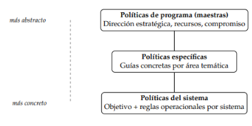

# **2\. Políticas y estándares de seguridad**

## **1\. Introducción: La necesidad de planificar la seguridad**  
En cualquier empresa circulan de forma implícita criterios sobre qué información es sensible, quién puede acceder a ella y cómo actuar ante un fallo. Sin embargo, mientras esas ideas permanezcan solo en la cabeza de ciertas personas, **no son exigibles, no se pueden auditar y se pierden cuando el personal se va.**  Una política de seguridad nace de la necesidad de poner todo ese conocimiento explícitamente por escrito.

Toda organización moderna que gestione información debe realizar una reflexión realista sobre el estado de sus sistemas, las amenazas que la acechan y los recursos disponibles.

### **Objetivos fundamentales de la planificación**

* **Minimizar las vulnerabilidades del sistema:** Detectar los puntos débiles y aplicar medidas de protección antes de que los atacantes los exploten.  
* **Reducir el tiempo de respuesta ante incidentes:** Acortar al máximo el intervalo entre la detección de un ataque o fallo, su neutralización y la restauración completa del servicio normal.

### **Actitudes inútiles y contraproducentes habituales**

* **Ignorar los riesgos:** Pensar que la empresa es "demasiado pequeña o insignificante" para ser atacada. Actualmente, la automatización de ataques (como *botnets* que escanean la red o campañas masivas de *phishing*) hace que cualquier dispositivo conectado sea un objetivo. La pregunta real no es *"¿por qué a nosotros?"*, sino *"¿cuándo nos detectará un escáner automático?"*.  

* **Dedicar demasiados recursos a amenazas poco probables:** Invertir en exceso para defenderse de escenarios extremadamente raros mientras se descuidan riesgos cotidianos. La gestión del riesgo debe basarse en la fórmula de Magnitud del daño × Probabilidad. Blindar una sala contra un ataque electromagnético pero no formar a los empleados contra la reutilización de contraseñas es un reparto irrazonable de recursos.  
   
* **Carecer de un plan de contingencias:** No prever qué hacer al sufrir un ataque convierte cualquier problema menor en una crisis caótica. Al actuar sin procedimientos previos ni ensayados, se decide bajo presión, con datos incompletos y sin roles claros, lo que maximiza el daño.

## **2\. Definición de Política de Seguridad**

Para entender el concepto, es necesario distinguir entre dos tipos de funcionamiento:

* **Expectativas de seguridad**: Definen el funcionamiento **esperado real** de un sistema teniendo en cuenta sus riesgos asociados. A diferencia del "funcionamiento ideal" (donde nunca ocurren fallos ni ataques), el funcionamiento esperado real asume que los incidentes ocurrirán e incorpora el riesgo como una variable del diseño ("prepararse para el fallo").

* **Política de seguridad:** Es la **documentación formal** de las expectativas de seguridad de una organización. Se plasma en un conjunto de enunciados, reglas y directivas (normas, reglamentos, procedimientos, buenas prácticas) que especifican el funcionamiento correcto de la entidad y cómo gestiona, protege y distribuye su información.

> **Responsabilidad compartida:** La política de seguridad no es un manual técnico exclusivo de TI. Es un marco de referencia corporativo que requiere el compromiso activo de la alta dirección, Recursos Humanos, el departamento jurídico y cada uno de los usuarios finales. Tratar la seguridad como un problema meramente informático es una de las principales causas de fracaso

### **Estructura jerárquica de abstracción**

Las políticas se organizan en diferentes niveles interconectados:

1. **Nivel alto (Estratégico):** Declaraciones abstractas sobre los grandes objetivos (ej. *"La información de los clientes debe tratarse con máxima confidencialidad"*).  
2. **Nivel bajo (Operativo):** Instrucciones técnicas concretas (ej. *"Parámetros de configuración del cortafuegos"* o *"Periodicidad de rotación de contraseñas"*).

> *Las políticas de nivel superior marcan el marco directivo para las de nivel inferior. Cualquier contradicción entre ambos niveles refleja un problema organizativo que debe corregirse.*

## **3\. Ventajas del uso de políticas de seguridad**

Disponer de un cuerpo formal de políticas reporta múltiples beneficios operacionales y legales:

* **Comunican intenciones y expectativas:** Hacen explícitos los criterios de protección para toda la empresa. Los controles técnicos pueden cambiar ante una reorganización, pero la política subyacente (ej. *"Impedir el acceso externo a datos internos"*) se mantiene conocida e inalterada  
* **Establecen criterios homogéneos de decisión:** Evitan que cada empleado actúe según su juicio personal ante dudas cotidianas (usar dispositivos personales, llevar portátiles a casa o compartir credenciales), reduciendo brechas de seguridad e inconsistencias  
* **Facilitan el cumplimiento normativo:** Simplifican la acreditación frente a leyes y estándares exigentes que obligan a tener políticas documentadas, tales como el RGPD (Unión Europea), el ENS (España) o la Ley Sarbanes-Oxley (EE. UU.)  
* **Mejoran la eficiencia organizativa:** Al estandarizar procesos y reducir la incertidumbre, facilitan una toma de decisiones más rápida y un reparto optimizado de los recursos de protección  
* **Aportan protección legal (*Due Diligence*):** En caso de sufrir un incidente grave, demostrar que existían políticas documentadas y en aplicación acredita que la empresa actuó con la **diligencia debida**. Esto suele ser un factor determinante para reducir de forma drástica las sanciones administrativas o judiciales

## **4\. Tipos de políticas de seguridad (Modelo NIST)**

El **NIST** (*National Institute of Standards and Technology*) clasifica las políticas en una jerarquía según su grado de abstracción:

### **Políticas de programa (Políticas maestras)**

* **Nivel:** Máximo nivel de abstracción (estratégico).  
* **Aprobación:** Alta dirección.  
* **Contenido:** Definen la visión global y el compromiso de la organización con la protección de la confidencialidad, integridad y disponibilidad de la información.  
* **Funciones principales:** Asignan los recursos económicos y humanos necesarios, designan formalmente la figura del **CISO** (*Chief Information Security Officer*) y fijan la estructura organizativa básica para gestionar la seguridad sin descender a detalles técnicos.

### **Importancia de las Políticas de Programa**

Las políticas de programa pueden parecer abstractas, pero son fundamentales por dos razones:

* **Formalizan el compromiso de la dirección:** Otorgan al departamento de seguridad el mandato explícito y la autoridad necesarios para imponer medidas frente a otros departamentos.  
* **Establecen la asignación presupuestaria:** Garantizan que la seguridad se reconozca como una prioridad y se le destinen recursos de forma continua.

### **2.1.4.2. Políticas Específicas**

Son guías concretas que abordan temas o áreas de especial relevancia dentro de la organización. Adaptan la visión general de la política de programa a reglas aplicables en entornos cotidianos.

**Ejemplos habituales:**

* **Acceso remoto:** Exige el uso de VPN con autenticación multifactor (MFA) para conexiones externas.  
* **Uso aceptable:** Define las actividades permitidas y prohibidas al usar los recursos corporativos (correo, internet, software).  
* **Contraseñas:** Fija requisitos de longitud y complejidad.  
* **Copias de seguridad:** Define la frecuencia, el tipo (completa, incremental, diferencial), la ubicación y los procesos de restauración.  
* **Gestión de incidentes:** Establece los procedimientos, la cadena de comunicación y las responsabilidades ante la detección de un problema.  
* **Dispositivos móviles y BYOD (*Bring Your Own Device*):** Regula el uso de dispositivos personales para tareas laborales (exigiendo cifrado, gestión remota y separación de datos).

### **2.1.4.3. Políticas del Sistema**

Son las políticas de más bajo nivel. Especifican las acciones permitidas en componentes técnicos concretos (cortafuegos, bases de datos, servidores web, estaciones de trabajo).

**Estructura de una política del sistema:**

1. **Objetivo de seguridad:** Declaración de lo que se desea proteger (ej. *"Garantizar la integridad y disponibilidad de los datos financieros"*)  
2. **Reglas operacionales:** Instrucciones técnicas detalladas para lograrlo (ej. *"Restringir accesos a una subred IP concreta"*, *"Aplicar parches en menos de 48 horas"*, *"Conservar logs 12 meses"*)

***Ejemplo en un Cortafuegos:** Regla de default deny (denegar todo el tráfico entrante salvo excepciones autorizadas), registro de conexiones rechazadas y alertas automáticas tras múltiples intentos fallidos.*

**Jerarquía entre los Tres Niveles**  
┌────────────────────────────────────────────────────────┐ │POLÍTICA DE PROGRAMA (Estratégico / Alto Nivel) │ │ "Protección general de los activos de la empresa"  └───────────────────────────┬────────────────────────────┘   ┌────────────────────────────────────────────────────────┐  POLÍTICA ESPECÍFICA (Ámbito Determinado) │ │ "Acceso a servidores internos mediante red autorizada" └───────────────────────────┬────────────────────────────┘ ┌────────────────────────────────────────────────────────┐ │POLÍTICA DEL SISTEMA (Técnico / Bajo Nivel) │ │ "Reglas de filtrado y denegación por defecto (VPN)"    
 └────────────────────────────────────────────────────────┘

## **2.1.5. Elementos que Componen una Buena Política de Seguridad**

Para ser efectiva, una política debe cumplir con siete requisitos clave:

1. **Propósito y objetivos claros:** Explicar con precisión qué pretende conseguir y por qué.  
2. **Ámbito de aplicabilidad bien definido:** Delimitar a qué departamentos, roles, sistemas o circunstancias aplica.  
3. **Compromiso explícito de la dirección:** Contar con el respaldo visible de la alta dirección en presupuesto y régimen disciplinario.  
4. **Realismo y aplicabilidad:** Deben ser razonables y ejecutables. Reglas demasiado estrictas se ignoran, creando una falsa sensación de seguridad.  
5. **Definición clara de términos:** Incluir un glosario con terminología técnica (ej. *"cifrado fuerte"*, *"autenticación multifactor"*).  
6. **Adaptación a los niveles de riesgo:** Aplicar medidas proporcionales a la sensibilidad del activo (proporcionalidad riesgo/coste).  
7. **Actualización periódica:** Establecer revisiones formales (ej. anuales) ante nuevas amenazas o avances normativos.

## **2.1.6. El Ciclo de Vida de una Política de Seguridad**

Las políticas son documentos dinámicos que deben gestionarse en un ciclo continuo:

1. **Desarrollo:** Identificación de la necesidad, definición del alcance, consulta a las partes (TI, legal, RR. HH.) y redacción del borrador.  
2. **Aprobación:** Validación formal por parte de la alta dirección para dotarla de autoridad.  
3. **Comunicación y formación:** Difusión y capacitación a los empleados (una política no conocida no existe en la práctica).  
4. **Implementación:** Despliegue de los controles técnicos, organizativos y procedimentales.  
5. **Cumplimiento y monitorización:** Auditoría continua para verificar la aplicación y corregir desviaciones  
6. **Revisión y actualización:** Modificación periódica o tras cambios del entorno (nuevas normativas, incidentes, guías como NIST SP 800-63-4), lo que reinicia el ciclo

## **2.1.7. Factores Humanos en las Políticas de Seguridad**

El factor humano es determinante en la efectividad de cualquier política de seguridad. Tres fenómenos condicionan su éxito:

* **Fatiga de seguridad (*security fatigue*):** Cuando los controles son excesivos o molestos (alertas continuas, cambios mensuales de contraseña), los usuarios buscan atajos (notas adhesivas con contraseñas, saltarse normas). Paradójicamente, *más restricciones pueden traducirse en menos seguridad real*.  
* **Ingeniería social:** Técnicas que explotan la confianza, la urgencia o la autoridad (ej. engaños para realizar transferencias). Las políticas deben incluir concientización y mecanismos estrictos de verificación.  
* **Cultura organizativa:** Si la empresa percibe la seguridad como un obstáculo y los directivos exigen excepciones para sí mismos, las políticas se incumplirán sistemáticamente. La dirección debe modelar el comportamiento esperado.

## **2.2. Estándares de Seguridad**

### **2.2.1. Propósito y Utilidad**

Los estándares proporcionan métodos sistemáticos y documentados para gestionar la seguridad. Mientras que las **políticas son internas**, los **estándares son marcos externos y globales**

* **Beneficios clave:** Evaluación metódica de riesgos, adopción de buenas prácticas internacionales, estandarización técnica y **obtención de certificaciones empresariales** para generar confianza.  
* **Cumplimiento vs. Seguridad:** El cumplimiento (*compliance*) no garantiza una protección total contra amenazas emergentes no contempladas en la norma.

#### **Roles en la Normalización y Certificación**

* **Organismos de Normalización:** Diseñan y redactan las normas (ej. **ISO** y **IEC**). *No certifican a las empresas*.  
* **Entidades de Certificación:** Auditores independientes acreditados que examinan a la empresa y emiten el certificado (ej. **AENOR** en España, **BSI** en Reino Unido).

### **2.2.2. La Familia ISO/IEC 27000**

Es la referencia internacional más extendida. Nació a partir de las normas británicas **BS 7799-1** (buenas prácticas) y **BS 7799-2** (SGSI certificable)

| Norma | Contenido Principal |
| :---- | :---- |
| **ISO/IEC 27000** | Vocabulario y definiciones comunes. |
| **ISO/IEC 27001** | **Requisitos del SGSI (Única norma certificable).** |
| **ISO/IEC 27002** | Catálogo de controles de seguridad (guía de buenas prácticas). |
| **ISO/IEC 27003** | Guía de implementación del SGSI. |
| **ISO/IEC 27004** | Métricas e indicadores para evaluar la eficacia del SGSI. |
| **ISO/IEC 27005** | Gestión de riesgos de seguridad de la información. |
| **ISO/IEC 27017 / 27018** | Controles de seguridad y privacidad en la **Nube**. |
| **ISO/IEC 27035** | Gestión de incidentes de seguridad. |

#### **2.2.2.1. ISO/IEC 27001: Requisitos del SGSI**

Define las exigencias para un **Sistema de Gestión de la Seguridad de la Información (SGSI)**, el cual no es un producto de software ni un dispositivo, sino un marco de gobernanza integral.

Se estructura en el ciclo de mejora continua **PDCA (Ciclo de Deming)**:

1. **Planificar (Plan):** Definir el alcance, elaborar la política de alto nivel, realizar el análisis de riesgos y redactar la **Declaración de Aplicabilidad (SoA)** (*Statement of Applicability*).  
2. **Hacer (Do):** Implementar los controles, formar al personal y operar el sistema.  
3. **Verificar (Check):** Auditar, revisar métricas y medir indicadores de rendimiento (KPIs).  
4. **Actuar (Act):** Aplicar acciones correctivas para mejorar el sistema.  
* **Proceso de Certificación:** Se audita en dos fases (revisión documental y auditoría *in situ*). Tiene **3 años de validez** con auditorías de seguimiento anuales.

#### **2.2.2.2. ISO/IEC 27002: Controles de Seguridad**

No es certificable por sí misma; actúa como catálogo de referencia de controles. La versión **2022** agrupa **93 controles en 4 categorías**:

* **Organizativos (37 controles):** Gestión de activos, acceso corporativo, proveedores, incidentes y continuidad.  
* **De personas (8 controles):** Seguridad pre, durante y post-empleo; concientización y formación.  
* **Físicos (14 controles):** Perímetros, entrada a instalaciones y protección de equipos.  
* **Tecnológicos (34 controles):** Redes, desarrollo seguro, cifrado y gestión de vulnerabilidades.

> **Atributos de control:** La revisión 2022 etiqueta los controles por tipo (*preventivo/detectivo/correctivo*), propiedad CIA (*confidencialidad, integridad, disponibilidad*), concepto de ciberseguridad (*identificar, proteger, detectar, responder, recuperar*) y capacidad operativa.

### **2.2.3. Otros Estándares Relevantes**

#### **2.2.3.1. NIST Serie 800 (EE. UU.)**

Publicaciones del *National Institute of Standards and Technology*. Son de **acceso libre y gratuito**:

* **SP 800-53:** Catálogo de \>1.000 controles técnicos (orientado a administraciones públicas).  
* **SP 800-37:** Marco de Gestión de Riesgos en 6 pasos (*RMF*).  
* **SP 800-61:** Guía de gestión de incidentes (preparación, detección/análisis, contención/erradicación y recuperación).  
* **SP 800-63:** Directrices de identidad digital y contraseñas.

#### **2.2.3.2. CobiT**

Marco de gestión y gobierno de las TI desarrollado por **ISACA**. A diferencia de ISO 27000 (que parte de la seguridad), CobiT parte del **gobierno corporativo del negocio** y ubica la seguridad como un resultado deseado.

**2.2.3.3. Esquema Nacional de Seguridad (ENS \- RD 311/2022)**

Obligatorio en España para las **Administraciones Públicas** y sus proveedores tecnológicos.

* **5 Dimensiones:** Disponibilidad, Autenticidad, Integridad, Confidencialidad y Trazabilidad (**A-A-I-C-T**).  
* **3 Categorías de Sistemas:** Básica, Media y Alta (determinan el rigor de las medidas obligatorias).  
* Exige auditorías **bienales** independientes.

#### **2.2.3.4. NIST Cybersecurity Framework (CSF 2.0)**

Marco flexible y compatible estructurado en **6 Funciones principales**:

1. **Gobernar (*Govern*):** Gestión estratégica y gobernanza transversal (introducida en la v2.0).  
2. **Identificar (*Identify*):** Activos, riesgos y contexto.  
3. **Proteger (*Protect*):** Salvaguardas.  
4. **Detectar (*Detect*):** Identificación de eventos.  
5. **Responder (*Respond*):** Acciones ante incidentes.  
6. **Recuperar (*Recover*):** Restauración de operaciones.

#### **2.2.3.5. Otros Marcos Específicos**

* **PCI DSS:** Obligatorio para cualquier entidad que procese, almacene o transmita **datos de tarjetas de pago**.  
* **COSO-ERM / SOX:** Requisitos de control interno y auditoría financiera aplicables a empresas cotizadas en bolsas estadounidenses.  
* **UNE 71502:2004:** Antigua norma española certificable, sustituida por la ISO 27001\.

### **2.2.4. Comparativa Sintética**

| Marco | Ámbito | Carácter | Enfoque Principal | Coste | Controles |
| :---- | :---- | :---- | :---- | :---- | :---- |
| **ISO 27001** | Internacional | Certificable | Gestión (SGSI) | De pago | 93 (v. 2022\) |
| **NIST 800-53** | EE. UU. / Global | Referencia técnica | Controles técnicos | Gratuito | \>1.000 |
| **ENS** | España (AAPP) | Obligatorio | Admón. Electrónica | Gratuito | Según categoría |
| **NIST CSF** | EE. UU. / Global | Voluntario | 6 Funciones de alto nivel | Gratuito | No prescribe |

> **Combinación en la práctica:** Un mismo organismo puede usar **ISO 27001** para certificarse, **NIST SP 800-53** para implementar controles técnicos, el **ENS** para cumplir con las leyes locales y **NIST CSF** para presentar métricas a la dirección.